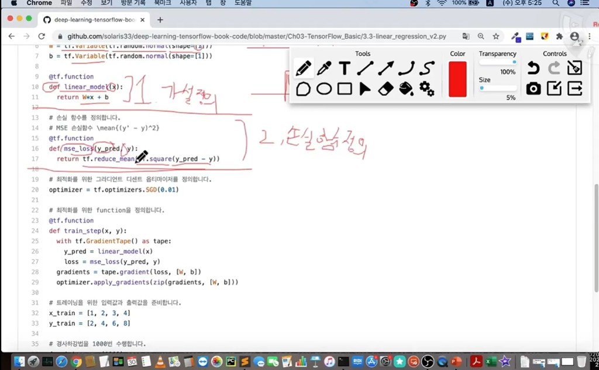
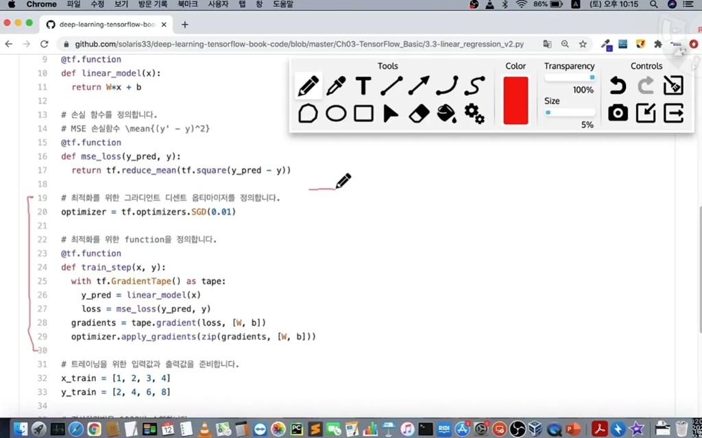

# 01. Linear Regression

선형 회귀는 입력과 출력 사이를 1차 함수로 근사해 예측하는 가장 기본적인 머신러닝 모델입니다.

아래 코드 흐름(2, 3번 이미지)에서 머신러닝의 큰 과정은 다음 3가지로 정리됩니다.

1. **가설 정의(Hypothesis)**: 입력 `x`에 대해 예측값 `y_pred`를 계산하는 모델 식을 정의합니다.  
   예: `linear_model(x) = w * x + b`
2. **손실함수 정의(Loss Function)**: 예측값과 정답의 차이를 수치화합니다.  
   예: 평균제곱오차 `MSE = mean((y_pred - y)^2)`
3. **옵티마이저 + 그라디언트 디센트 정의(Optimizer & Gradient Descent)**: 손실을 줄이도록 파라미터(`w`, `b`)를 업데이트합니다.  
   예: `SGD`로 gradient를 계산하고 `apply_gradients` 수행

## 코드 예시 캡처

## 정리

- 선형 회귀 학습은 결국 **가설 정의 -> 손실 계산 -> 경사하강 기반 파라미터 업데이트**의 반복입니다.
- 이 3단계가 명확하면 다른 딥러닝 모델(다층 신경망)에서도 학습 구조를 같은 틀로 이해할 수 있습니다.
