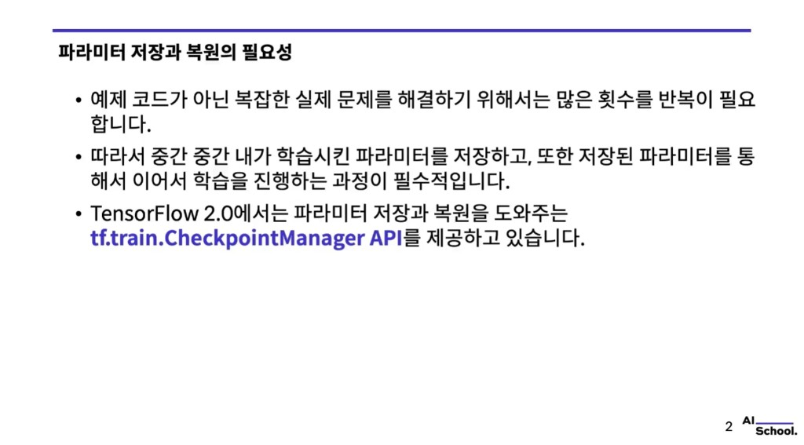
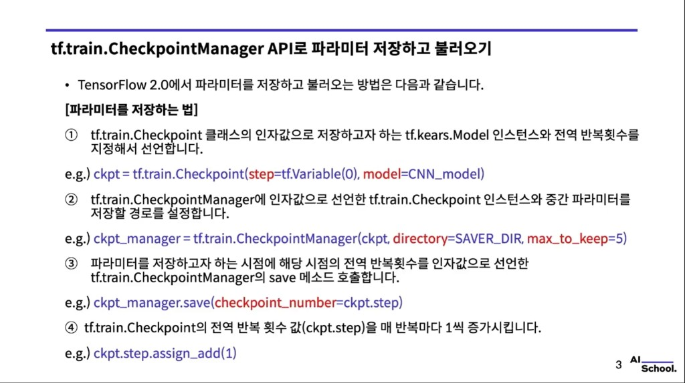
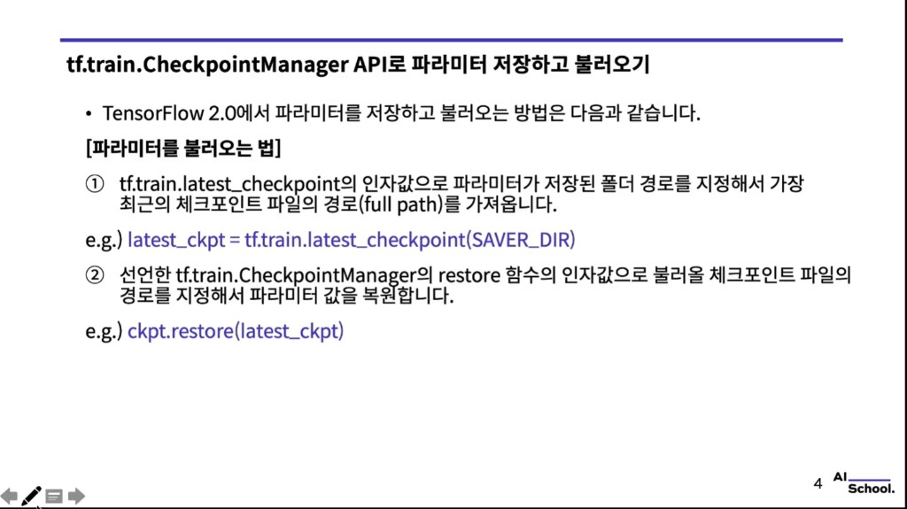

# `tf.train.CheckpointManager` API로 파라미터 저장·불러오기

> 예제 코드: [`01.mnist_classification_using_cnn_with_tfsaver_v2_keras.py`](./01.mnist_classification_using_cnn_with_tfsaver_v2_keras.py)  
> 공식 문서: [tf.train.Checkpoint](https://www.tensorflow.org/api_docs/python/tf/train/Checkpoint) · [tf.train.CheckpointManager](https://www.tensorflow.org/api_docs/python/tf/train/CheckpointManager)

슬라이드 캡처: `images/checkpoint_manager/`

---

## 1. 파라미터 저장과 복원이 필요한 이유



- **예제 수준을 넘는 실제 문제**를 풀려면 학습을 **많이 반복**해야 한다.
- 그래서 **중간중간 학습된 파라미터를 저장**하고, **저장본으로 이어서 학습**하는 과정이 사실상 필수다.
- TensorFlow 2.0에서는 이를 돕기 위해 **`tf.train.CheckpointManager`** API를 제공한다.

(학습이 길어질수록 중단·장애 대비, 최적 성능 시점 보존, 재학습 비용 절감 등의 이유로 checkpoint는 표준 관행에 가깝다.)

---

## 2. Checkpoint에 담을 수 있는 것 (개념)

Checkpoint에 둘 수 있는 구성 요소(예시):

- **Model** (가중치)
- **Optimizer** 상태
- **Training step** 정보

즉, 필요에 따라 **학습 상태 전체**를 저장할 수 있다.

이 예제 스크립트에서는 **`model`**과 **`step`**만 `Checkpoint`에 넣어 저장한다.

---

## 3. 파라미터 저장하기 (`Checkpoint` → `CheckpointManager` → `save`)



TensorFlow 2.0에서 **저장** 흐름은 슬라이드와 같이 네 단계로 정리할 수 있다.

### 1) `tf.train.Checkpoint` 선언

저장할 **`tf.keras.Model` 인스턴스**와 **전역 반복 횟수**(예: `tf.Variable`)를 인자로 넘긴다.

```python
ckpt = tf.train.Checkpoint(step=tf.Variable(0), model=CNN_model)
```

### 2) `tf.train.CheckpointManager` 생성

위에서 만든 **`Checkpoint` 인스턴스**와 **저장 디렉터리**, 유지할 개수 등을 설정한다.

```python
ckpt_manager = tf.train.CheckpointManager(ckpt, directory=SAVER_DIR, max_to_keep=5)
```

- **`max_to_keep`**: 디스크에 남겨 둘 최근 checkpoint 개수

예제에서는 `SAVER_DIR = "./model"` 을 사용한다.

### 3) 저장 시점에 `save` 호출

저장하고 싶을 때, 그 시점의 **전역 스텝**을 넘겨 `save`를 호출한다.

```python
ckpt_manager.save(checkpoint_number=ckpt.step)
```

보통은 **epoch 종료 시** 또는 **일정 step마다** 저장한다. 예제는 **100 step마다** 저장한다.

### 4) 매 반복마다 `step` 증가

학습이 진행될 때마다 `ckpt.step`을 올려 **진행 상황**을 기록한다.

```python
ckpt.step.assign_add(1)
```

---

## 4. 파라미터 불러오기 (`latest_checkpoint` → `restore`)



### 1) 가장 최근 checkpoint 경로 얻기

`tf.train.latest_checkpoint`에 **파라미터가 저장된 폴더 경로**를 넘기면, **가장 최근 checkpoint 파일의 full path**를 얻을 수 있다.

```python
latest_ckpt = tf.train.latest_checkpoint(SAVER_DIR)
```

### 2) `restore`로 복원

앞서 선언해 둔 **`tf.train.Checkpoint` 객체**의 `restore`에 불러올 경로를 넘겨 **가중치 등을 복원**한다.

```python
ckpt.restore(latest_ckpt)
```

슬라이드·예제 모두 **`ckpt.restore(...)`** 형태를 쓴다. (`CheckpointManager`가 아니라 **`Checkpoint` 인스턴스**의 메서드다.)

예제 스크립트에서는 복원에 성공하면 테스트 정확도를 출력한 뒤 `exit()`로 종료한다.

---

## 핵심 정리

**CheckpointManager**는 학습 중 **모델(및 지정한 상태) 저장·관리**를 돕는 도구다.

**저장 흐름**

1. `Checkpoint` 생성  
2. `CheckpointManager` 생성  
3. `save` 호출  
4. `step` 증가  

**복원 흐름**

1. `latest_checkpoint`  
2. `ckpt.restore(...)`  

---

## 한 줄 핵심

**CheckpointManager** → 딥러닝 학습 **중간 상태를 저장**하고, **이어서 학습**하거나 **저장된 모델로 평가**할 수 있게 하는 기능이다.
