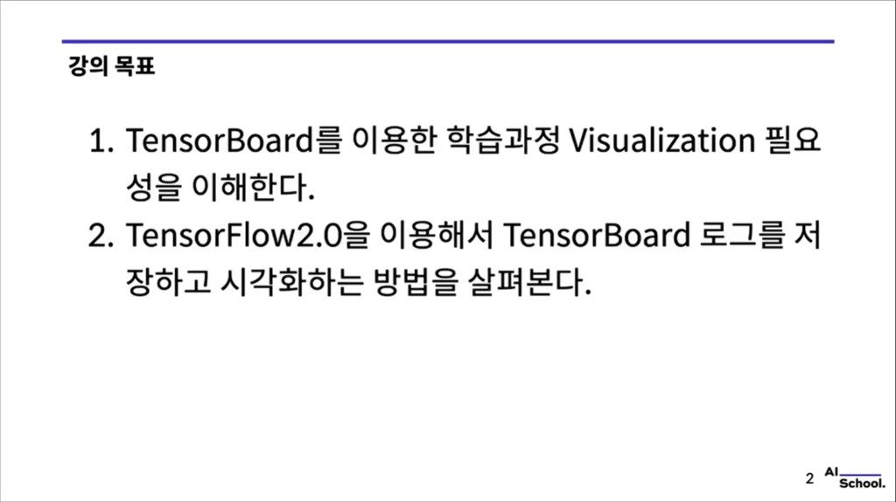
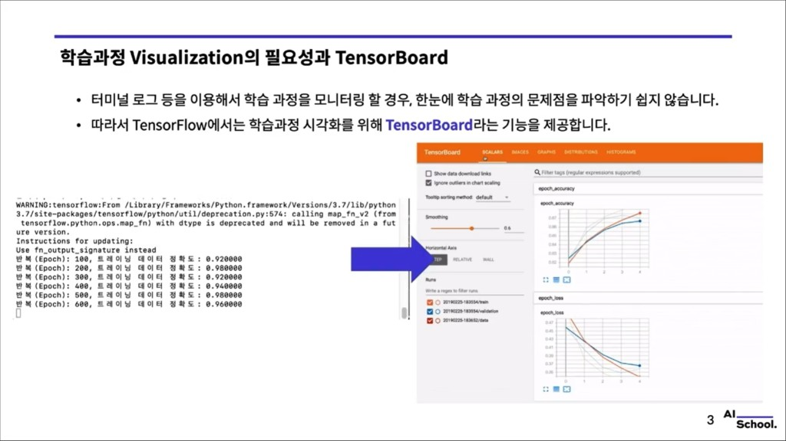
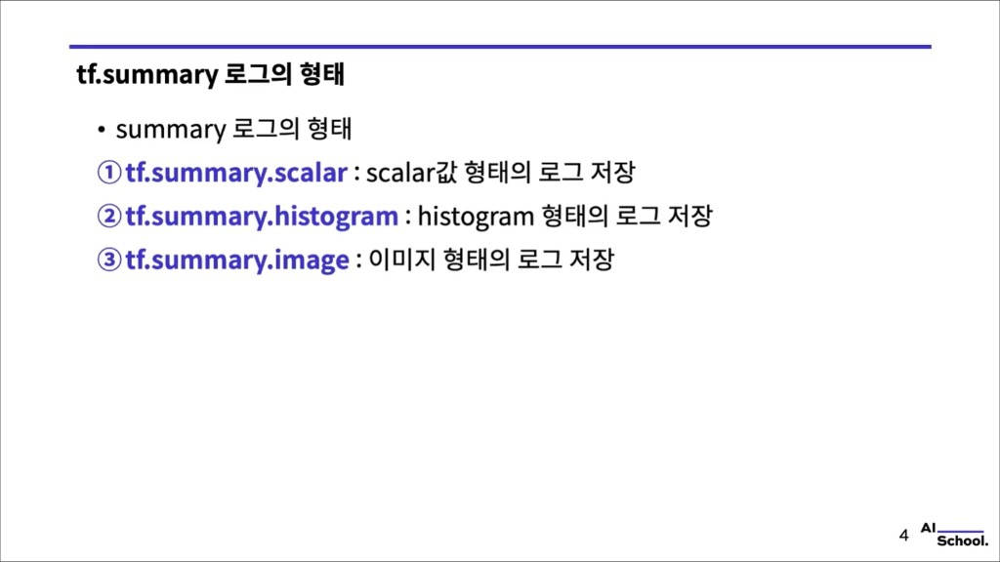
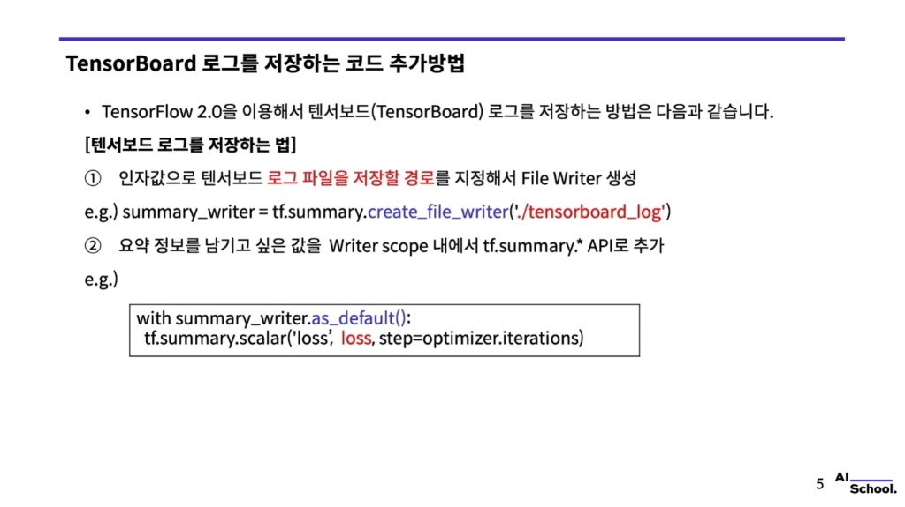
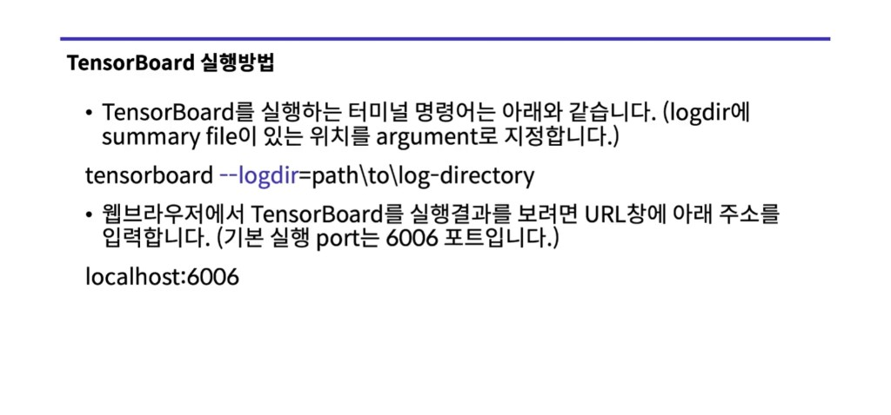

# TensorBoard를 이용한 학습 과정 시각화 (Visualization)

> 예제 코드: [`02.mnist_classification_using_cnn_v2_keras_with_tensorboard.py.py`](./02.mnist_classification_using_cnn_v2_keras_with_tensorboard.py.py)  
> 공식: [TensorBoard](https://www.tensorflow.org/tensorboard) · [tf.summary](https://www.tensorflow.org/api_docs/python/tf/summary)

슬라이드 캡처: `images/tensorboard_lecture/`

---

## 1. 강의 목표



1. **TensorBoard**로 학습 과정을 **시각화할 필요성**을 이해한다.
2. **TensorFlow 2.0**으로 TensorBoard **로그를 저장·시각화**하는 방법을 살펴본다.

---

## 2. 학습 과정 시각화가 필요한 이유와 TensorBoard



- **터미널 로그**만으로 학습을 모니터링하면, 과정의 문제점을 **한눈에** 파악하기 어렵다.
- TensorFlow는 학습 과정 시각화를 위해 **TensorBoard**를 제공한다.

추가로 기억할 점:

- **Loss**, **Accuracy** 추이를 그래프로 보면 과적합·학습률 문제 등을 빨리 감지하기 쉽다.
- **Training vs Validation**을 나란히 두면 일반화 상태를 비교하기 좋다.

이 예제에서는 **학습용·테스트용 로그를 폴더를 나누어** 기록해, TensorBoard에서 run을 분리해 볼 수 있게 한다.

---

## 3. `tf.summary` 로그의 형태



| API | 용도 (슬라이드 요약) |
|-----|---------------------|
| **`tf.summary.scalar`** | 스칼라 값 로그 (예: loss, accuracy) |
| **`tf.summary.histogram`** | 히스토그램 로그 (가중치·편향 등 **분포**) |
| **`tf.summary.image`** | 이미지 로그 (입력·생성 샘플 등) |

TensorBoard에서 **Scalars**, **Histograms**, **Images** 등 탭과 대응된다.

이 예제에서는 **`scalar`**(loss, accuracy)와 **`image`**(배치에서 일부 입력 이미지)를 사용한다.

---

## 4. TensorBoard 로그를 저장하는 코드 (요약 → 예제 스크립트)



슬라이드에서 정리한 **두 단계**:

1. **로그를 둘 경로**를 정해 `create_file_writer`로 **File Writer** 생성  
   - 예: `summary_writer = tf.summary.create_file_writer('./tensorboard_log')`
2. **`with writer.as_default():`** 안에서 기록할 값을 **`tf.summary.*`** 로 남김  
   - 예: `tf.summary.scalar('loss', loss, step=optimizer.iterations)`

아래는 **이 저장소 예제 스크립트**에서 쓰는 구체 코드다. (학습·테스트 writer 분리)

### File Writer 생성

```python
train_summary_writer = tf.summary.create_file_writer('./tensorboard_log/train')
test_summary_writer = tf.summary.create_file_writer('./tensorboard_log/test')
```

실행 후 `./tensorboard_log/` 아래에 `train`, `test` 이벤트 파일이 쌓인다.

### `summary` 기록

`with writer.as_default():` 안에서 `tf.summary.*`로 값을 남긴다.

**학습 스텝에서 loss·이미지 기록** (예제의 `train_step`):

```python
with train_summary_writer.as_default():
    tf.summary.scalar('loss', loss, step=optimizer.iterations)
    x_image = tf.reshape(x, [-1, 28, 28, 1])
    tf.summary.image('training image', x_image, max_outputs=10, step=optimizer.iterations)
```

- **`loss`**: 현재 스텝의 손실  
- **`step`**: 예제에서는 `optimizer.iterations`로 학습 iteration을 맞춤  
- **`image`**: 배치에서 최대 10장까지 입력 이미지를 로그에 남김  

**정확도 기록** (예제의 `compute_accuracy`):

```python
with summary_writer.as_default():
    tf.summary.scalar('accuracy', accuracy, step=optimizer.iterations)
```

`summary_writer` 인자로 **train용 / test용 writer**를 넘겨 같은 함수로 train·test 로그를 분리한다.

---

## 5. TensorBoard 실행 방법



- 터미널에서 **`--logdir`**에 **summary 파일이 있는 디렉터리**를 넘긴다.

```bash
tensorboard --logdir=path\to\log-directory
```

예제 기준(상위 폴더에 `train` / `test`가 있을 때):

```bash
tensorboard --logdir=./tensorboard_log
```

(스크립트를 실행한 **현재 작업 디렉터리** 기준이므로, 경로는 실행 위치에 맞게 조정한다.)

- 웹 브라우저 주소창에 **`http://localhost:6006`** 입력 (기본 포트 **6006**).

`train` / `test` run을 선택해 **Scalars**, **Images** 탭에서 그래프·이미지를 확인할 수 있다.

---

## 핵심 정리

**TensorBoard** → 딥러닝 **학습 과정을 시각화**하는 도구.

**로그 저장 흐름**

1. **File Writer** 생성 (`create_file_writer`)
2. `with writer.as_default():` 안에서 **`tf.summary`** 로 기록

**실행**

1. 터미널에서 `tensorboard --logdir=...`
2. **`localhost:6006`** 접속

---

## 한 줄 핵심

TensorBoard는 **loss·accuracy·이미지 등을 step 단위로 남겨**, 학습이 잘 되고 있는지 **눈으로 추적**할 수 있게 해 주는 도구다.
