# EfficientNet — 모델 스케일링과 Compound Scaling

> 강의·논문 기반 필기. 원문: Tan & Le, *EfficientNet: Rethinking Model Scaling for Convolutional Neural Networks*, ICML 2019.  
> PDF: [arXiv:1905.11946](https://arxiv.org/pdf/1905.11946.pdf) · SOTA 추적: [Papers with Code — ImageNet classification](https://paperswithcode.com/sota/image-classification-on-imagenet)

슬라이드 캡처는 `images/efficientnet/` 에 두고 GitHub에서 함께 렌더링되도록 연결했다.

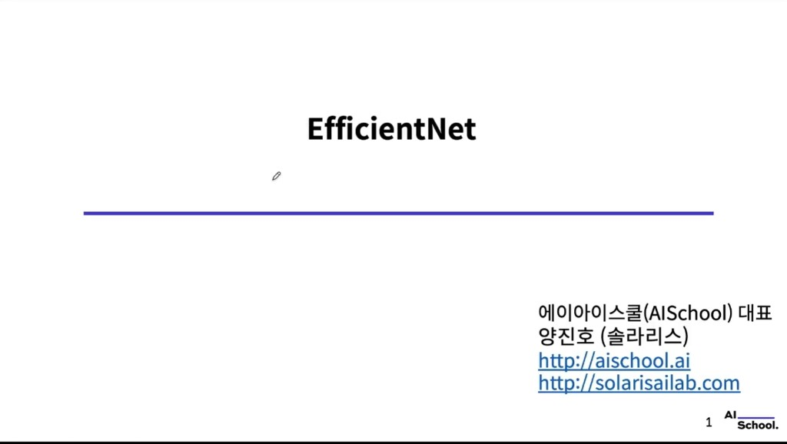

---

## 1. 맥락: ILSVRC와 “깊이”의 시대

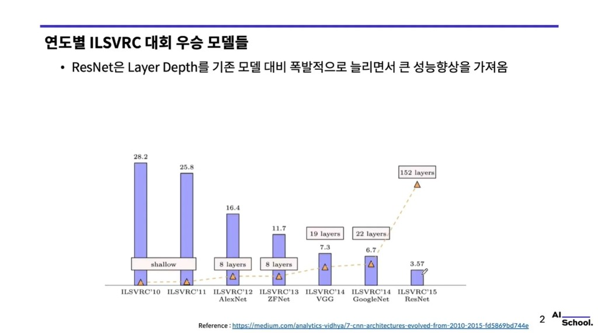

ILSVRC 우승 모델을 보면 오류율은 내려가고, 특히 **ResNet**은 층 수를 크게 늘려 성능을 끌어올린 사례로 자주 인용된다.

EfficientNet이 주목하는 축은 “무조건 더 깊게”만이 아니라, **같은·더 적은 연산·파라미터로 정확도를 끌어올리는 스케일링 원리**에 가깝다.

---

## 2. 최신 SOTA 흐름 (Papers with Code)

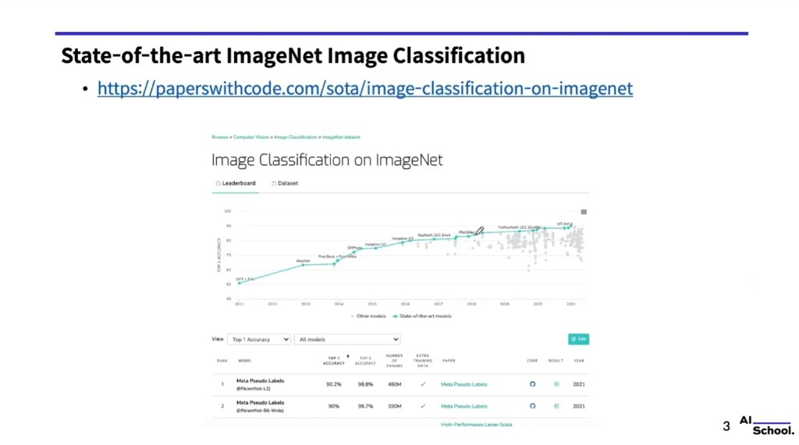

**Papers with Code** 등 벤치마크에서는 연도별로 Top-1 정확도가 올라가고, **EfficientNet·ViT** 등 다양한 계열이 상위권을 차지한다.  
실무·연구에서는 **Top-1 / Top-5**, **파라미터 수**, **추가 학습 데이터 여부**를 함께 본다.

---

## 3. 논문 핵심 한눈에

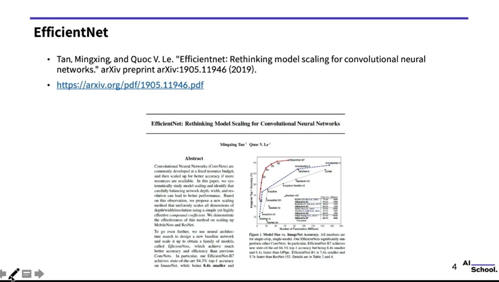

- CNN **스케일링(확장)** 을 체계적으로 보고, **depth·width·resolution** 의 **균형**이 성능에 중요하다고 정리한다.
- **Compound coefficient** 로 세 축을 함께 키우는 **compound scaling** 을 제안한다.
- **EfficientNet** 계열: 예를 들어 **EfficientNet-B7**은 ImageNet에서 **약 84.3% top-1**(논문 발표 기준)을 기록하면서, 당시 비교 대상 대비 **훨씬 작고 빠른** 모델이라는 메시지를 강조한다.

**Figure 1**은 파라미터 수 대비 **EfficientNet(B0–B7)** 이 다른 유명 아키텍처들보다 **왼쪽 아래(작은 모델)·위쪽(높은 정확도)** 에 가깝게 올라가는 **효율–정확도 트레이드오프**를 시각화한다.

---

## 4. 성능에 영향 주는 세 축: Depth ($d$), Width ($w$), Resolution ($r$)

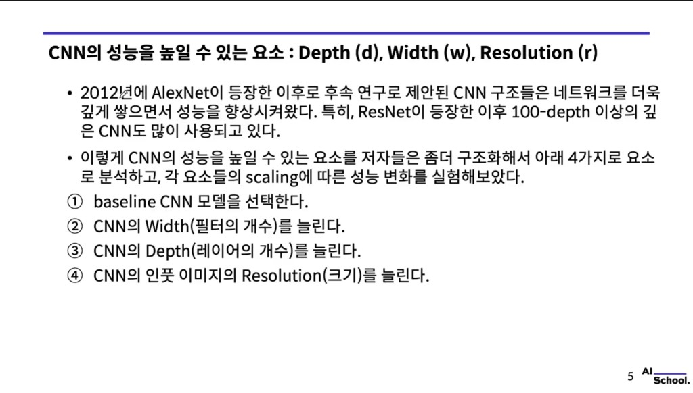

- 2012 **AlexNet** 이후 CNN은 **더 깊게** 쌓는 방향으로 발전했고, **ResNet** 이후 **100층 이상** 구조도 흔해졌다.
- 성능을 올리기 위해 논문은 대략 다음 네 단계로 실험을 구성한다:
  1. **baseline** 모델 선택  
  2. **width** 확장 (채널·필터 수)  
  3. **depth** 확장 (층 수)  
  4. **입력 해상도(resolution)** 확장  

---

## 5. Figure 2: 한 축만 키우기 vs Compound

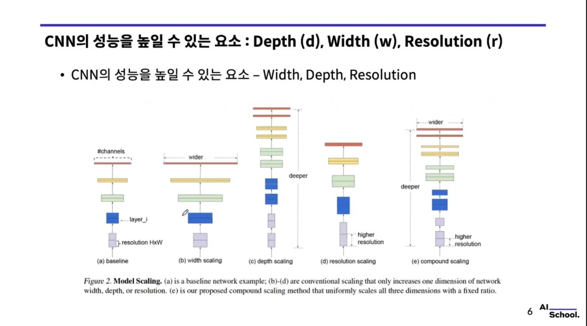

- **(a) baseline**  
- **(b) width scaling** 만  
- **(c) depth scaling** 만  
- **(d) resolution scaling** 만  
- **(e) compound scaling**: 세 축을 **고정 비율로 함께** 키우는 방식 (논문 제안)

---

## 6. Figure 3: 한 차원만 키우면 금방 포화

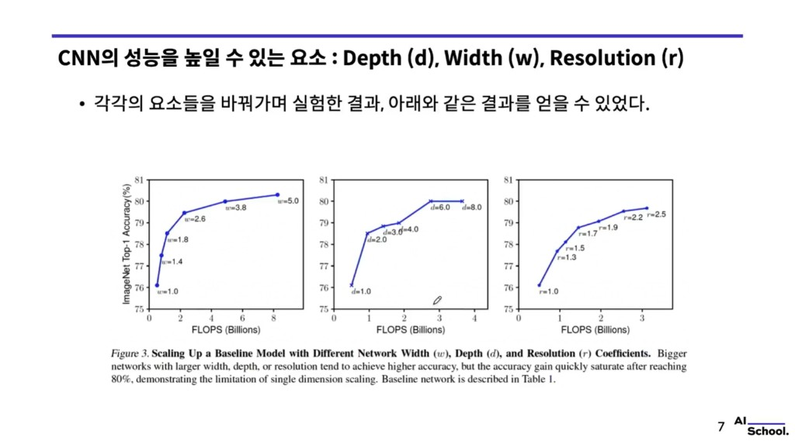

- **width ($w$), depth ($d$), resolution ($r$)** 각각을 키우면 정확도는 오르지만, **FLOPS**를 늘려도 **약 80% 부근에서 이득이 빨리 줄어드는(saturate)** 경향이 관찰된다.
- → “**한 가지만 무한히 키우는 스케일링**”에는 한계가 있다는 동기가 된다.

---

## 7. Compound scaling — 수식

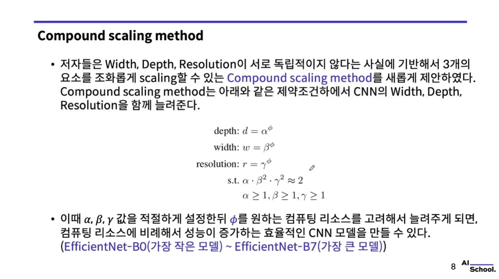

**width, depth, resolution** 은 서로 독립이 아니라고 보고, **동시에** 스케일한다.

$$
d = \alpha^{\phi},\quad w = \beta^{\phi},\quad r = \gamma^{\phi}
$$

**제약 (논문):**

$$
\alpha \cdot \beta^2 \cdot \gamma^2 \approx 2,\qquad \alpha \ge 1,\; \beta \ge 1,\; \gamma \ge 1
$$

- $\alpha, \beta, \gamma$: 작은 모델에 **grid search** 등으로 정한 상수  
- $\phi$: 사용자가 정하는 **compound coefficient** — 자원(연산·크기)을 얼마나 키울지 조절  

$\phi$ 를 키우면 **EfficientNet-B0**(가장 작은 베이스)에서 **B1 … B7** 까지 확장된 계열이 된다.

---

## 8. 직관: 해상도·깊이·폭은 같이 움직일 때 시너지

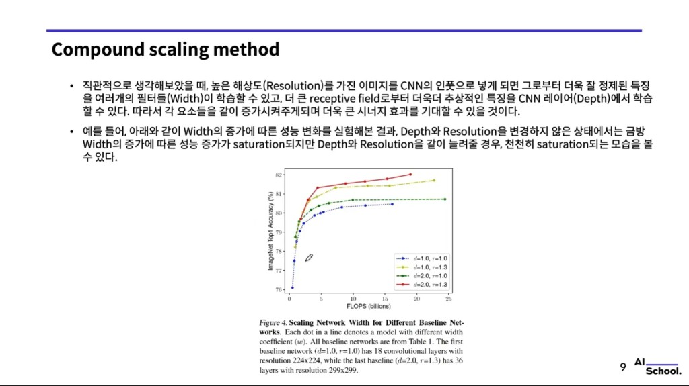

**직관 (슬라이드 요지)**

- 해상도가 크면 **폭(width)** 이 세밀한 특징을 더 잘 잡을 여지가 있고, **깊이(depth)** 는 수용장이 커지며 더 추상적 표현을 쌓을 수 있다.  
- **폭만** 키우되 depth·resolution 을 고정하면 이득이 빨리 **포화**하지만, **depth·resolution 을 함께** 키우면 같은 FLOPS 대비 **포화가 더 늦게** 온다.

캡션 예시: 첫 baseline은 $d{=}1.0, r{=}1.0$ (18 conv layers, $224{\times}224$), 마지막 baseline은 $d{=}2.0, r{=}1.3$ (36 layers, $299{\times}299$) 등.

---

## 9. 베이스라인 EfficientNet-B0 (Table 1)

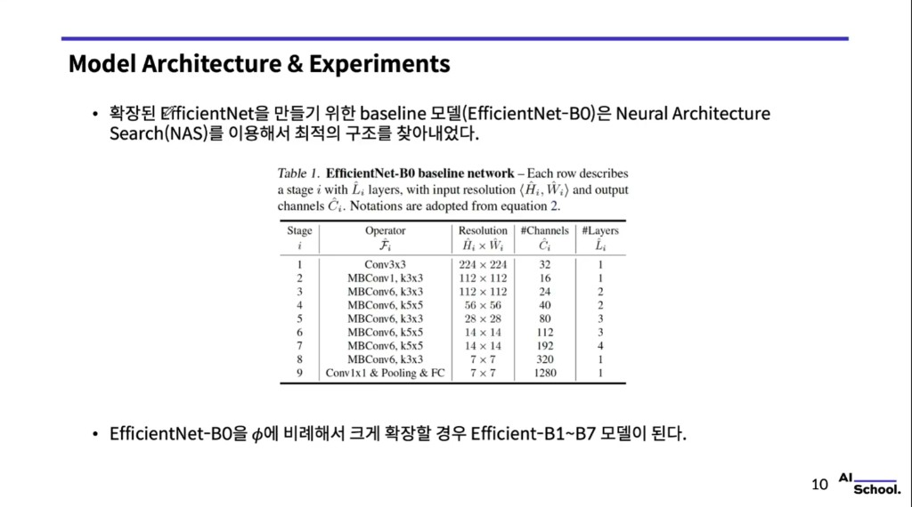

- **EfficientNet-B0** 은 **NAS(Neural Architecture Search)** 로 찾은 **작은 베이스**이고, 여기에 $\phi$ 에 비례해 compound scaling 하면 **B1–B7** 이 된다.

| Stage $i$ | Operator | Resolution | Channels | Layers |
|:---:|:---|:---:|:---:|:---:|
| 1 | Conv3×3 | 224×224 | 32 | 1 |
| 2 | MBConv1, k3×3 | 112×112 | 16 | 1 |
| 3 | MBConv6, k3×3 | 112×112 | 24 | 2 |
| 4 | MBConv6, k5×5 | 56×56 | 40 | 2 |
| 5 | MBConv6, k3×3 | 28×28 | 80 | 3 |
| 6 | MBConv6, k5×5 | 14×14 | 112 | 3 |
| 7 | MBConv6, k5×5 | 14×14 | 192 | 4 |
| 8 | MBConv6, k3×3 | 7×7 | 320 | 1 |
| 9 | Conv1×1 & Pool & FC | 7×7 | 1280 | 1 |

---

## 10. ImageNet에서의 정확도·파라미터 트레이드오프

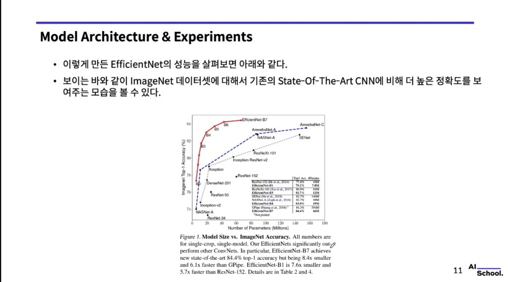

논문이 강조하는 비교 예 (single-crop, single-model 등 조건은 논문 본문 따름):

| 비교 | 요지 |
|------|------|
| **EfficientNet-B1** vs ResNet-152 | 더 작고 빠르면서도 더 높은 정확도(슬라이드: 79.2% vs 77.8%, 파라미터 7.8M vs 60M) |
| **EfficientNet-B7** vs GPipe | 비슷하거나 더 나은 정확도(84.4% vs 84.3%)에 **훨씬 작고 빠름**(66M vs 556M 등) |

---

## 11. CAM으로 보는 Compound Scaling (Figure 7 & Table 7)

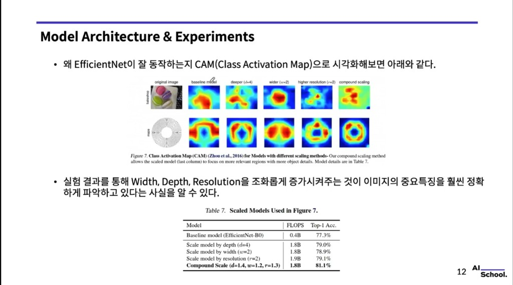

- **Class Activation Map(CAM)** 으로 보면, **depth만 / width만 / resolution만** 키운 경우보다 **compound scaling** 이 객체에 히트맵이 더 **집중**되는 경향이 보고된다.
- **Table 7 (슬라이드 수치):** 대략 **1.8B FLOPS** 근처에서  
  - depth-only ($d{=}4$) ≈ 79.0%  
  - width-only ($w{=}2$) ≈ 78.9%  
  - resolution-only ($r{=}2$) ≈ 79.1%  
  - **compound** ($d{=}1.4, w{=}1.2, r{=}1.3$) ≈ **81.1%**  

→ 비슷한 연산 예산에서 **세 축을 조화롭게** 키우는 쪽이 유리하다는 증거로 쓸 수 있다.

---

## 12. CPU 추론 지연 (Table 4 요지)

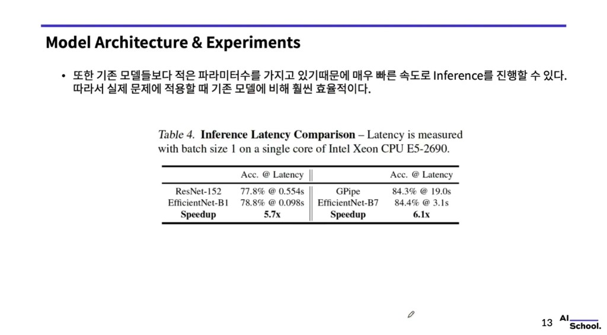

파라미터가 상대적으로 적으면 **추론 latency** 도 줄어든다는 메시지.

| 비교 | 정확도 · 지연 (슬라이드) |
|------|-------------------------|
| ResNet-152 vs **EfficientNet-B1** | 77.8% @ 0.554s vs **78.8% @ 0.098s** → 약 **5.7×** 빠름 |
| GPipe vs **EfficientNet-B7** | 84.3% @ 19.0s vs **84.4% @ 3.1s** → 약 **6.1×** 빠름 |

실제 서비스·엣지 배포에서 **효율**이 중요할 때 근거 자료로 쓰인다.

---

## 13. EfficientNet의 의의

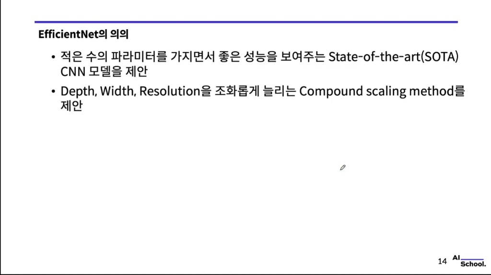

- **적은 파라미터**로도 강한 성능을 내는 **SOTA급 CNN 계열**을 제시했다.
- **Depth, Width, Resolution** 을 **조화롭게** 키우는 **Compound scaling** 을 제안했다.

---

## 한 줄 정리

**EfficientNet**은 B0 베이스에 **$\phi$ 로 묶인 compound scaling** 을 적용해 **정확도–크기–속도** 균형이 좋은 모델 스펙트럼(B0–B7)을 만든다; **한 축만 무한 확장**의 한계를 피하고 **세 축을 함께** 키우는 것이 핵심이다.
