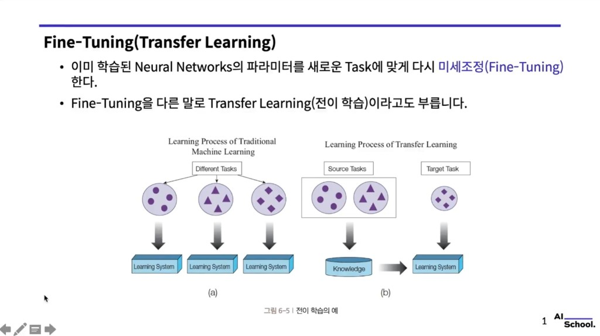
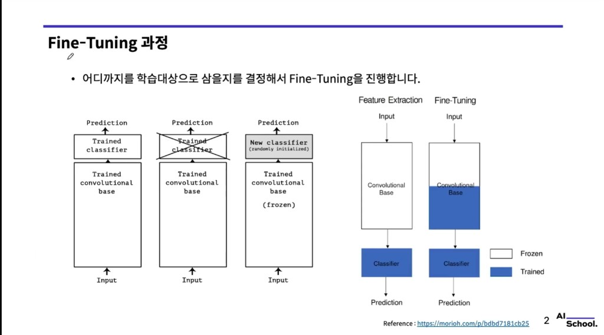
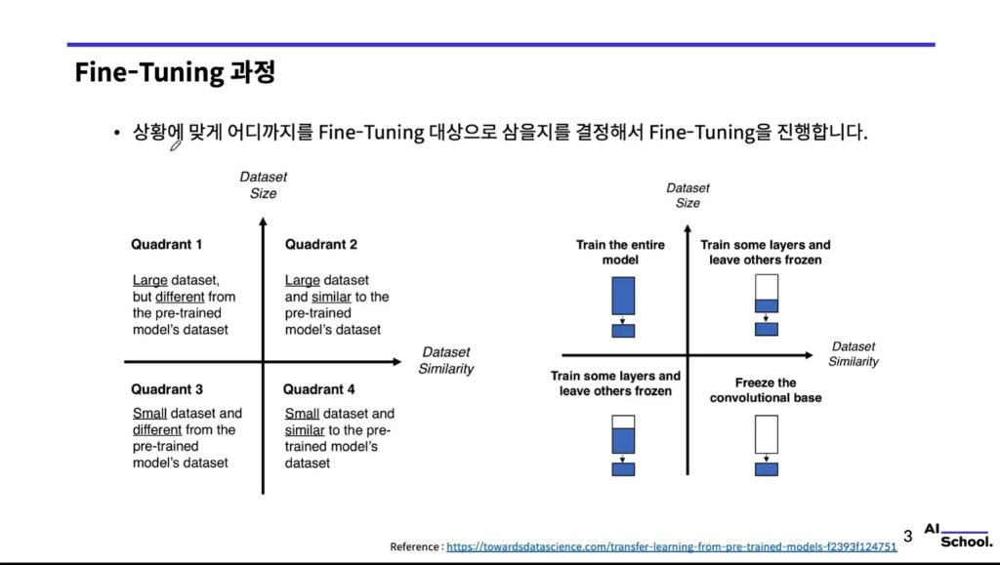

# Fine-Tuning (Transfer Learning · 전이 학습)

> 강의 슬라이드 기반 필기. 실습에서는 보통 `tf.keras.applications` 등 **사전 학습 모델** 위에 **분류 헤드**를 얹고, **동결(freeze)** 범위를 조절한다.

슬라이드 캡처: `images/finetuning/`

---

## 1. 정의

- **Fine-Tuning**: 이미 학습된 신경망 **가중치**를, **새 태스크(데이터·클래스)** 에 맞게 **다시 미세 조정**하는 것.
- 같은 맥락에서 **Transfer Learning(전이 학습)** 이라고도 부른다.

### 전통 ML vs 전이 학습 (그림 6-5 요지)

- **(a) 전통적 학습:** 태스크마다 **처음부터** 별도의 학습 시스템을 둔다. 태스크 간 **지식 공유**가 없다.
- **(b) 전이 학습:** **소스 태스크**에서 얻은 **Knowledge**를 **타깃 태스크** 학습에 **넘겨** 데이터·연산이 부족할 때도 효율적으로 맞춘다.

---

## 2. Fine-Tuning 절차 (베이스 + 새 헤드)

**흐름 요약**

1. **사전 학습 모델** 로드: `Input` → **Convolutional base** → (기존) **Classifier** → 예측  
2. **원래 분류 헤드 제거:** ImageNet 등 **다른 데이터**용 출력층은 새 클래스 수와 맞지 않으므로 **떼어 낸다**.  
3. **새 분류기 부착:** `Input` → **Convolutional base** → **New classifier**(랜덤 초기화) → 예측  
   - 초기에는 base를 **frozen** 해 두고 **헤드만** 학습하는 경우가 많다.

### Feature Extraction vs Fine-Tuning (슬라이드 색 코드)

- **흰색 = Frozen**, **파란색 = 학습(Train)**

| 전략 | Base | Classifier |
|------|------|------------|
| **Feature extraction** | 전부 frozen | 학습 |
| **Fine-tuning** | **일부 상위 블록**까지 학습 | 학습 |

즉, **특징 추출**은 base를 고정한 채 **선형·소형 MLP 헤드**만 맞추고, **파인튜닝**은 **높은 층**부터 풀어 **도메인 적응**을 더 시킨다.

(참고 링크 예: [morioh — transfer learning 개요](https://morioh.com/p/bdbd7181cb25))

---

## 3. 데이터 크기·유사도에 따른 전략 (2×2 매트릭스)

두 축:

- **세로:** 데이터 **양** (작음 ↔ 큼)  
- **가로:** 사전 학습 데이터와의 **유사도** (다름 ↔ 비슷)

**사분면별 권장 (슬라이드 요지)**

| 데이터 | 유사도 | 전략 (슬라이드 시각) |
|--------|--------|----------------------|
| **큼** | **다름** | **전체 모델**을 학습 대상으로 두는 쪽이 유리할 수 있음 (전체 블루) |
| **큼** | **비슷** | **일부 층만** 학습, 나머지 frozen |
| **작음** | **다름** | **일부 층만** 학습 + 나머지 frozen (실무에서는 하이퍼·데이터에 따라 조정) |
| **작음** | **비슷** | **Convolutional base 전체 frozen**, **분류 헤드만** 학습 |

핵심은 **“어디까지를 `trainable` 로 둘지”** 를 **데이터 규모·도메인 격차**에 맞게 정한다는 것이다.

---

## 4. 코드에서의 대응 (Keras 스타일)

- 사전 학습 모델: `base_model = tf.keras.applications.XXX(..., include_top=False, ...)`
- **동결:** `base_model.trainable = False` (또는 층별 `layer.trainable = False`)
- **새 헤드:** `GlobalAveragePooling2D` → `Dense` 등으로 `Sequential` / Functional API 결합
- **파인튜닝 단계:** 상위 블록만 `True` 로 풀고 **작은 learning rate** 로 추가 학습

---

## 한 줄 정리

**Fine-Tuning**은 사전 학습 **표현(representation)** 을 유지·조정하면서 **새 헤드**(및 필요 시 **상위 conv**)만 학습해 **적은 데이터**로도 **새 태스크**에 맞추는 **전이 학습**의 대표 실무 패턴이다.
