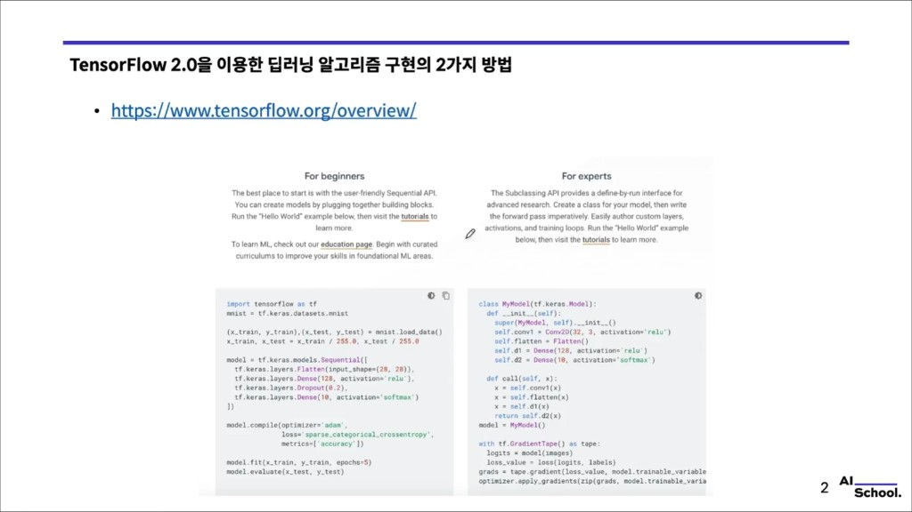
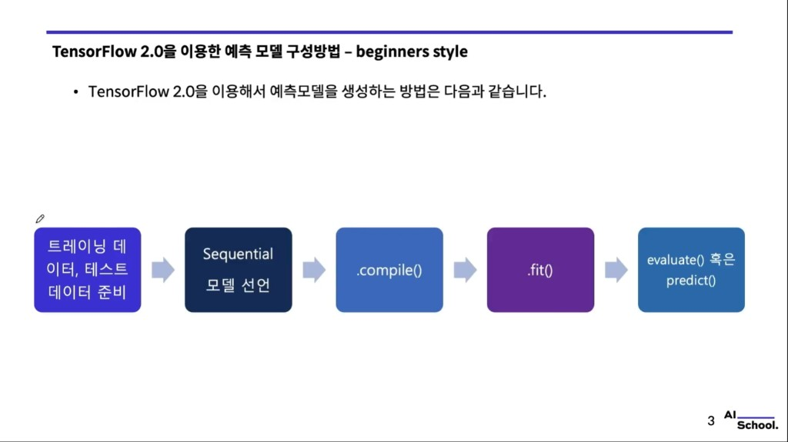
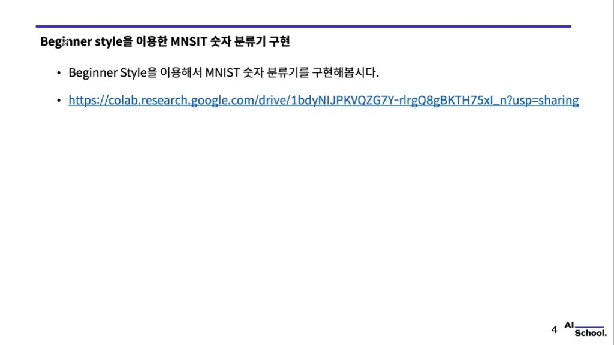

# TensorFlow 2.0 — 딥러닝 구현의 두 가지 방법 (high-level vs low-level)

> 강의 슬라이드 기반 필기. 공식 개요: [TensorFlow — Overview](https://www.tensorflow.org/overview/)

슬라이드 캡처: `images/tf2_impl/`

---

## 1. 두 갈래: `fit` vs 직접 학습 루프


TensorFlow 2.0에서 딥러닝을 구현하는 대표적인 선택지는 다음과 같다.

| 방식 | 요약 |
|------|------|
| **High-level** | **`model.fit()`** 등으로 **학습 루프를 프레임워크에 맡김** |
| **Low-level** | **경사 하강(Gradient Descent) 과정**을 `tf.GradientTape` 등으로 **직접** 작성 |

(같은 주제의 다른 캡처: [`02_two_ways_flow_alt.png`](images/tf2_impl/02_two_ways_flow_alt.png))

---

## 2. 공식 문서의 Beginners vs Experts



### For beginners — `Sequential` + `compile` / `fit`

블록을 조립해 모델을 만들고, **`.compile()`** 로 옵티마이저·손실·지표를 정한 뒤 **`.fit()`** 으로 학습한다.

```python
import tensorflow as tf

mnist = tf.keras.datasets.mnist
(x_train, y_train), (x_test, y_test) = mnist.load_data()
x_train, x_test = x_train / 255.0, x_test / 255.0

model = tf.keras.models.Sequential([
    tf.keras.layers.Flatten(input_shape=(28, 28)),
    tf.keras.layers.Dense(128, activation="relu"),
    tf.keras.layers.Dropout(0.2),
    tf.keras.layers.Dense(10, activation="softmax"),
])

model.compile(
    optimizer="adam",
    loss="sparse_categorical_crossentropy",
    metrics=["accuracy"],
)

model.fit(x_train, y_train, epochs=5)
model.evaluate(x_test, y_test)
```

### For experts — `Model` 서브클래싱 + 커스텀 학습

**define-by-run** 스타일로 `call` 안에 순전파를 쓰고, **`tf.GradientTape`** 로 손실·그래디언트·`apply_gradients` 를 직접 돌린다.

```python
class MyModel(tf.keras.Model):
    def __init__(self):
        super().__init__()
        self.conv1 = tf.keras.layers.Conv2D(32, 3, activation="relu")
        self.flatten = tf.keras.layers.Flatten()
        self.d1 = tf.keras.layers.Dense(128, activation="relu")
        self.d2 = tf.keras.layers.Dense(10, activation="softmax")

    def call(self, x):
        x = self.conv1(x)
        x = self.flatten(x)
        x = self.d1(x)
        return self.d2(x)


model = MyModel()

# 아래는 슬라이드 예시 골격: loss, images, labels, optimizer는 실제 코드에서 정의
# with tf.GradientTape() as tape:
#     logits = model(images)
#     loss_value = loss_fn(labels, logits)
# grads = tape.gradient(loss_value, model.trainable_variables)
# optimizer.apply_gradients(zip(grads, model.trainable_variables))
```

---

## 3. Beginner 스타일 — 예측 모델 구성 흐름 (5단계)



1. **학습·테스트 데이터 준비**  
2. **`Sequential` 모델 선언** (또는 Functional / Subclassing)  
3. **`.compile()`** — 옵티마이저, 손실, metrics  
4. **`.fit()`** — 학습  
5. **`.evaluate()`** 또는 **`.predict()`** — 검증·추론  

---

## 4. Beginner style MNIST 분류기 (Colab)



- **Colab 노트북:** [MNIST Beginner (Google Colab)](https://colab.research.google.com/drive/1bdyNIJPKVQZG7Y-rlrgQ8gBKTH75xl_n?usp=sharing)

위 노트북에서 **high-level API** 로 MNIST 숫자 분류를 실습할 수 있다.

---

## 한 줄 정리

**TF 2.0**에서는 **`Sequential`/`compile`/`fit`** 으로 빠르게 가져가거나, **`GradientTape` 기반 커스텀 루프**로 연구·특수 학습 절차를 세밀하게 제어하는 **두 축**을 상황에 맞게 고르면 된다.
