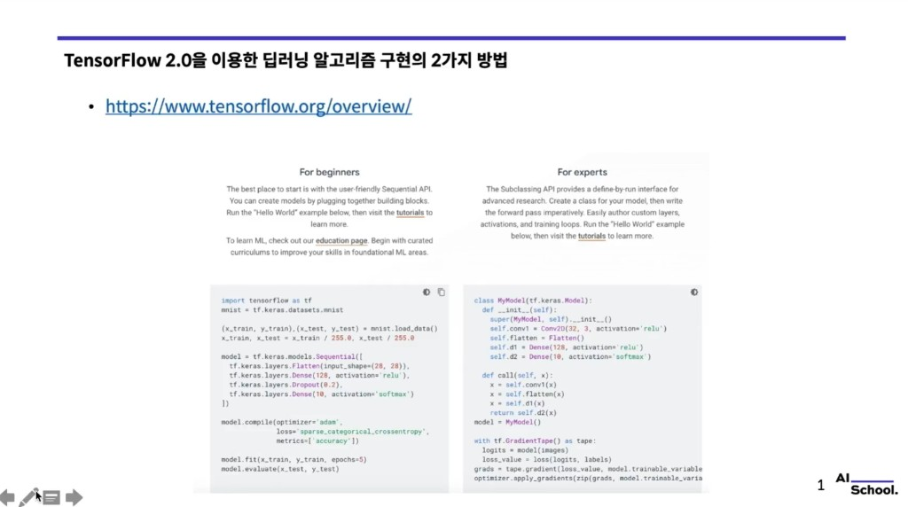
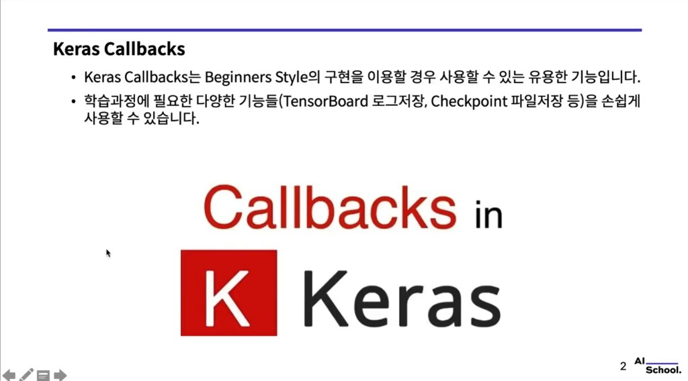
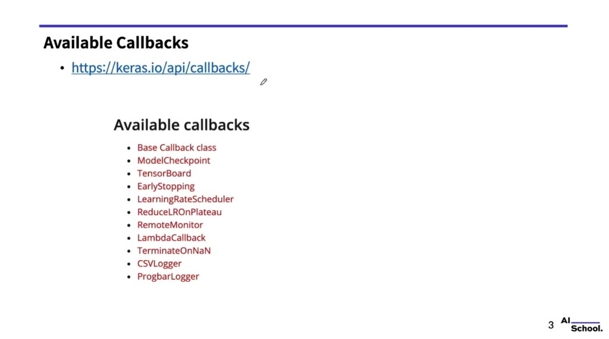
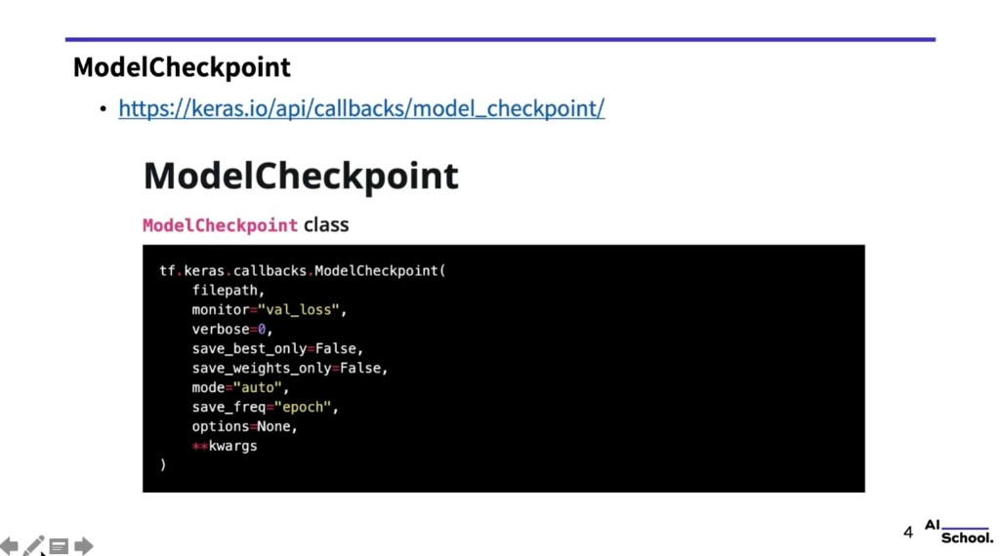
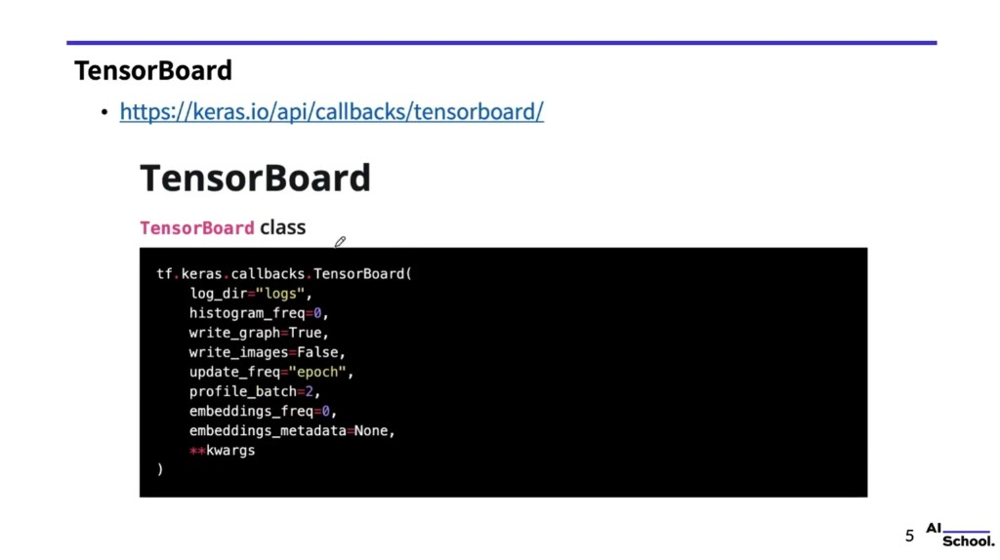
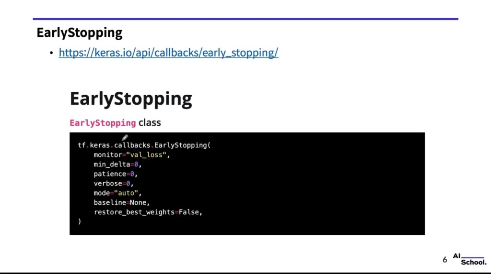
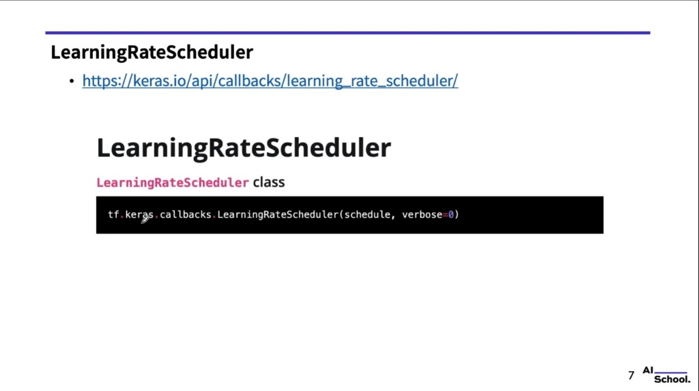
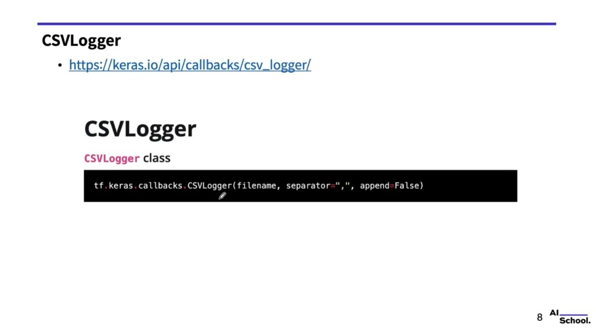
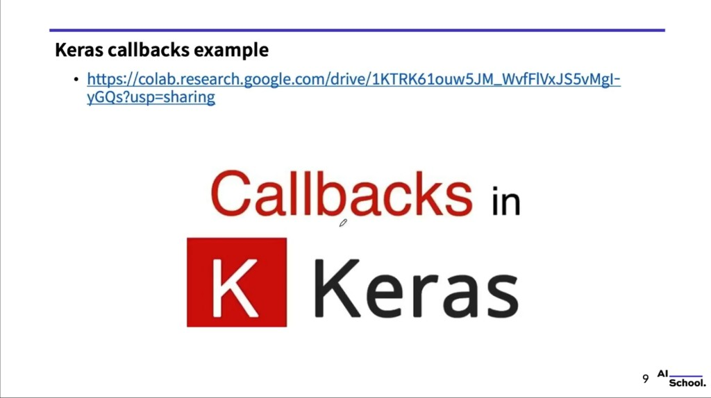

# Keras Callbacks — 학습 중 로깅·체크포인트·조기 종료

> 강의 슬라이드 기반 필기. 공식 API: [Keras Callbacks](https://keras.io/api/callbacks/) · TensorFlow 개요: [tensorflow.org/overview](https://www.tensorflow.org/overview/)  
> `Sequential` + `model.fit()` 흐름은 [06. high-level vs low-level](06.tensorflow2_high_level_low_level.md), TensorBoard 예제는 [02. MNIST + TensorBoard](02.mnist_classification_using_cnn_v2_keras_with_tensorboard.md)와 연결해서 보면 좋다.

슬라이드 캡처: `images/keras_callbacks/`

---

## 1. TensorFlow 2.0으로 모델을 짜는 두 가지 방향



- **초심자 스타일:** `tf.keras` **Sequential** 등으로 레이어를 쌓고, `compile` / `fit` / `evaluate` 로 학습·평가 (MNIST 예: `Flatten` → `Dense` → `Dropout` → `softmax`).
- **연구·커스텀:** **`tf.keras.Model` 서브클래스** + `call`, 필요 시 **`tf.GradientTape`** 로 직접 역전파·`apply_gradients`.

**Callbacks**는 주로 전자처럼 **`model.fit(..., callbacks=[...])`** 를 쓸 때 붙여서, 에폭마다 할 일(저장, 로그, LR 조정 등)을 선언적으로 넣는다.

---

## 2. Keras Callbacks가 하는 일



- **초보자 스타일 구현**에서도 쓰기 좋은 기능이다.
- 학습 과정에서 필요한 일을 쉽게 붙일 수 있다. 예: **TensorBoard 로그**, **체크포인트(가중치/모델) 저장**.

---

## 3. 대표 Callback 목록



| Callback | 용도 요약 |
| :--- | :--- |
| **Base `Callback`** | 다른 콜백의 기반 클래스 |
| **`ModelCheckpoint`** | 주기적으로 모델·가중치 저장 |
| **`TensorBoard`** | TensorBoard용 로그 기록 |
| **`EarlyStopping`** | 지표가 나아지지 않으면 학습 중단 |
| **`LearningRateScheduler`** | 에폭마다 학습률을 함수로 갱신 |
| **`ReduceLROnPlateau`** | 지표 정체 시 LR 감소 |
| **`RemoteMonitor`** | 서버로 이벤트 스트리밍 |
| **`LambdaCallback`** | 간단한 커스텀 로직을 람다로 |
| **`TerminateOnNaN`** | loss가 NaN이면 종료 |
| **`CSVLogger`** | 에폭 결과를 CSV로 기록 |
| **`ProgbarLogger`** | stdout에 메트릭 출력 |

---

## 4. `ModelCheckpoint`

문서: [ModelCheckpoint](https://keras.io/api/callbacks/model_checkpoint/)



```python
tf.keras.callbacks.ModelCheckpoint(
    filepath,
    monitor="val_loss",
    verbose=0,
    save_best_only=False,
    save_weights_only=False,
    mode="auto",
    save_freq="epoch",
    options=None,
    **kwargs
)
```

- **`save_best_only`**: 개선될 때만 덮어쓰기 여부.
- **`save_weights_only`**: `True`면 가중치만, `False`면 전체 모델 저장 흐름에 가깝게 동작.
- **`save_freq`**: `"epoch"` 또는 N 배치마다 등.

---

## 5. `TensorBoard`

문서: [TensorBoard](https://keras.io/api/callbacks/tensorboard/)



```python
tf.keras.callbacks.TensorBoard(
    log_dir="logs",
    histogram_freq=0,
    write_graph=True,
    write_images=False,
    update_freq="epoch",
    profile_batch=2,
    embeddings_freq=0,
    embeddings_metadata=None,
    **kwargs
)
```

로컬에서 확인: 터미널에서 `tensorboard --logdir=logs` (또는 지정한 `log_dir`) 후 브라우저에서 대시보드 연다.

---

## 6. `EarlyStopping`

문서: [EarlyStopping](https://keras.io/api/callbacks/early_stopping/)



```python
tf.keras.callbacks.EarlyStopping(
    monitor="val_loss",
    min_delta=0,
    patience=0,
    verbose=0,
    mode="auto",
    baseline=None,
    restore_best_weights=False,
)
```

- **`patience`**: 개선 없이 기다릴 에폭 수.
- **`restore_best_weights`**: `True`면 가장 좋았던 스텝의 가중치로 되돌림.

---

## 7. `LearningRateScheduler`

문서: [LearningRateScheduler](https://keras.io/api/callbacks/learning_rate_scheduler/)



```python
tf.keras.callbacks.LearningRateScheduler(schedule, verbose=0)
```

- **`schedule(epoch, lr)`**: 현재 에폭 인덱스(0부터)와 현재 LR을 받아 **새 LR(float)** 을 반환.

---

## 8. `CSVLogger`

문서: [CSVLogger](https://keras.io/api/callbacks/csv_logger/)



```python
tf.keras.callbacks.CSVLogger(filename, separator=",", append=False)
```

- **`append`**: 이어 쓰기 여부.

---

## 9. 예제 노트북 (Colab)



- 강의에서 안내한 예제: [Google Colab — Keras callbacks example](https://colab.research.google.com/drive/1KTRK61ouw5JM_WvfFlVxJS5vMgl-yGQs?usp=sharing)

**`fit`에 같이 넘기기 (개념):**

```python
callbacks = [
    tf.keras.callbacks.ModelCheckpoint("ckpt.keras", save_best_only=True, monitor="val_loss"),
    tf.keras.callbacks.TensorBoard(log_dir="logs/fit"),
    tf.keras.callbacks.EarlyStopping(patience=3, restore_best_weights=True),
    tf.keras.callbacks.CSVLogger("training_log.csv"),
]
model.fit(x_train, y_train, validation_data=(x_val, y_val), epochs=20, callbacks=callbacks)
```

---

## 한 줄 정리

**Callback**은 `fit`이 도는 동안 정해진 시점에 **저장·로그·LR·중단** 같은 부가 동작을 끼워 넣는 훅이다. 실무에서는 `ModelCheckpoint` + `EarlyStopping` + (`TensorBoard` 또는 `CSVLogger`) 조합을 자주 쓴다.
