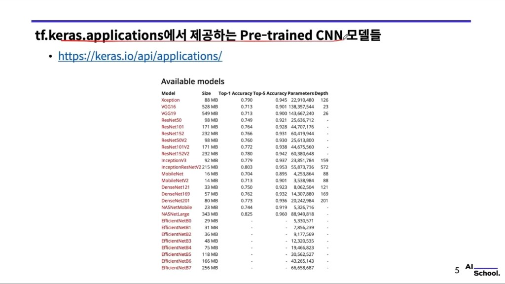
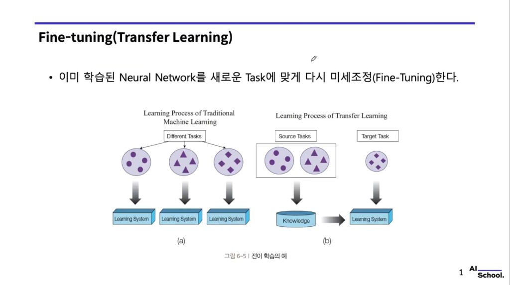
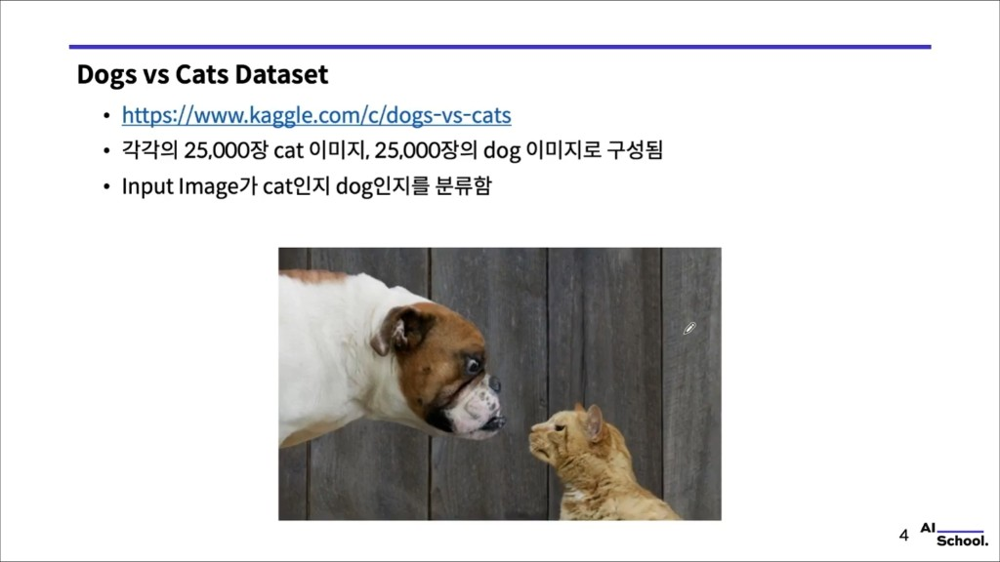

# `tf.keras.applications` — 사전 학습 CNN 모델 · Dogs vs Cats 맥락

> 강의 슬라이드 기반 필기. 공식 API: [Keras Applications](https://keras.io/api/applications/)  
> 전이 학습·동결 범위에 대한 정리는 [05. Fine-Tuning 필기](05.finetuning_transfer_learning.md)와 함께 보면 좋다.

슬라이드 캡처: `images/tf_keras_pretrained/`

---

## 1. `tf.keras.applications` 에서 제공하는 모델



ImageNet 등으로 **미리 학습된 가중치**를 불러와 **특징 추출** 또는 **파인튜닝**에 쓴다.  
아래 표는 슬라이드에 인쇄된 수치이며, **Keras/TF 버전**에 따라 문서의 수치가 갱신될 수 있으므로 최종 확인은 [공식 Applications 문서](https://keras.io/api/applications/)를 따른다.

| Model | Size (MB) | Top-1 Acc. | Top-5 Acc. | Parameters | Depth |
| :--- | ---: | :---: | :---: | ---: | :---: |
| Xception | 88 | 0.790 | 0.945 | 22,910,480 | 126 |
| VGG16 | 528 | 0.713 | 0.901 | 138,357,544 | 23 |
| VGG19 | 549 | 0.713 | 0.900 | 143,667,240 | 26 |
| ResNet50 | 98 | 0.749 | 0.921 | 25,636,712 | — |
| ResNet101 | 171 | 0.764 | 0.928 | 44,707,176 | — |
| ResNet152 | 232 | 0.766 | 0.931 | 60,419,944 | — |
| ResNet50V2 | 98 | 0.760 | 0.930 | 25,613,800 | — |
| ResNet101V2 | 171 | 0.772 | 0.938 | 44,675,560 | — |
| ResNet152V2 | 232 | 0.780 | 0.942 | 60,380,648 | — |
| InceptionV3 | 92 | 0.779 | 0.937 | 23,851,784 | 159 |
| InceptionResNetV2 | 215 | 0.803 | 0.953 | 55,873,736 | 572 |
| MobileNet | 16 | 0.704 | 0.895 | 4,253,864 | 88 |
| MobileNetV2 | 14 | 0.713 | 0.901 | 3,538,984 | 88 |
| DenseNet121 | 33 | 0.750 | 0.923 | 8,062,504 | 121 |
| DenseNet169 | 57 | 0.762 | 0.932 | 14,307,880 | 169 |
| DenseNet201 | 80 | 0.773 | 0.936 | 20,242,984 | 201 |
| NASNetMobile | 23 | 0.744 | 0.919 | 5,326,716 | — |
| NASNetLarge | 343 | 0.825 | 0.960 | 88,949,818 | — |
| EfficientNetB0 | 29 | — | — | 5,330,571 | — |
| EfficientNetB1 | 31 | — | — | 7,856,239 | — |
| EfficientNetB2 | 36 | — | — | 9,177,569 | — |
| EfficientNetB3 | 48 | — | — | 12,320,535 | — |
| EfficientNetB4 | 75 | — | — | 19,466,823 | — |
| EfficientNetB5 | 118 | — | — | 30,562,527 | — |
| EfficientNetB6 | 166 | — | — | 43,265,143 | — |
| EfficientNetB7 | 256 | — | — | 66,658,687 | — |

**사용 예 (개념):**

```python
base = tf.keras.applications.ResNet50(
    weights="imagenet",
    include_top=False,
    input_shape=(224, 224, 3),
)
```

- **`include_top=False`**: ImageNet 1000-class 헤드를 빼고 **특징 추출기만** 쓰기 좋다.  
- **`weights='imagenet'`** (또는 `None`): 사전 학습 가중치 사용 여부.

---

## 2. 왜 쓰나: Fine-Tuning · Transfer Learning



- **Fine-Tuning**: 이미 학습된 네트워크를 **새 태스크**(클래스 수·데이터 분포)에 맞게 **가중치를 미세 조정**한다.  
- **Transfer Learning**: 소스 태스크에서 얻은 **지식(Knowledge)** 을 타깃 태스크 학습에 **넘겨** 데이터·시간을 절약한다.

실무에서는 `applications` 로 **베이스**를 고르고, **새 분류 헤드**를 얹은 뒤 **동결 범위**를 조절한다. 자세한 전략은 [05 필기](05.finetuning_transfer_learning.md) 참고.

---

## 3. Dogs vs Cats 데이터셋 (이진 분류 예시)



- **출처:** [Kaggle — Dogs vs Cats](https://www.kaggle.com/c/dogs-vs-cats)  
- **규모:** 고양이 이미지 **25,000장**, 개 이미지 **25,000장** (합계 50,000장)  
- **태스크:** 입력 이미지가 **고양이인지 개인지** 이진 분류  

`applications` 의 ImageNet 사전 학습 모델을 베이스로 두고, **2-class 헤드** + **binary cross-entropy**(또는 `sigmoid` + `binary_crossentropy`) 조합으로 실습하는 전형적인 예제 데이터셋이다.

---

## 한 줄 정리

**`tf.keras.applications`** 는 **검증된 CNN 백본 + ImageNet 가중치**를 한 줄로 불러오게 해 주고, **Dogs vs Cats** 같은 **소규모·다른 도메인** 문제에는 **헤드 교체 + 파인튜닝**으로 연결하는 것이 일반적이다.
