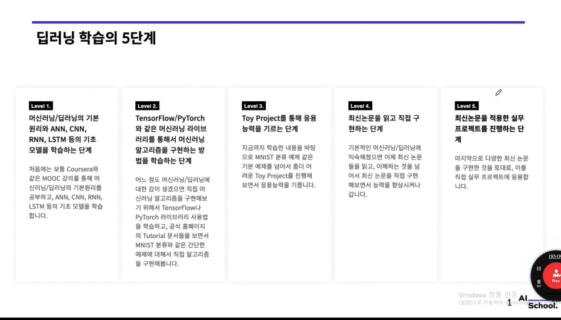
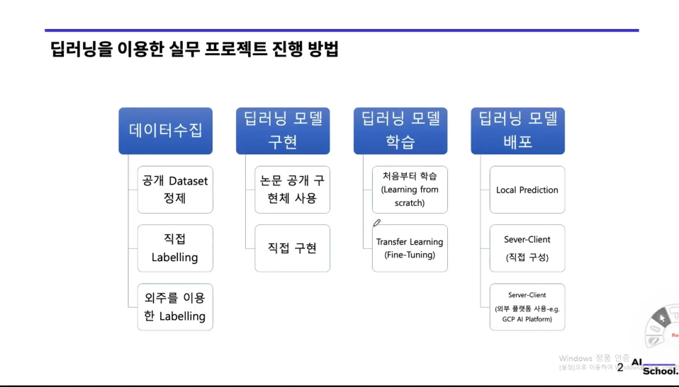
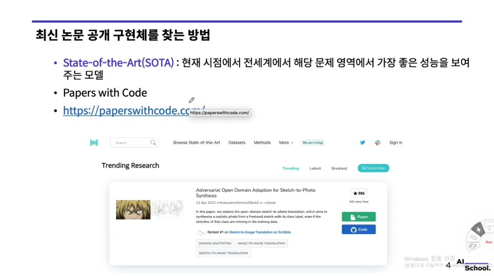
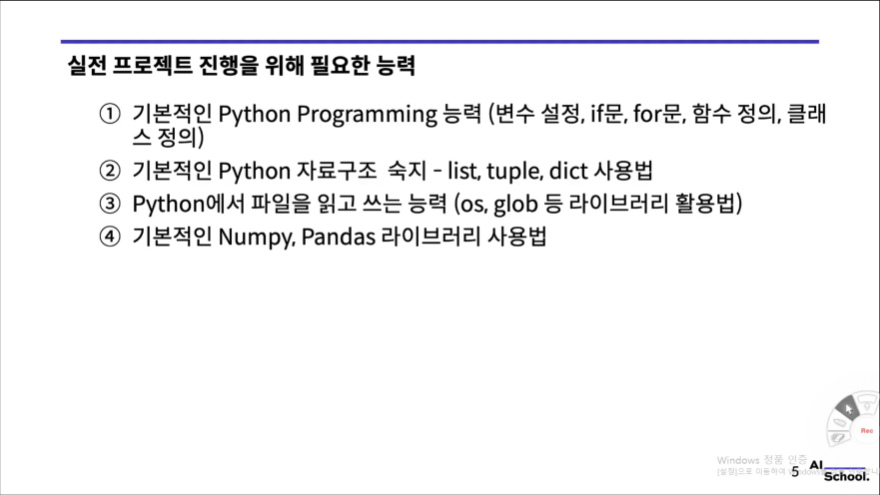
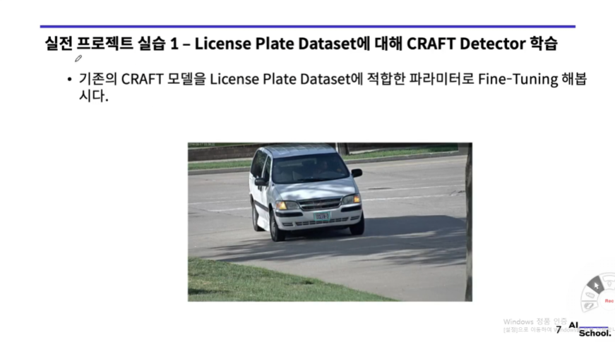
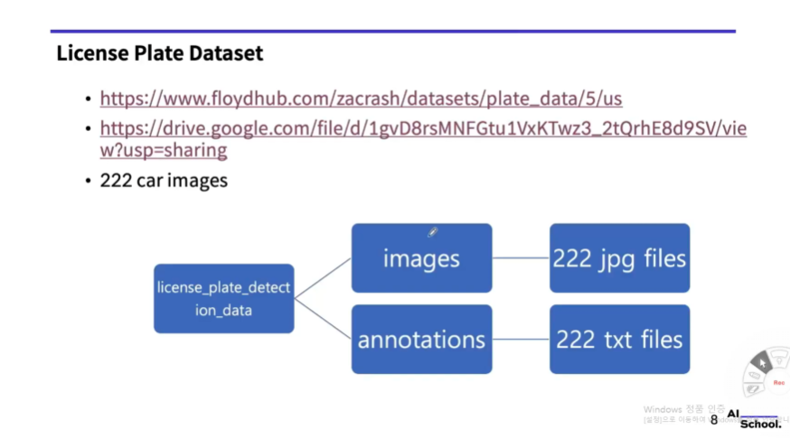
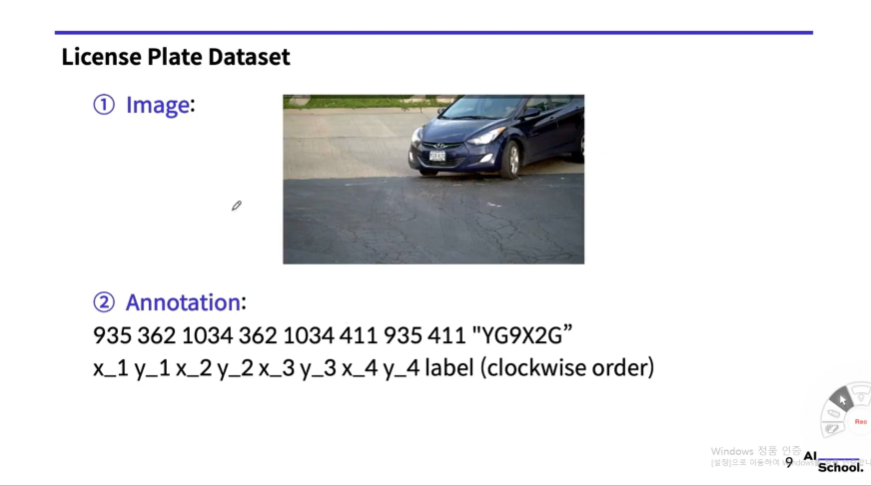
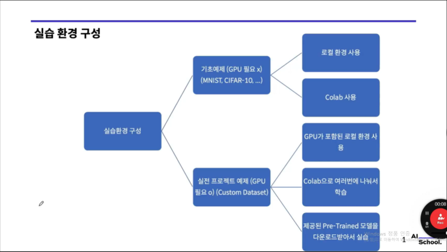

# Deep learning practice roadmap (딥러닝 학습·실무·연구 로드맵)

> 강의 교안 기반 필기. 슬라이드 캡처: `images/`

---

## Part A — 딥러닝 학습의 5단계



### Level 1 — 기초 이론·모델

- **머신러닝·딥러닝 기본 원리**와 **ANN, CNN, RNN, LSTM** 등 **기초 모델**을 익힌다.
- 보통 **Coursera** 등 **MOOC**로 원리를 잡고, 기본 아키텍처를 따라가며 감을 쌓는다.

### Level 2 — 프레임워크·튜토리얼

- **TensorFlow / PyTorch** 등으로 **알고리즘을 구현**하는 방법을 익힌다.
- **공식 Tutorial**을 보며 **MNIST 분류** 같은 **간단한 예제**를 직접 구현해 본다.

### Level 3 — Toy project

- 기본 예제를 넘어 **조금 더 어려운 Toy project**로 **응용력**을 기른다.

### Level 4 — 최신 논문 읽기·구현

- 기초에 익숙해지면 **최신 논문**을 읽고 이해하는 것을 넘어 **직접 구현**하며 역량을 높인다.

### Level 5 — 실무 적용

- 여러 최신 논문 구현 경험을 바탕으로 **실무 프로젝트**에 **직접 적용**한다.

---

## Part B — 딥러닝을 이용한 실무 프로젝트 진행 방법



### 1. 데이터 수집

- **공개 Dataset 정제**
- **직접 Labelling**
- **외주 Labelling**

### 2. 딥러닝 모델 구현

- **논문 공개 구현체** 활용
- **직접 구현**

### 3. 딥러닝 모델 학습

- **처음부터 학습 (from scratch)**
- **Transfer Learning (Fine-Tuning)**

### 4. 딥러닝 모델 배포

- **Local prediction**
- **Server–Client (직접 구성)**
- **Server–Client (외부 플랫폼, e.g. GCP AI Platform)**

---

## Part C — 최신 논문·공개 구현체 찾기 (SOTA, Papers with Code)



- **SOTA (State-of-the-Art):** 당시 기준 해당 문제 영역에서 **세계적으로 가장 좋은 성능**을 내는 모델·방법.
- **[Papers with Code](https://paperswithcode.com/)** 에서 **논문**과 **코드(구현)** 를 함께 찾아볼 수 있다. **Trending**, **Benchmark 랭킹** 등으로 최신 동향을 추적한다.

---

## Part D — 실전 프로젝트에 필요한 역량



1. **Python 기초:** 변수, `if` / `for`, 함수·**클래스** 정의  
2. **자료구조:** `list`, `tuple`, `dict` 사용  
3. **파일 입출력:** `os`, `glob` 등 활용  
4. **NumPy, Pandas** 기본 사용

---

## Part E — 실전 프로젝트 실습 1: License Plate + CRAFT Detector

### E-1. 과제 개요



- **CRAFT** (*Character Region Awareness for Text Detection*): 텍스트 영역 검출에 쓰이는 검출기 모델.
- **실습 목표:** 기존 **CRAFT** 모델을 **번호판(License Plate) 데이터**에 맞게 **Fine-Tuning** 하여, 차량 이미지에서 **번호판 영역**을 잘 찾도록 파라미터를 맞춘다.

### E-2. License Plate Dataset



- **데이터 규모:** 자동차 이미지 **222장**.
- **다운로드 (슬라이드 기준):**
  - [FloydHub — plate_data](https://www.floydhub.com/zacrash/datasets/plate_data/5/us)
  - [Google Drive (백업 링크)](https://drive.google.com/file/d/1gvD8rsMNFGtu1VxKTwz3_2tQrhE8d9SV/view?usp=sharing)

**권장 디렉터리 구조 (예시)**

```text
license_plate_detection_data/
├── images/          # 222장 jpg
└── annotations/     # 222개 txt (라벨·박스 등)
```

### E-3. Annotation 포맷 예시



- 예시 라벨 한 줄:
  - `935 362 1034 362 1034 411 935 411 "YG9X2G"`
- 의미:
  - 앞의 8개 숫자는 번호판 4개 꼭짓점 좌표 `x_1 y_1 x_2 y_2 x_3 y_3 x_4 y_4` 순서
  - 마지막 문자열은 번호판 텍스트 라벨 (예: `"YG9X2G"`)
  - 좌표는 슬라이드 기준 **clockwise order**를 따른다.

### E-4. 실습 환경 구성 가이드



- **기초 예제 (GPU 불필요):** MNIST, CIFAR-10 등은 로컬 환경 또는 Colab으로 진행 가능
- **실전 프로젝트 예제 (GPU 필요):** 커스텀 데이터셋 학습은 GPU 포함 로컬 환경 또는 Colab 분산 학습 권장
- **사전학습 모델 활용:** 제공된 Pre-Trained 모델을 먼저 내려받아 Fine-Tuning 실습으로 이어간다.

---

## 한 줄 정리

**이론·프레임워크 → Toy → 논문 재현 → 실무**로 단계를 밟고, 프로젝트는 **데이터–모델–학습–배포** 파이프로 정리하며, **SOTA·공개 코드**는 Papers with Code로 찾는다. 예로 **CRAFT + 번호판 데이터**처럼 **공개 검출기를 도메인 데이터에 Fine-Tuning** 하고, 데이터 규모에 맞는 **실습 환경(GPU/Colab)** 을 선택해 Part B·D를 연결할 수 있다.
