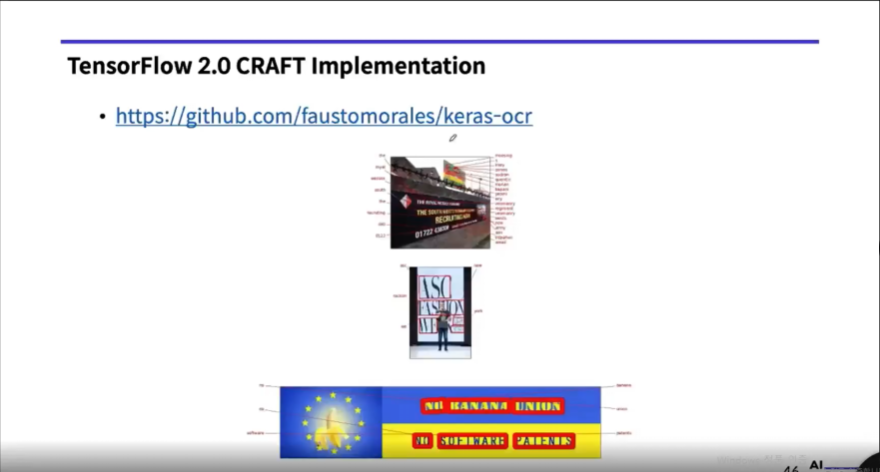

# License Plate + CRAFT practice (실전 프로젝트 실습 1)

> `01.deep_learning_practice_roadmap.md`의 실전 실습 파트를 분리한 정리 노트.

---

## Part A — 과제 개요


- **CRAFT** (*Character Region Awareness for Text Detection*): 텍스트 영역 검출에 쓰이는 검출기 모델.
- **실습 목표:** 기존 **CRAFT** 모델을 **번호판(License Plate) 데이터**에 맞게 **Fine-Tuning** 하여, 차량 이미지에서 **번호판 영역**을 잘 찾도록 파라미터를 맞춘다.

---

## Part B — License Plate Dataset


- **데이터 규모:** 자동차 이미지 **222장**.
- **다운로드 (슬라이드 기준):**
  - [FloydHub — plate_data](https://www.floydhub.com/zacrash/datasets/plate_data/5/us)
  - [Google Drive (백업 링크)](https://drive.google.com/file/d/1gvD8rsMNFGtu1VxKTwz3_2tQrhE8d9SV/view?usp=sharing)

**권장 디렉터리 구조 (예시)**

```text
license_plate_detection_data/
├── images/          # 222장 jpg
└── annotations/     # 222개 txt (라벨·박스 등)
```

---

## Part C — Annotation 포맷 예시


- 예시 라벨 한 줄:
  - `935 362 1034 362 1034 411 935 411 "YG9X2G"`
- 의미:
  - 앞의 8개 숫자는 번호판 4개 꼭짓점 좌표 `x_1 y_1 x_2 y_2 x_3 y_3 x_4 y_4` 순서
  - 마지막 문자열은 번호판 텍스트 라벨 (예: `"YG9X2G"`)
  - 좌표는 슬라이드 기준 **clockwise order**를 따른다.

---

## Part D — 실습 환경 구성 가이드


- **기초 예제 (GPU 불필요):** MNIST, CIFAR-10 등은 로컬 환경 또는 Colab으로 진행 가능
- **실전 프로젝트 예제 (GPU 필요):** 커스텀 데이터셋 학습은 GPU 포함 로컬 환경 또는 Colab 분산 학습 권장
- **사전학습 모델 활용:** 제공된 Pre-Trained 모델을 먼저 내려받아 Fine-Tuning 실습으로 이어간다.

---

## Part E — TensorFlow 2.0 CRAFT 구현 참고



- 구현 참고 링크: [faustomorales/keras-ocr](https://github.com/faustomorales/keras-ocr)
- CRAFT 텍스트 검출 파이프라인을 TensorFlow 2.x 환경에서 빠르게 실습할 때 출발점으로 사용할 수 있다.

---

## 한 줄 정리

**실전 실습 1**은 `데이터셋 구조 이해 → annotation 파싱 → 학습 환경 선택 → 공개 구현체 기반 Fine-Tuning` 흐름으로 정리한다.
