# Week 7 — Object Detection & R-CNN 계열 (R-CNN → Fast R-CNN → Faster R-CNN)

> **이 문서의 목표**: GitHub 페이지만 보고 Object Detection을 처음 접하는 사람도 R-CNN 계열의 발전 흐름을 완전히 이해할 수 있도록, 각 개념을 단계별로 풀어서 설명합니다.

---

## 들어가기 전에 — Object Detection이란?

딥러닝 비전 태스크는 크게 세 가지로 나뉩니다.

| 태스크 | 질문 | 출력 |
|--------|------|------|
| **Classification** | "이 이미지에 뭐가 있나?" | 클래스 레이블 1개 |
| **Object Detection** | "이미지의 어디에, 무엇이 있나?" | 클래스 레이블 + 위치(Bounding Box) |
| **Segmentation** | "각 픽셀이 어떤 물체에 속하나?" | 픽셀 단위 레이블 |

Object Detection은 Classification보다 훨씬 어렵습니다. 물체의 **위치(어디에)**와 **종류(무엇인지)**를 동시에 맞혀야 하기 때문입니다. 2012년 AlexNet이 Classification에서 혁신을 보여준 뒤, 자연스럽게 "딥러닝으로 Detection도 할 수 있을까?"라는 질문이 이어졌고, 그 답이 바로 **R-CNN(2014)** 입니다.

---

## Part A — TensorFlow Object Detection API 주요 모델

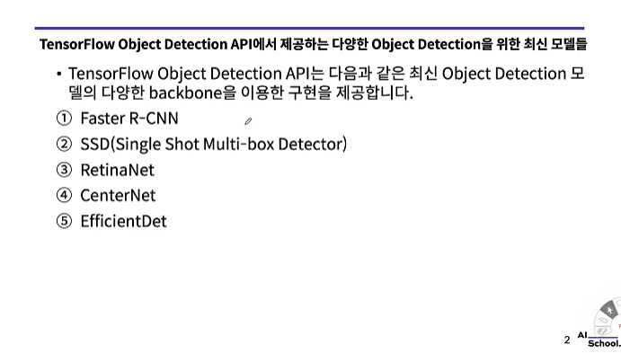

이 강의에서 다루는 모델들을 포함해, TensorFlow Object Detection API는 현재 가장 많이 쓰이는 다음 5가지 모델의 구현을 제공합니다.

| 모델 | 방식 | 핵심 특징 |
|------|------|-----------|
| **Faster R-CNN** | Two-stage | 높은 정확도, RPN으로 proposal 생성 |
| **SSD** | One-stage | 다양한 스케일에서 동시 탐지, 빠름 |
| **RetinaNet** | One-stage | Focal Loss로 class imbalance 해결 |
| **CenterNet** | One-stage | 물체 중심점(keypoint) 기반 탐지 |
| **EfficientDet** | One-stage | EfficientNet backbone + BiFPN(양방향 FPN) |

이 중 강의의 핵심 주제는 **R-CNN → Fast R-CNN → Faster R-CNN**의 발전 흐름입니다.  
이를 이해하면 현대 Object Detection 아키텍처의 설계 철학을 파악할 수 있습니다.

---

## Part B — Object Detector 분류: One-stage vs Two-stage

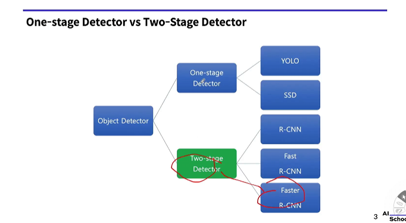

Object Detector는 "어떻게 물체를 찾는가"에 따라 두 계열로 나뉩니다.

### Two-stage Detector (두 단계)

```
[Stage 1] 이미지에서 "물체가 있을 것 같은 후보 영역(Region Proposal)" 생성
                              ↓
[Stage 2] 각 후보 영역에 대해 "이게 실제로 무슨 물체인지" 분류 + 위치 정밀화
```

- **대표 모델**: R-CNN, Fast R-CNN, Faster R-CNN
- **장점**: 후보 영역을 먼저 좁히고 분류하므로 **정확도가 높음**
- **단점**: 두 단계를 거치므로 **속도가 느림**

### One-stage Detector (한 단계)

```
[단 한 번의 forward pass로] 이미지 전체를 스캔하며 물체의 위치 + 종류를 동시에 예측
```

- **대표 모델**: YOLO, SSD
- **장점**: 빠른 속도, 실시간 처리 가능
- **단점**: 정확도가 Two-stage보다 낮을 수 있음 (특히 작은 물체)

> **직관적 비유**: Two-stage는 "관심 있어 보이는 곳을 먼저 표시해두고, 그 곳을 자세히 들여다보는" 방식. One-stage는 "사진 전체를 한 번에 훑으며 바로 답을 내는" 방식입니다.

---

## Part C — R-CNN 계열의 발전 흐름

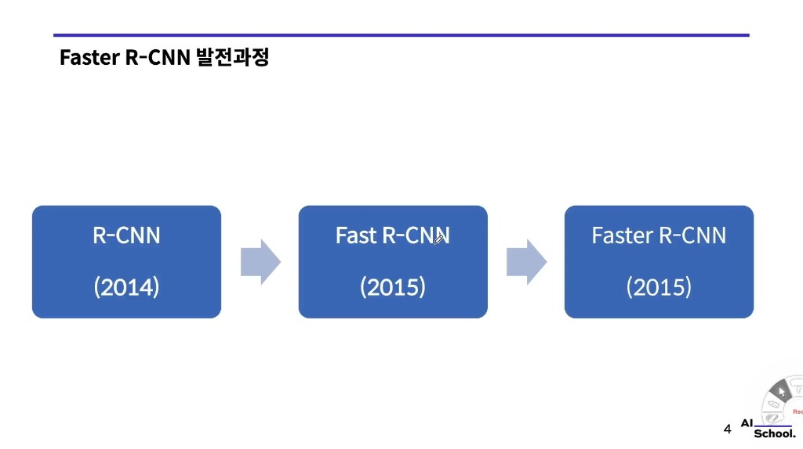

| 모델 | 발표 연도 | 핵심 개선 내용 |
|------|-----------|---------------|
| **R-CNN** | 2014 | CNN으로 Object Detection, 최초의 딥러닝 기반 탐지기 |
| **Fast R-CNN** | 2015 (Apr) | 이미지 전체를 한 번만 CNN에 통과 (146× 속도 향상) |
| **Faster R-CNN** | 2015 (Jun) | Region Proposal도 네트워크 내부에서 (250× 속도 향상) |

세 모델 모두 같은 연구실(Ross Girshick)에서 나왔으며, 각 모델은 이전 모델의 병목(bottleneck)을 하나씩 해결하면서 발전했습니다.

---

## Part D — R-CNN 개요: 딥러닝으로 Detection에 도전하다

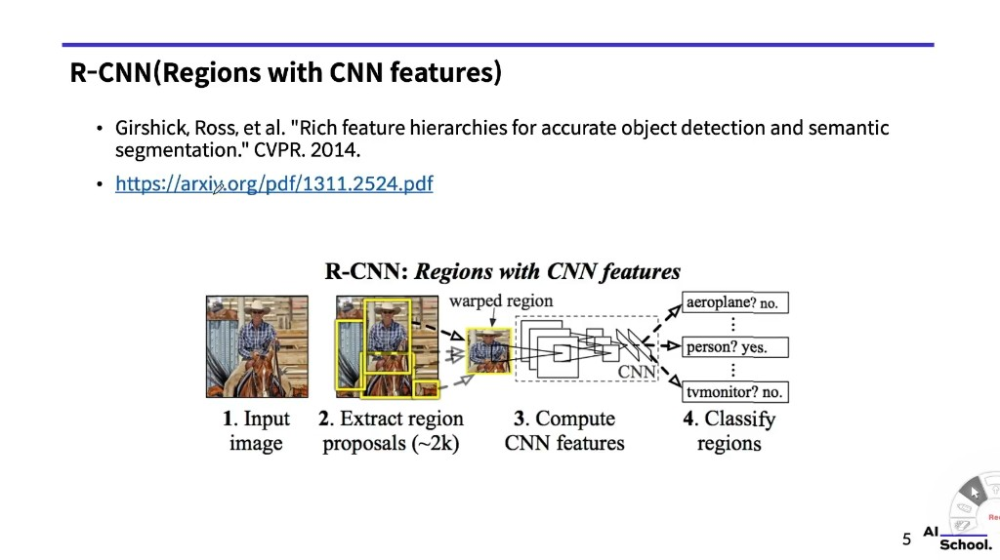

> **논문**: Girshick, Ross, et al. *"Rich feature hierarchies for accurate object detection and semantic segmentation."* **CVPR 2014.**  
> **논문 링크**: [arxiv.org/pdf/1311.2524.pdf](https://arxiv.org/pdf/1311.2524.pdf)

### 왜 R-CNN이 등장했는가?

2012년 AlexNet이 ImageNet LSVRC Classification 대회에서 top-5 error 15.3%를 달성했습니다 (2위 대비 10%p 이상 차이). 이것은 딥러닝이 "보는 것"에 대단히 뛰어남을 증명했습니다.

> R-CNN에는 사용자의 필기가 포함되어 있습니다:  
> *AlexNet이 Classification에서 압도적 성능을 보인 뒤, 자연스럽게 Detection 연구에도 CNN을 적용하려는 시도가 이어졌다. 당시까지 Detection은 HOG, DPM 같은 고전 방법론이 지배하고 있었고, R-CNN은 CNN의 강력한 feature 추출 능력을 Detection에 처음으로 성공적으로 결합한 논문이다.*

### R-CNN 추론의 4단계

슬라이드에 표시된 R-CNN의 전체 추론 흐름입니다:

```
① Input image 입력
        ↓
② Selective Search로 ~2,000개 Region Proposal 추출
        ↓
③ 각 region을 227×227로 warp → CNN에 통과 → 4096-d feature 추출
        ↓
④ Linear SVM으로 클래스 분류 + Bounding Box Regression으로 위치 보정
```

이 흐름의 핵심 문제는 ③에 있습니다. 2,000개의 region을 **각각 별도로** CNN에 통과시키기 때문에, 이미지 한 장에 2,000번의 CNN 연산이 필요합니다. 이것이 R-CNN이 느린 근본 원인입니다.

---

## Part E — R-CNN Architecture 상세

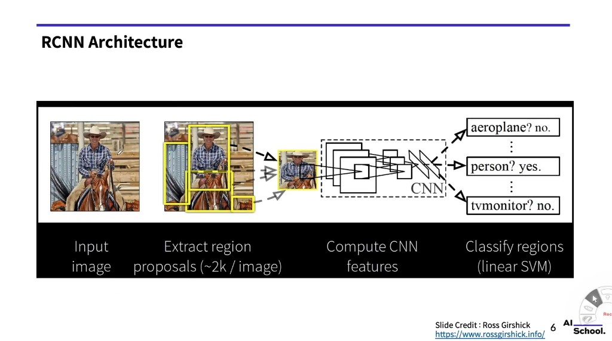

슬라이드의 R-CNN 아키텍처를 왼쪽에서 오른쪽으로 따라가 봅시다.

### 전체 파이프라인

```
[Input Image]
      ↓
[Selective Search] → ~2,000개 Region Proposals (각각 다른 크기와 비율)
      ↓
[Crop + Warp] → 각 region을 227×227 고정 크기로 변환
      ↓
[CNN (AlexNet)] → 각 region에서 4,096-dim feature vector 추출
      ↓
[Linear SVM (클래스별)] → "이 region이 고양이인가, 개인가, 배경인가?"
      ↓
[Bounding Box Regression] → proposal 위치를 GT box에 맞게 미세 조정
```

### 왜 227×227로 강제 변환하는가?

CNN(특히 AlexNet)의 FC layer는 **고정된 크기의 입력**을 요구합니다.  
Selective Search가 뽑아주는 region은 크기와 비율이 제각각이기 때문에, CNN에 넣기 전에 모두 동일한 크기(227×227)로 리사이즈합니다. 이를 **anisotropic scaling(왜곡 허용 리사이즈)** 이라고 합니다.

> 단점: 비율을 맞추지 않고 강제로 늘리기 때문에 물체가 찌그러질 수 있습니다. Fast R-CNN의 RoI Pooling이 이 문제를 해결합니다.

### 왜 Linear SVM을 사용하는가?

R-CNN은 CNN의 마지막에 softmax를 붙이는 대신, CNN feature를 뽑은 뒤 별도의 **Linear SVM**을 학습시킵니다.  
이유는 경험적(empirical)으로 SVM이 softmax보다 mAP가 높게 나왔기 때문입니다(54% vs 51%). 이것은 R-CNN 파이프라인이 **end-to-end로 학습되지 않는다**는 것을 의미합니다 — CNN fine-tuning과 SVM 학습이 완전히 분리되어 있습니다.

---

## Part F — Selective Search: 어떻게 후보 영역을 뽑는가?

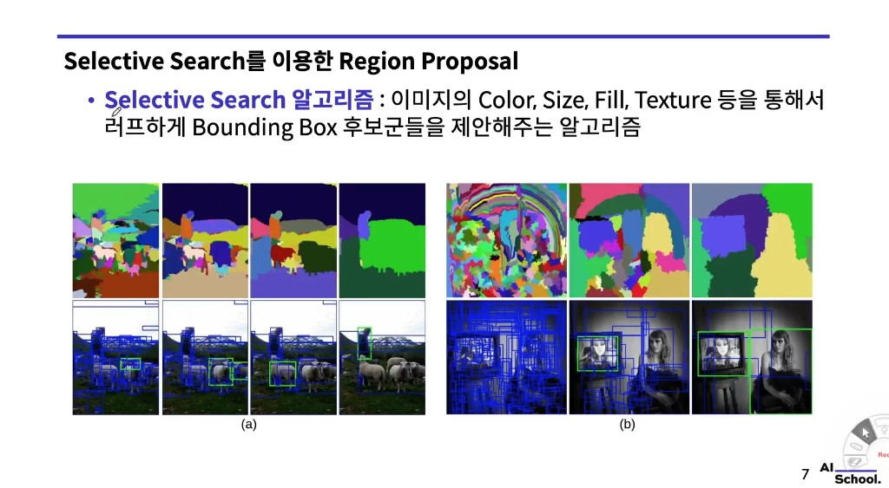

### Selective Search란?

딥러닝이 아닌 **전통적인 컴퓨터 비전 알고리즘**으로 "물체가 있을 법한 곳"의 후보 bounding box를 생성합니다.

**동작 원리:**
1. 이미지를 매우 잘게 **과분할(over-segmentation)** 합니다 (픽셀 단위 작은 영역들로 나눔).
2. 인접한 영역들을 유사도 기준으로 **점차적으로 합칩니다**:
   - **색상(Color)**: 비슷한 색이면 같은 물체일 가능성
   - **질감(Texture)**: 유사한 패턴이면 같은 재질 가능성
   - **크기(Size)**: 작은 것들 먼저 합쳐 균등한 병합 유도
   - **채움(Fill)**: 한 영역이 다른 영역을 잘 둘러싸는지
3. 합쳐진 모든 단계의 영역들을 **bounding box로 변환**합니다.
4. 결과: 약 **2,000개의 후보 bounding box** 생성

### Selective Search의 한계

- CPU 기반 알고리즘 → GPU 가속 불가
- 이미지당 약 **2초** 소요
- 학습 불가능(non-learnable) → gradient 역전파 불가
- → Faster R-CNN에서 **RPN(Region Proposal Network)** 으로 완전히 대체됨

---

## Part G — R-CNN 추론 단계 상세 분석

### G-1. Test Step 2 — Region Crop & Scale

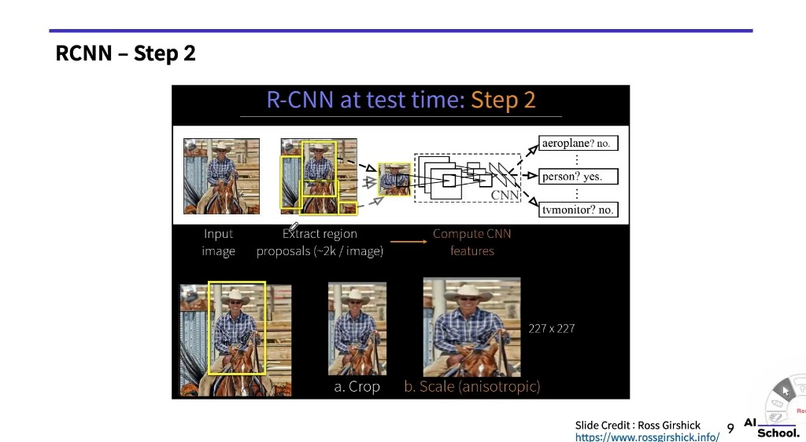

Selective Search가 제안한 region을 CNN에 넣기 위한 전처리 단계입니다.

**작업 순서:**
1. 원본 이미지에서 proposal region을 **crop**합니다.
2. 크기와 비율이 제각각인 region들을 모두 **227×227 픽셀**로 강제 리사이즈합니다.
3. 이렇게 변환된 2,000개의 이미지 패치가 각각 **독립적으로** CNN에 입력됩니다.

**문제점**: 2,000번의 독립적인 CNN forward pass는 엄청난 연산 낭비입니다.  
대부분의 region이 서로 겹치는데도 공유되는 연산이 없습니다.

---

### G-2. Test Step 3 — CNN Feature Extraction

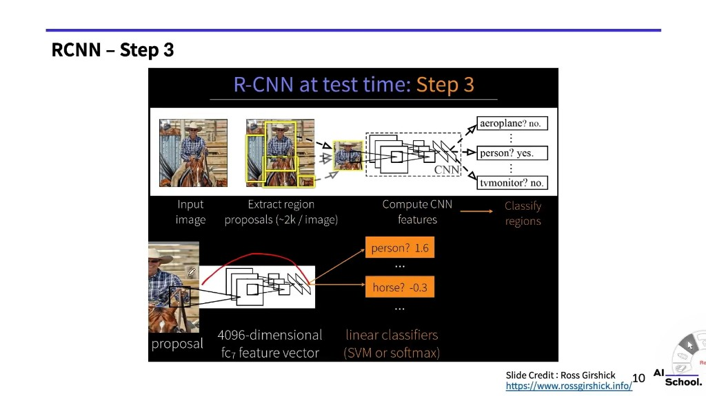

227×227로 리사이즈된 각 region이 CNN을 통과하는 단계입니다.

**CNN (AlexNet 기반) 구조:**
```
[입력: 227×227×3 RGB 이미지]
        ↓
[5개 Conv layer + max pooling]
        ↓
[2개 Fully-Connected layer]
        ↓
[출력: 4,096-dim feature vector (fc7 layer)]
```

이 4,096-dim 벡터가 해당 region의 "visual fingerprint(시각적 지문)"입니다.  
이 벡터를 다음 단계의 Linear SVM에 입력합니다.

**실제로 얼마나 느린가?**  
- GPU 사용 시: 이미지 1장에 약 **13초**
- CPU 사용 시: 이미지 1장에 약 **53초**

이는 PASCAL VOC 테스트셋(5,000장 이상)을 처리하는 데 수십 시간이 걸린다는 의미입니다.

---

### G-3. Test Step 4 — Bounding Box Regression

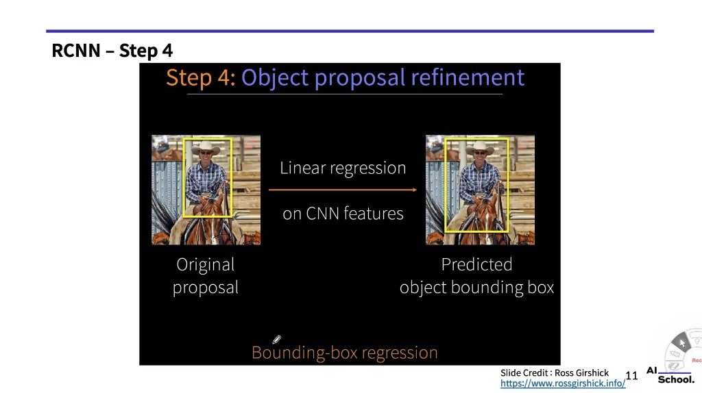

Selective Search가 제안한 region의 위치는 정확하지 않습니다.  
이 단계에서 CNN feature를 사용해 bounding box의 위치를 **정밀하게 보정**합니다.

**왜 위치 보정이 필요한가?**

```
Selective Search 결과:  [   실제 물체 ↕ ]  ← 위치가 약간 빗나감
                        ↓
BBox Regression 후:     [ 실제 물체 ]  ← 더 정확하게 맞춤
```

보정 목표는 4개의 오프셋 값 `(dx, dy, dw, dh)`입니다:
- `dx, dy`: 중심점의 이동량 (proposal 대비 얼마나 이동시킬지)
- `dw, dh`: 폭/높이의 스케일 변화량 (log scale로 표현)

---

## Part H — R-CNN BBox Regression 수식 분석

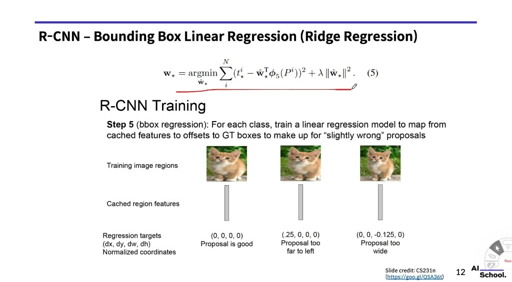

$$\mathbf{w}_\star = \underset{\hat{\mathbf{w}}}{\arg\min} \sum_i \left(t^i_\star - \hat{\mathbf{w}}^\top \phi_5(P^i)\right)^2 + \lambda \|\hat{\mathbf{w}}_\star\|^2$$

이 수식은 **Ridge Regression(L2 정규화가 포함된 선형 회귀)** 입니다. 각 항의 의미를 풀어봅시다.

| 기호 | 의미 | 설명 |
|------|------|------|
| $\mathbf{w}_\star$ | 최적 가중치 벡터 | 학습하고자 하는 파라미터 |
| $\hat{\mathbf{w}}$ | 후보 가중치 | 최적화 과정에서 탐색되는 값 |
| $\phi_5(P^i)$ | Pool5 feature | CNN의 pool5 layer에서 추출한 proposal $P^i$의 feature 벡터 |
| $t^i_\star$ | 학습 목표 offset | proposal $P^i$에서 GT box까지의 변환량 (정규화된 좌표) |
| $\lambda \|\hat{\mathbf{w}}_\star\|^2$ | L2 정규화 항 | 과적합 방지; 가중치가 너무 커지지 않게 제약 |

### 학습 목표 $t_\star$가 의미하는 것

BBox Regression은 proposal의 4개 좌표를 직접 예측하는 게 아니라,  
**"proposal을 GT로 옮기는 데 필요한 변환량"** 을 예측합니다.

$$t_x = \frac{G_x - P_x}{P_w}, \quad t_y = \frac{G_y - P_y}{P_h}$$

$$t_w = \log\frac{G_w}{P_w}, \quad t_h = \log\frac{G_h}{P_h}$$

| 값 | 해석 |
|----|------|
| $t_\star = (0, 0, 0, 0)$ | proposal이 GT와 완전히 일치 — 보정 불필요 |
| $t_x = 0.25$ | proposal 중심이 GT보다 왼쪽 — 오른쪽으로 이동 필요 |
| $t_w = -0.125$ | proposal이 GT보다 넓음 — 폭 축소 필요 |

왜 w, h에 log를 쓰는가? 스케일 변화는 비율(곱셈)로 표현하는 것이 자연스럽고,  
log를 취하면 곱셈이 덧셈이 되어 **선형 회귀에 적합**해집니다.

---

## Part I — R-CNN 학습 과정

R-CNN의 학습은 **세 단계**로 분리되어 있습니다. 이 세 단계가 **독립적**으로 진행된다는 것이 R-CNN의 큰 한계입니다.

### I-1. Training Step 1 — ImageNet Pre-training (지도 사전 학습)

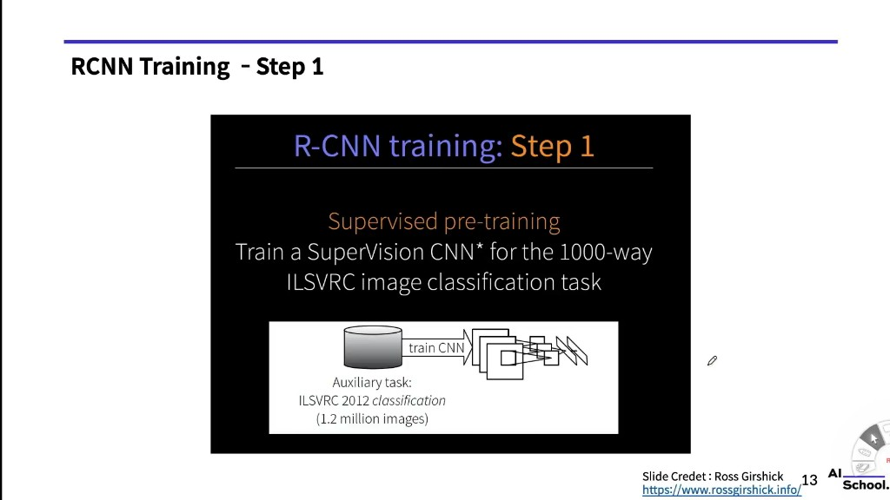

**무엇을 하는가?**  
ILSVRC(ImageNet Large Scale Visual Recognition Challenge)의 **1,000-class image classification** 태스크로 CNN을 먼저 학습합니다.

**왜 이 단계가 필요한가?**

Object Detection 데이터셋(PASCAL VOC)은 이미지가 몇 천~수만 장에 불과합니다. 이 데이터만으로 CNN을 처음부터(from scratch) 학습하면 과적합이 발생하거나 성능이 낮아집니다. 반면 ImageNet은 **1.2백만 장**의 이미지를 보유하고 있어, 이로 학습된 CNN은 이미지의 일반적인 특징(edge, texture, shape 등)을 잘 추출합니다.

이렇게 대규모 데이터로 먼저 학습된 모델을 목표 태스크에 맞게 추가 학습하는 방법을 **Transfer Learning(전이 학습)** 이라고 합니다.

---

### I-2. Training Step 2 — Domain-specific Fine-tuning

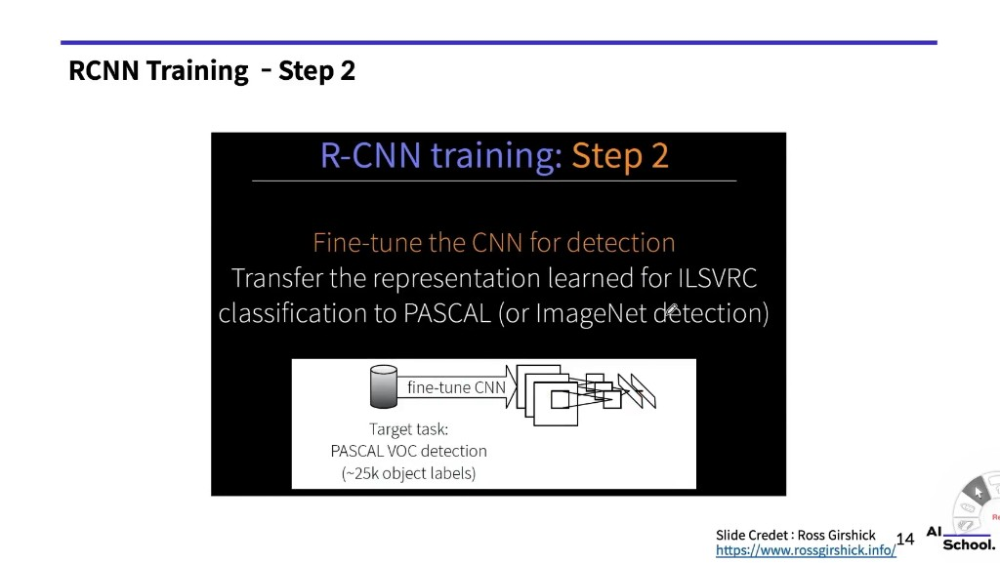

**무엇을 하는가?**  
ImageNet으로 학습된 CNN을 **PASCAL VOC Detection 태스크에 맞게 미세 조정(fine-tuning)** 합니다.

**구체적 변경 사항:**
- CNN의 마지막 1,000-class classification head를 **(N+1)-class 분류기**로 교체  
  (N: 탐지 클래스 수, +1: background 클래스)
- PASCAL VOC: N=20 → 21-class softmax 헤드

**학습 데이터 구성 (Fine-tuning용):**
- Ground-truth box와 **IoU ≥ 0.5인 proposal → positive** (해당 클래스로 레이블)
- 나머지 proposal → **negative** (배경)
- Mini-batch: 32 positive + 96 background = 128 total

**IoU(Intersection over Union)란?**

```
       ┌──────────┐
       │  Proposal│
       │    ┌─────┼──┐
       │    │ 교집합│  │
       └────┼─────┘  │
            │   GT   │
            └────────┘

IoU = 교집합 넓이 / (Proposal넓이 + GT넓이 - 교집합넓이)
```

- IoU = 1.0: proposal이 GT와 완벽하게 일치
- IoU = 0.5: 두 박스가 절반 정도 겹침 (일반적으로 "좋은 detection"의 기준)
- IoU = 0.0: 전혀 겹치지 않음

---

### I-3. Mini-batch 구성 전략 — Biased Sampling

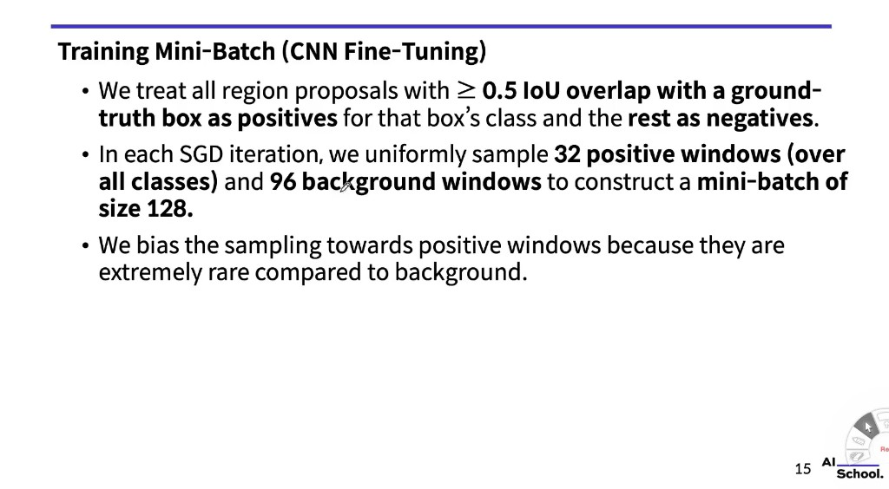

실제 이미지에서 물체가 차지하는 영역보다 배경이 훨씬 많습니다.  
Selective Search로 뽑힌 2,000개의 region 중 실제 물체에 해당하는 것은 극히 일부입니다.

**문제**: 무작위로 샘플링하면 배경(negative) 샘플이 압도적으로 많아 학습이 편향됩니다.

**해결책 — Biased Sampling (의도적 편향 샘플링):**

| 종류 | 기준 | 비율 | 개수 |
|------|------|------|------|
| Positive | GT와 IoU ≥ 0.5 | 25% | 32 |
| Negative (Hard) | 0.3 ≤ IoU < 0.5 | 75% | 96 |
| **Total** | - | 100% | **128** |

배경 중에서도 물체와 어느 정도 겹치는 "헷갈리는" region(hard negative)을 우선 사용합니다. 이렇게 하면 모델이 "쉬운 배경"에 치우치지 않고 **어려운 경우를 집중 학습**합니다.

---

### I-4. Training Step 3 — 클래스별 Linear SVM 학습

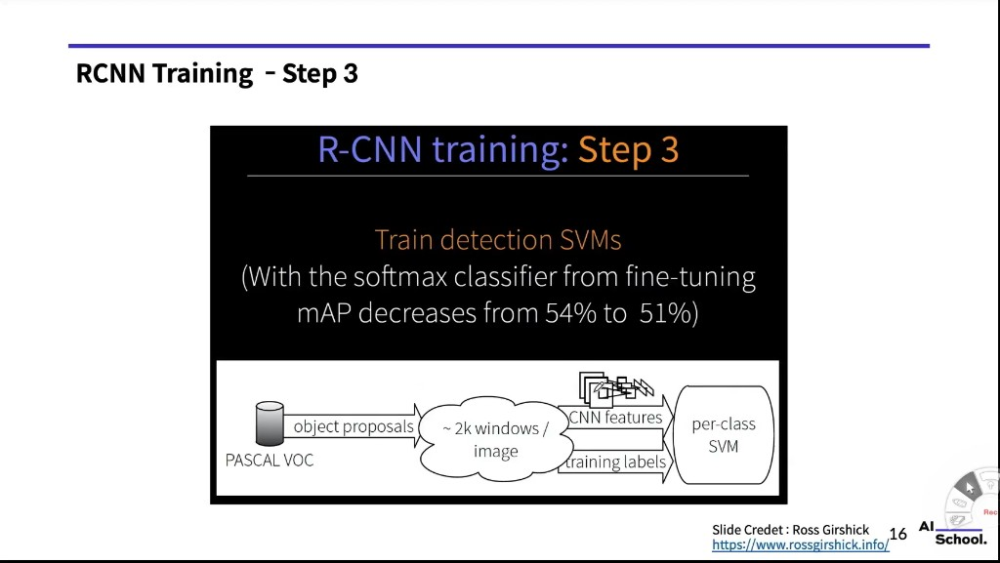

**무엇을 하는가?**  
Fine-tuning이 완료된 CNN에서 feature를 추출하고, 이를 기반으로 **클래스마다 별도의 Linear SVM**을 학습합니다.

**왜 softmax 대신 SVM인가?**

| 분류기 | VOC07 mAP | 이유 |
|--------|-----------|------|
| CNN softmax | 51% | fine-tuning 데이터의 IoU 기준이 느슨함 (IoU ≥ 0.5) |
| **Linear SVM** | **54%** | hard negative mining 적용 가능, 더 엄격한 기준 적용 |

SVM 학습 기준:
- GT box 자체 → **positive**
- GT box와 IoU < 0.3인 region → **negative** (hard negative)
- 0.3 ≤ IoU < 1.0 인 region → 학습에서 제외

> 이처럼 CNN fine-tuning과 SVM 학습의 positive/negative 기준이 다릅니다. 이것이 R-CNN의 복잡성 중 하나입니다.

---

## Part J — R-CNN 성능 평가

### J-1. 정량적 분석 — mAP (mean Average Precision)

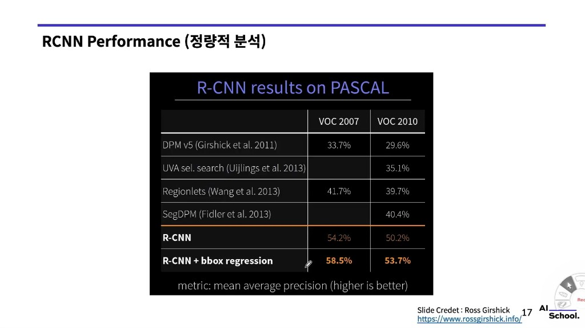

**mAP란?** 모든 클래스에 대한 Average Precision(AP)의 평균입니다.

- **AP**: 각 클래스별로 Precision-Recall 곡선 아래 넓이
- **mAP**: 전체 클래스의 AP 평균 (0~100%)  
- mAP가 높을수록 detection 성능이 좋습니다.

| 모델 | VOC 2007 mAP | VOC 2010 mAP |
|------|-------------|-------------|
| DPM v5 (고전 방법) | 33.7% | 29.6% |
| Regionlets | 41.7% | 39.7% |
| **R-CNN** | 54.2% | 50.2% |
| **R-CNN + BBox Regression** | **58.5%** | **53.7%** |

- R-CNN만으로도 기존 최고 방법(DPM)보다 **20%p 이상** 향상
- BBox Regression을 추가하면 약 **4~5%p 추가 향상**

BBox Regression이 mAP를 높이는 이유: proposal의 위치를 GT에 맞게 보정하면 IoU가 올라가고, 이는 precision 향상으로 이어집니다.

---

### J-2. 정성적 분석 — 실제 Detection 결과

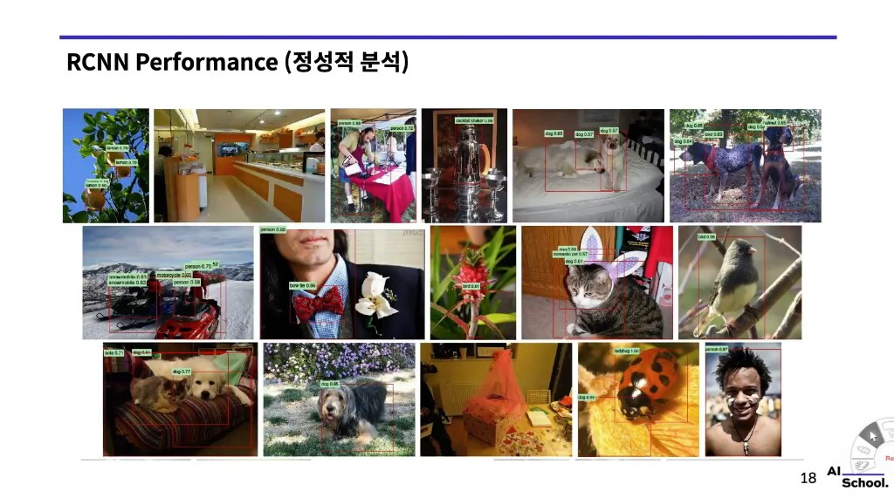

실제 이미지에서 R-CNN이 탐지한 결과를 시각적으로 확인할 수 있습니다.  
사람, 자동차, 말, 양 등 다양한 카테고리에서 bounding box가 올바르게 그려진 것을 볼 수 있습니다.

---

## Part K — R-CNN 장점과 단점

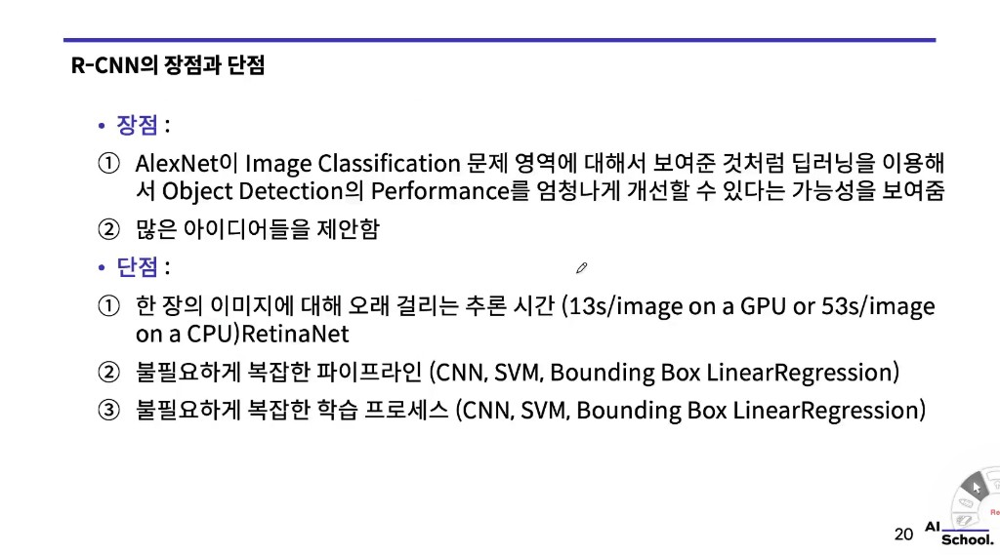

### 장점

1. **딥러닝으로 Object Detection의 가능성을 처음 입증**  
   AlexNet이 Classification에서 혁신을 일으켰듯, R-CNN은 Detection에서 "CNN이 통한다"는 것을 처음으로 보여줬습니다. 이후 모든 Detection 연구의 출발점이 됩니다.

2. **체계적인 파이프라인 제시**  
   Region Proposal + CNN Feature + SVM 분류 + BBox Regression이라는 구조는 이후 발전 방향의 설계도가 됐습니다.

### 단점 (그리고 각각 어떻게 해결됐는가)

| 단점 | 원인 | 해결책 |
|------|------|--------|
| **추론 속도 매우 느림** (GPU 13s, CPU 53s) | 2,000개 region을 각각 CNN에 통과 | Fast R-CNN: 이미지 전체 1회 forward pass |
| **파이프라인 복잡, end-to-end 학습 불가** | CNN / SVM / BBox Regressor가 완전히 분리 | Fast R-CNN: Multi-task loss로 통합 학습 |
| **Region Proposal이 학습 불가** | Selective Search는 고전 알고리즘(비학습) | Faster R-CNN: RPN으로 proposal도 학습 |
| **디스크 공간 낭비** | 중간 feature를 파일로 저장 | Fast R-CNN: 메모리 내에서 처리 |

---

## Part L — Fast R-CNN: 이미지를 한 번만 CNN에 통과시키다

> **논문**: Girshick, Ross. "Fast r-cnn." Proceedings of the IEEE international conference on computer vision. **ICCV 2015.**  
> **논문 링크**: [arxiv.org/pdf/1504.08083.pdf](https://arxiv.org/pdf/1504.08083.pdf)

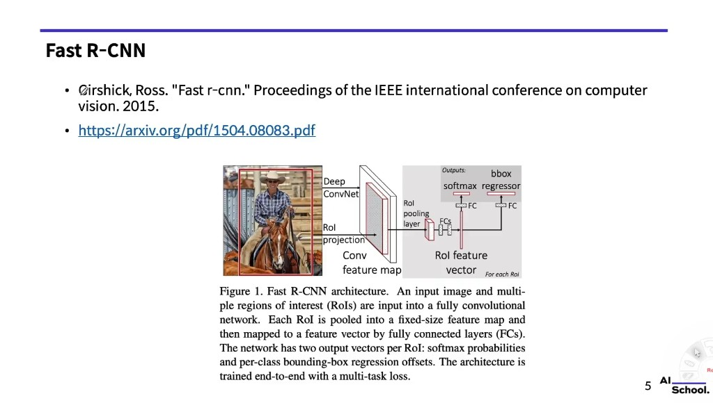

### 핵심 아이디어

R-CNN의 가장 큰 비효율은 "2,000개의 region을 각각 CNN에 통과시키는 것"이었습니다.  
생각해보면, 같은 이미지에서 나온 region들은 **이미지의 공통된 특징을 공유**합니다.  
그렇다면 CNN을 이미지 전체에 한 번만 적용하고, 그 결과인 **feature map을 공유**하면 어떨까?  
이것이 Fast R-CNN의 핵심 아이디어입니다.

---

### L-1. R-CNN의 문제점 — Slow R-CNN

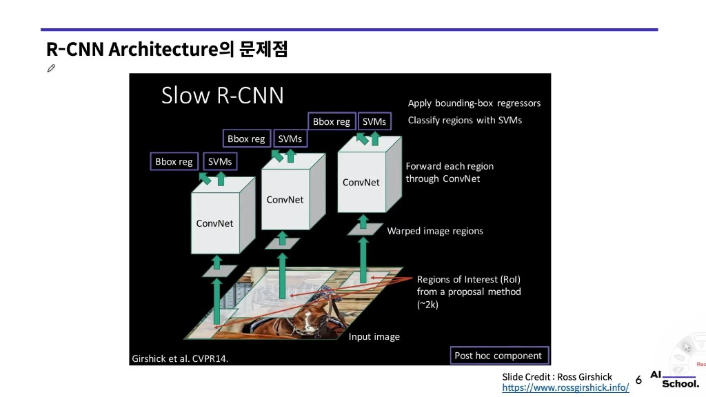

슬라이드의 그림을 보면 R-CNN의 비효율이 한눈에 보입니다:

- Input image에서 RoI(Region of Interest) ~2,000개를 추출
- **각 RoI를 warped image region으로 변환 → 각각 별도의 ConvNet 통과**
- 각 ConvNet에서 SVM으로 분류 + BBox Regressor로 보정

즉, 그림에서 ConvNet 박스가 여러 개 나란히 있는 것이 바로 2,000번의 반복 연산을 의미합니다. "Post hoc component"라고 표시된 것처럼, SVM과 BBox Regressor가 CNN과 분리된 별개의 컴포넌트입니다.

| 문제 | 결과 |
|------|------|
| Region별 독립 CNN | GPU 13s, CPU 53s / image |
| end-to-end 학습 불가 | CNN → SVM → BBox Reg 순서로 별도 학습 |
| 특징을 디스크에 저장 | 수백 GB의 디스크 공간 필요 |

---

### L-2. Fast R-CNN Architecture — 추론(Test time)

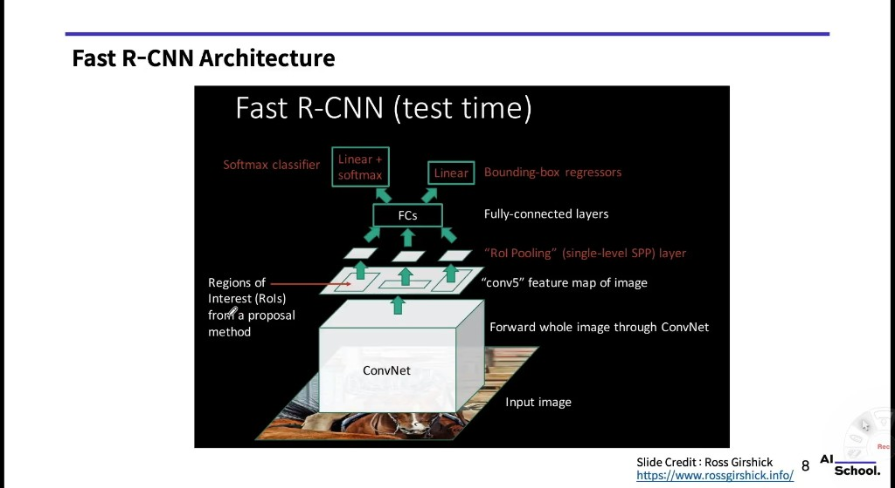

슬라이드 그림 "Fast R-CNN (test time)"을 아래에서 위로 따라가 봅시다:

```
[Input image]                     ← 원본 이미지 1장
       ↓
[ConvNet (conv5까지)]              ← 이미지 전체를 CNN에 단 1회 통과
       ↓
["conv5" feature map of image]    ← 이미지 전체의 feature map
       ↑
[Regions of Interest from proposal method]  ← Selective Search가 제안한 ~2,000개 RoI
       ↓
[RoI Pooling (single-level SPP)]   ← feature map에서 각 RoI 영역을 추출
       ↓
[Fully-connected layers (FCs)]    ← 고정 크기 vector로 변환
       ↓
[두 개의 출력 브랜치]
  ├── Linear + softmax → 클래스 분류
  └── Linear → Bounding-box regressors
```

**가장 큰 변화**: ConvNet이 이미지당 딱 **1회**만 실행됩니다.  
2,000개의 RoI는 ConvNet을 다시 통과하지 않고, 이미 만들어진 feature map에 **projection**됩니다.

---

### L-3. RoI Pooling — 핵심 모듈 분석

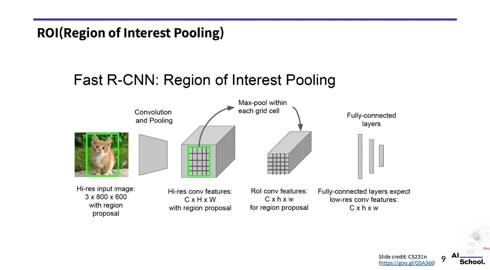

슬라이드의 그림을 왼쪽에서 오른쪽으로 따라가 봅시다.

**문제**: ConvNet feature map에서 추출된 각 RoI 영역의 크기가 제각각입니다. FC layer는 고정 크기의 입력을 요구합니다. 어떻게 해결하나?

**해결책 — RoI Pooling:**

```
[Hi-res input image: 3×800×600 (예시)]
         ↓ Convolution + Pooling
[Hi-res conv features: C×H×W]
         ↓ 각 RoI를 feature map에 projection
[RoI conv features: C×h×w (임의 크기)]
         ↓ 각 grid cell 내에서 Max-pool
[고정 크기 output: C×h'×w' (예: 7×7)]
         ↓
[Fully-connected layers (고정 크기 입력 처리 가능)]
```

**단계별 설명:**

1. **RoI 좌표 변환**: 원본 이미지 기준의 RoI 좌표를 feature map 크기에 맞게 스케일링  
   (예: 이미지 800px → feature map 50px면 1/16 비율 적용)

2. **Grid 분할**: 해당 RoI 영역을 target 크기(예: 7×7)의 격자로 균등 분할

3. **Max Pooling**: 각 격자 셀 내의 값들 중 최댓값만 취함

**왜 Max Pooling인가?** 각 격자 안의 가장 강한 신호(most activated feature)만 살리면 위치 변화에 어느 정도 robust하면서도 중요한 특징을 놓치지 않습니다.

**SPP(Spatial Pyramid Pooling)와의 관계**: RoI Pooling은 SPP에서 단일 스케일만 사용하는 간소화된 버전입니다.

---

### L-4. Fast R-CNN Architecture — 학습(Training)

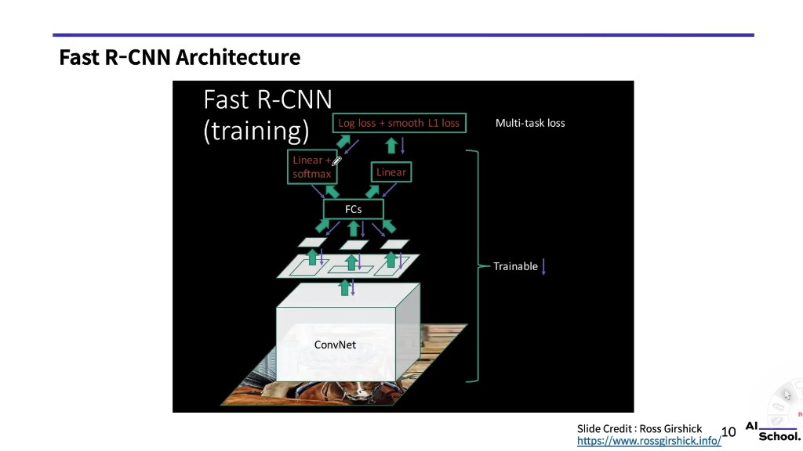

슬라이드 그림 "Fast R-CNN (training)"을 살펴봅시다.

R-CNN과 가장 큰 차이점:

**R-CNN 학습**: CNN fine-tuning → SVM 학습 → BBox Regressor 학습 (완전히 분리)

**Fast R-CNN 학습**: 하나의 네트워크에서 **모든 것을 동시에(end-to-end)** 학습

```
[Input image + RoIs]
        ↓
[ConvNet] ← gradient 역전파 가능 (backbone도 함께 학습)
        ↓
[RoI Pooling]
        ↓
[FC layers]
        ↓  ↙ 
[Softmax] [BBox Regressor]
     ↓         ↓
[Log loss] [Smooth L1 loss]
        ↘   ↙
    [Multi-task Loss]  ← 두 loss를 합산하여 역전파
```

슬라이드에서 파란 화살표(gradient)가 ConvNet 전체를 통과하는 것을 볼 수 있습니다.  
즉, 분류 성능을 높이면서 동시에 feature 추출 능력(backbone)도 함께 개선됩니다.

---

### L-5. Fast R-CNN Multi-Task Loss

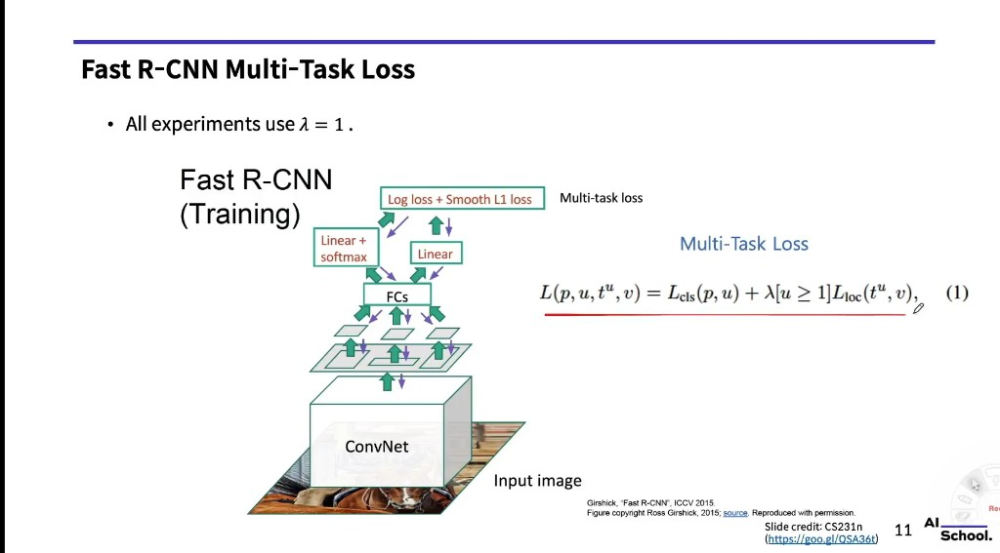

Fast R-CNN은 분류 loss와 위치 loss를 **하나의 수식**으로 합쳐서 한 번에 최적화합니다.

$$L(p, u, t^u, v) = L_{\text{cls}}(p, u) + \lambda [u \geq 1] L_{\text{loc}}(t^u, v)$$

각 기호의 의미:

| 기호 | 의미 | 설명 |
|------|------|------|
| $p$ | 예측 확률 분포 | softmax 출력, $p = (p_0, p_1, ..., p_K)$ |
| $u$ | 정답 클래스 | ground-truth class label (정수) |
| $t^u$ | 예측 bbox offset | 클래스 $u$에 대한 예측 변환량 $(t_x^u, t_y^u, t_w^u, t_h^u)$ |
| $v$ | GT bbox | ground-truth bounding box 좌표 |
| $L_{\text{cls}}(p, u)$ | 분류 손실 | $-\log p_u$ (log loss, 정답 클래스의 예측 확률이 낮을수록 패널티) |
| $L_{\text{loc}}(t^u, v)$ | 위치 손실 | Smooth L1 loss (아래 설명) |
| $[u \geq 1]$ | 배경 제외 표시 | background($u=0$)에는 위치 손실 미적용 |
| $\lambda$ | 두 손실의 균형 | 논문에서 $\lambda = 1$ |

**왜 background에는 위치 손실을 안 적용하는가?**  
배경 region에는 "정확한 위치"라는 개념 자체가 의미 없습니다. 배경을 배경으로 분류하면 끝이고, 어디에 있는지를 맞출 필요가 없습니다.

**Smooth L1 Loss란?**

$$\text{smooth}_{L_1}(x) = \begin{cases} 0.5x^2 & \text{if } |x| < 1 \\ |x| - 0.5 & \text{otherwise} \end{cases}$$

- $|x|$가 작을 때(정확한 예측): L2처럼 부드럽게 감소 → 학습 안정
- $|x|$가 클 때(큰 오차): L1처럼 선형 증가 → **이상치(outlier) 영향 감소**

이는 일반 L2 loss가 큰 오차에 지나치게 민감한 문제를 해결합니다.

---

### L-6. Fast R-CNN Training Mini-batch

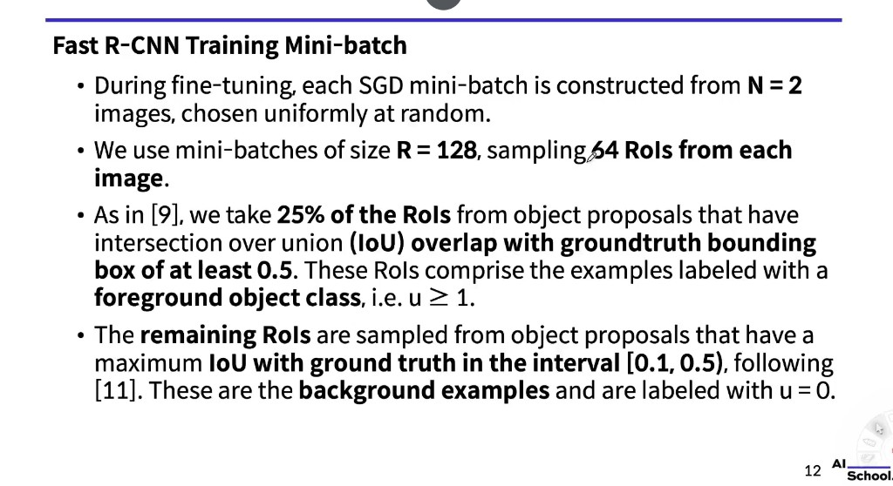

Fast R-CNN은 R-CNN과는 다른 **계층적 샘플링(Hierarchical Sampling)** 전략을 사용합니다.

| 파라미터 | 값 | 의미 |
|----------|----|------|
| N (이미지 수/SGD iteration) | **2** | 각 mini-batch에 사용하는 이미지 수 |
| R (RoI 수/mini-batch) | **128** | 총 128개의 RoI (이미지당 64개) |
| Positive RoI | **32개 (25%)** | IoU ≥ 0.5인 RoI → foreground (물체) |
| Negative RoI | **96개 (75%)** | 0.1 ≤ IoU < 0.5인 RoI → background |

**왜 Hierarchical Sampling인가?**

R-CNN: 각 region을 독립적으로 CNN에 통과 → 같은 이미지의 region들이 feature map을 공유하지 않음

Fast R-CNN: 같은 이미지 N=2장에서 R=128개를 뽑으므로, **같은 이미지에서 나온 64개의 RoI가 동일한 feature map을 공유**합니다.

```
이미지 A의 feature map (1회 계산)
  → RoI_A1, RoI_A2, ..., RoI_A64 (64개 RoI가 공유)

이미지 B의 feature map (1회 계산)
  → RoI_B1, RoI_B2, ..., RoI_B64 (64개 RoI가 공유)
```

이 방식으로 **ConvNet 연산을 이미지 수만큼(N=2)만 수행**하면 됩니다.

**Negative RoI에서 IoU ≥ 0.1인 이유?**  
IoU가 0인 완전히 무관한 배경은 너무 쉬워서 학습 효과가 없습니다.  
어느 정도 겹치는(0.1~0.5) "어려운 배경"을 사용해야 분류기가 실력이 늘어납니다.

---

### L-7. Fast R-CNN 성능 결과

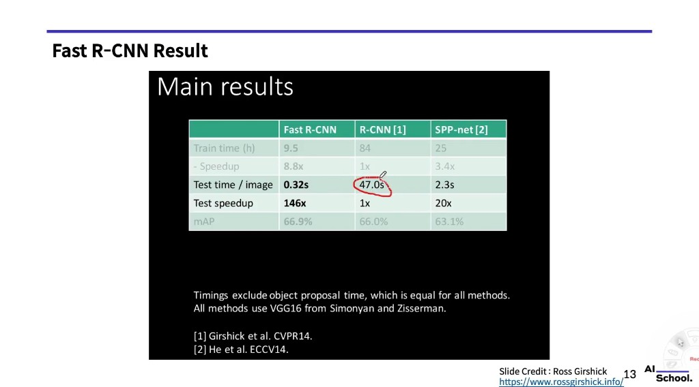

모든 실험에서 VGG16을 backbone으로 사용했습니다 (Simonyan & Zisserman).

| 지표 | Fast R-CNN | R-CNN | SPP-Net |
|------|------------|-------|---------|
| Train time | **9.5h** | 84h | 25h |
| Train speedup | **8.8×** | 1× | 3.4× |
| Test time / image | **0.32s** | 47.0s | 2.3s |
| Test speedup | **146×** | 1× | 20× |
| mAP (VOC07) | **66.9%** | 66.0% | 63.1% |

- 참고: [1] Girshick et al. CVPR14 (R-CNN), [2] He et al. ECCV14 (SPP-Net)
- **중요**: 위 Test time 0.32s는 **region proposal 시간을 제외한** 수치입니다.

왜 제외하는가? Selective Search는 모든 모델에서 동일하게 사용되므로, 네트워크 자체의 성능 비교를 위해 제외했습니다. 그러나 실제 end-to-end 추론 시간은 Selective Search 포함 **~2.3초**입니다.

---

### L-8. Fast R-CNN의 새로운 병목 — Region Proposal

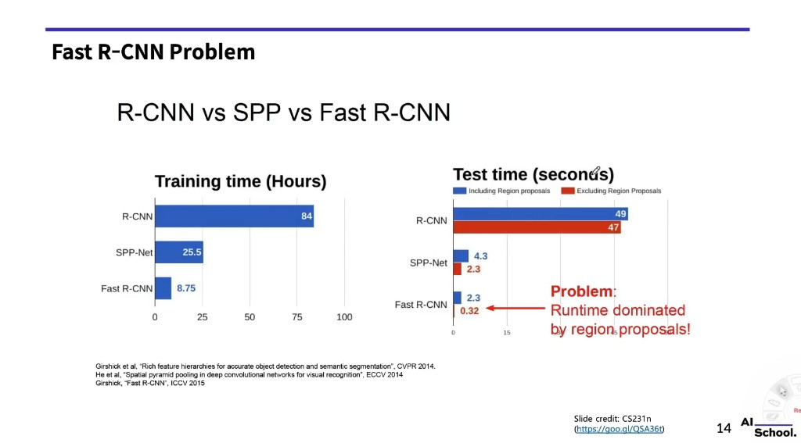

슬라이드의 두 그래프를 분석해 봅시다.

**왼쪽 그래프 — Training time (Hours):**
- R-CNN: 84h → SPP-Net: 25.5h → Fast R-CNN: **8.75h**
- 학습 시간은 크게 줄었습니다.

**오른쪽 그래프 — Test time (Seconds, per image):**
- 파란 막대(region proposal 포함): R-CNN 49s, SPP-Net 4.3s, Fast R-CNN **2.3s**
- 빨간 막대(region proposal 제외): R-CNN 47s, SPP-Net 2.3s, Fast R-CNN **0.32s**

**핵심 관찰**: Fast R-CNN의 실제 test time이 2.3s인데,  
network-only time은 0.32s입니다. **나머지 2초는 Selective Search**가 차지합니다!

슬라이드에 "**Problem: Runtime dominated by region proposals!**"라고 명시되어 있습니다.

네트워크 자체는 146배 빨라졌는데, Selective Search가 새로운 병목이 됐습니다.  
Selective Search는 CPU 기반이므로 GPU로 가속할 수도 없습니다.

→ **해결책**: Faster R-CNN에서 Selective Search를 GPU에서 학습 가능한 **RPN**으로 대체합니다.

---

### L-9. Fast R-CNN 장점과 단점 요약

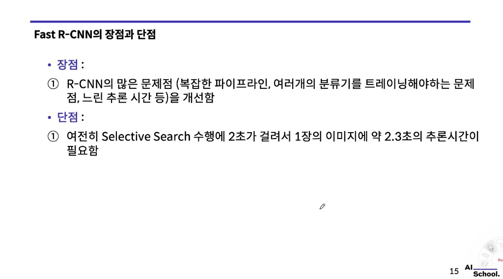

**장점**
- R-CNN의 복잡한 3단계 파이프라인(CNN fine-tuning → SVM → BBox Reg) → **단일 end-to-end 학습**으로 통합
- 클래스별 SVM → **Softmax로 통합**, Multi-task loss로 동시 학습
- GPU 13초 추론 → **0.32초** (proposal 제외 기준, 146배 향상)
- backbone 포함 **전체 네트워크를 joint하게 fine-tuning** → feature 품질 향상
- mAP도 66.0% → **66.9%** 소폭 향상

**단점**
- Selective Search가 이미지당 **약 2초** (CPU 기반) 소요 → 실제 추론 2.3초
- 네트워크가 아무리 빨라져도 Selective Search가 bottleneck
- Selective Search는 **학습 불가능** → gradient 역전파 불가, 성능 한계 존재

---

## Part M — Faster R-CNN: Region Proposal도 네트워크 안으로

### M-1. Faster R-CNN 발전과정

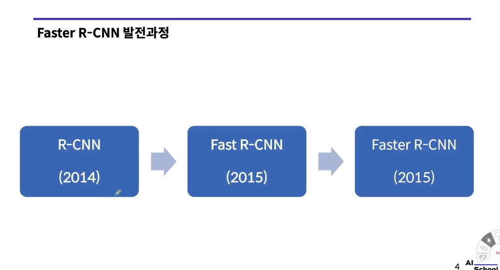

**R-CNN (2014)** → **Fast R-CNN (2015 Apr)** → **Faster R-CNN (2015 Jun)**

놀랍게도 Fast R-CNN과 Faster R-CNN은 **같은 해(2015년)** 에 불과 2개월 차이로 나왔습니다.  
두 논문 모두 Ross Girshick이 1저자 혹은 공저자로 참여했습니다.

Faster R-CNN의 핵심 질문:  
*"Fast R-CNN은 네트워크가 빨라졌는데 왜 전체 시간은 여전히 느린가?"*  
*→ Selective Search 때문이다. 이것도 네트워크 안으로 넣자."*

---

### M-2. Faster R-CNN 개요

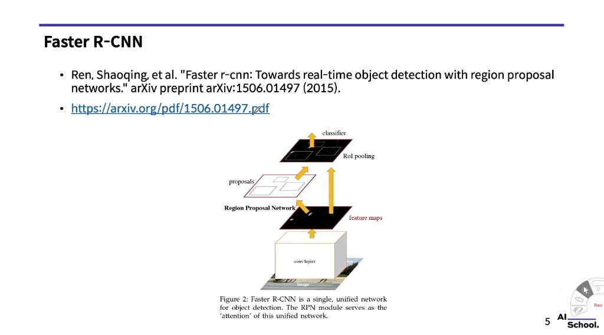

> **논문**: Ren, Shaoqing, et al. "Faster r-cnn: Towards real-time object detection with region proposal networks." **NeurIPS 2015 / arXiv:1506.01497.**  
> **논문 링크**: [arxiv.org/pdf/1506.01497.pdf](https://arxiv.org/pdf/1506.01497.pdf)

슬라이드의 Figure 2 다이어그램을 분석해 봅시다:

```
[Image]
   ↓
[conv layers]  ← backbone CNN (VGG16 등)
   ↓
[feature maps]  ← conv layer와 RPN이 이 feature map을 공유
   ↙         ↓
[Region Proposal Network (RPN)]
   ↓ proposals
[RoI Pooling]
   ↓
[classifier] ← 클래스 분류 + bbox 보정
```

"The RPN module serves as the 'attention' of this unified network."  
RPN은 "어디에 물체가 있을 것 같은가?"를 먼저 알려주는 **attention 역할**을 합니다.

**핵심 혁신**: conv layer를 **RPN과 Fast R-CNN 두 모듈이 공유**합니다.  
즉, CNN을 한 번 통과하면 동시에 (1) region proposal 생성 + (2) 분류/위치보정이 가능합니다.

---

### M-3. RPN (Region Proposal Network) Architecture

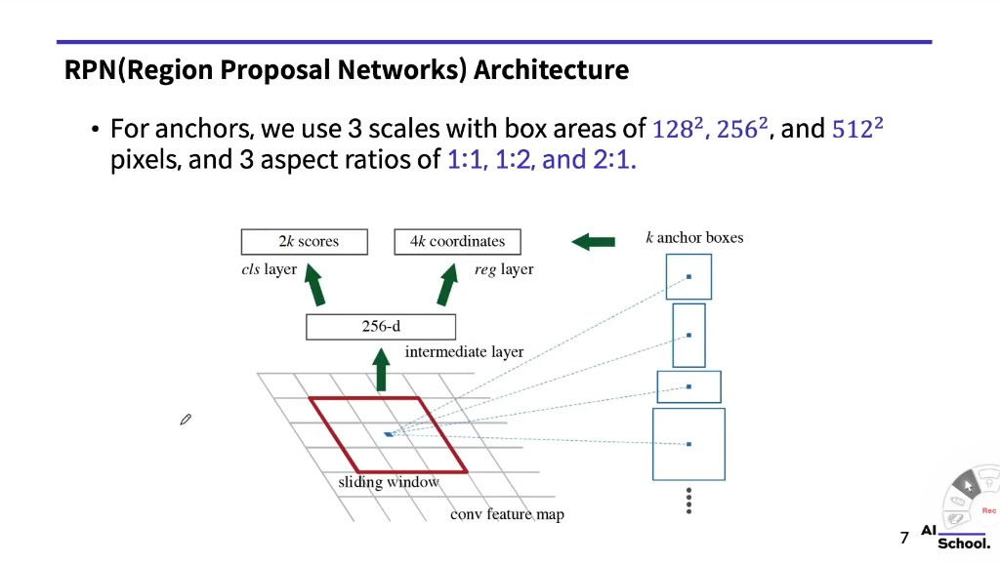

RPN은 Fast R-CNN에서 Selective Search가 하던 일을 **학습 가능한 신경망**으로 대체합니다.

**동작 방식:**

1. backbone CNN의 feature map(예: VGG16의 conv5 feature map) 위에서 작동
2. n×n(보통 3×3) **sliding window**를 feature map 위에서 이동
3. 각 위치에서 **256-d intermediate layer**를 거쳐 두 출력을 생성:

```
feature map
    ↓
[3×3 sliding window]  ← feature map의 각 위치에 적용
    ↓
[256-d intermediate layer]
    ↙             ↘
[cls layer]      [reg layer]
[2k scores]      [4k coordinates]
```

**출력 설명:**

| 출력 | 크기 | 의미 |
|------|------|------|
| cls scores | 2k | 각 anchor가 object인가/background인가 (2개 클래스 × k anchors) |
| reg coordinates | 4k | 각 anchor의 bbox 보정값 (tx, ty, tw, th) × k anchors |

여기서 **k = 9** (3 scales × 3 aspect ratios)

**Anchor 설정 (슬라이드 명시):**
- 3가지 크기(scale): **128², 256², 512²** pixels
- 3가지 비율(aspect ratio): **1:1, 1:2, 2:1**
- → 위치당 총 **k = 3 × 3 = 9개**의 anchor

예를 들어 conv feature map이 40×60이면, 전체 anchor 수 = 40 × 60 × 9 = **21,600개**

---

### M-4. RPN — Anchor의 직관적 이해

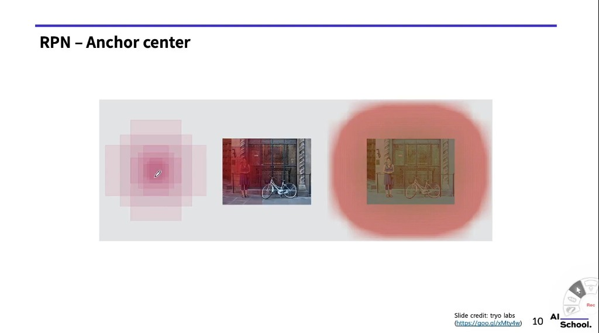

슬라이드의 그림을 해석해 봅시다.

**왼쪽 그림**: 하나의 anchor center를 기준으로 9가지 서로 다른 크기/비율의 anchor box들이 배치된 모습(밝고 어두운 사각형들이 겹쳐있는 것처럼 보임)

**가운데 그림**: 실제 이미지 (사람 + 자전거)

**오른쪽 그림**: 이미지 전체에 anchor들이 배치되었을 때의 모습. 이미지 전역을 다양한 크기의 빨간 박스들이 촘촘하게 커버합니다.

**왜 9가지 anchor를 쓰는가?**

물체마다 크기와 비율이 다릅니다:
- 사람(서 있는): 세로로 긴 비율 (1:2)
- 자동차: 가로로 넓은 비율 (2:1)  
- 공: 정사각형에 가까운 비율 (1:1)

9가지 anchor를 미리 정의해두면 다양한 형태의 물체를 커버할 수 있습니다.

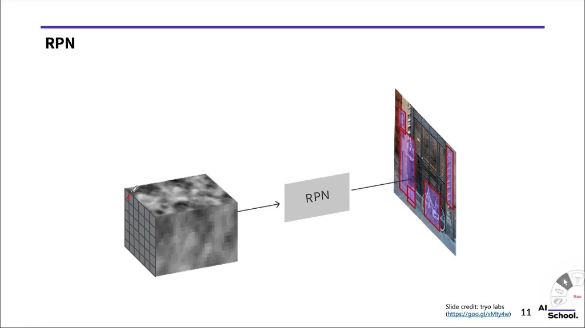

RPN의 최종 결과: feature map에서 **물체가 있을 법한 region proposals**를 bbox + objectness score 형태로 출력합니다.

---

### M-5. RPN Loss Function

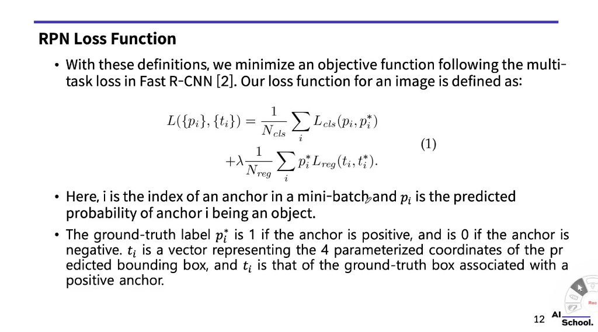

$$L(\{p_i\}, \{t_i\}) = \frac{1}{N_{cls}} \sum_i L_{cls}(p_i, p_i^*) + \lambda \frac{1}{N_{reg}} \sum_i p_i^* L_{reg}(t_i, t_i^*)$$

이 수식도 Fast R-CNN의 Multi-task loss와 구조가 동일합니다. 각 기호를 풀어봅시다.

| 기호 | 의미 |
|------|------|
| $i$ | mini-batch 내 anchor의 인덱스 |
| $p_i$ | anchor $i$가 object(foreground)일 예측 확률 |
| $p_i^*$ | ground-truth label — positive anchor면 1, negative면 0 |
| $t_i$ | 예측 bbox: anchor에서 얼마나 이동/스케일 변환하는지 (4개 값) |
| $t_i^*$ | GT bbox를 기준으로 한 anchor 변환량 (4개 값) |
| $N_{cls}$ | cls term 정규화 상수 (mini-batch 크기 = 256) |
| $N_{reg}$ | reg term 정규화 상수 (anchor 위치 수 ≈ 2,400) |
| $\lambda$ | 두 항의 균형 파라미터 (**기본값 $\lambda = 10$**) |

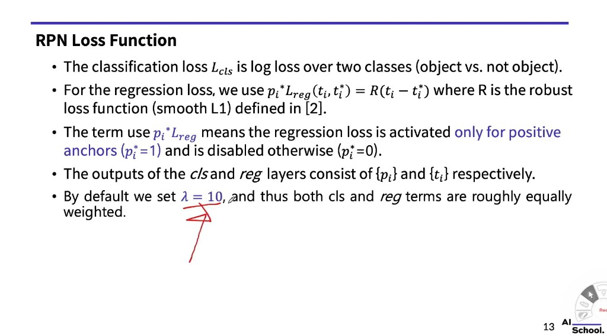

슬라이드에서 추가로 설명하는 내용:

- $L_{cls}$: **log loss** (binary classification: object vs. not object)  
  → Fast R-CNN의 20-class가 아닌, 단 **2-class** (물체/배경)

- $L_{reg} = R(t_i - t_i^*)$에서 R은 **Smooth L1 loss**  
  → 이 함수는 Fast R-CNN [2]에서 정의된 것을 그대로 사용

- $p_i^* L_{reg}$: **positive anchor($p_i^* = 1$)에만 regression loss 활성화**  
  negative anchor($p_i^* = 0$)는 regression loss = 0

- $\lambda = 10$으로 설정하면 $N_{cls} = 256$, $N_{reg} \approx 2400$이므로  
  cls항: 1/256, reg항: 10/2400 ≈ 1/240 → **두 항이 roughly equally weighted**

---

### M-6. RPN BBox Regression 파라미터화

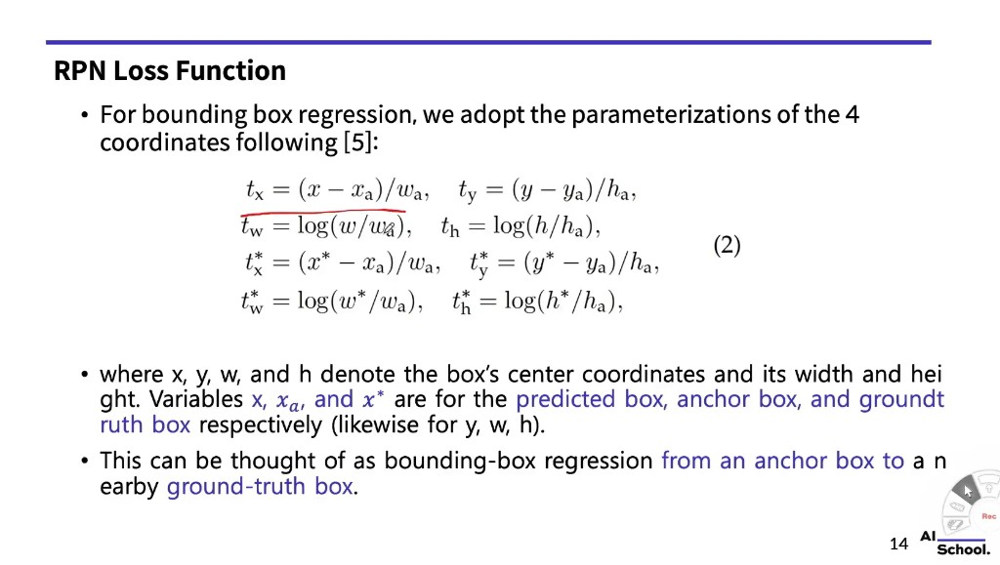

**예측 bbox의 파라미터화 (anchor 기준 상대적 표현):**

$$t_x = \frac{x - x_a}{w_a}, \quad t_y = \frac{y - y_a}{h_a}$$
$$t_w = \log\frac{w}{w_a}, \quad t_h = \log\frac{h}{h_a}$$

**GT bbox의 파라미터화:**

$$t_x^* = \frac{x^* - x_a}{w_a}, \quad t_y^* = \frac{y^* - y_a}{h_a}$$
$$t_w^* = \log\frac{w^*}{w_a}, \quad t_h^* = \log\frac{h^*}{h_a}$$

각 변수의 의미:

| 변수 | 의미 | 기준 |
|------|------|------|
| $x, y$ | 예측 bbox 중심의 x, y 좌표 | 이미지 픽셀 단위 |
| $x_a, y_a$ | anchor box 중심의 x, y 좌표 | 이미지 픽셀 단위 |
| $x^*, y^*$ | ground-truth box 중심의 x, y 좌표 | 이미지 픽셀 단위 |
| $w, h$ | 예측 bbox의 폭, 높이 | 이미지 픽셀 단위 |
| $w_a, h_a$ | anchor box의 폭, 높이 | 이미지 픽셀 단위 |
| $w^*, h^*$ | ground-truth box의 폭, 높이 | 이미지 픽셀 단위 |

**직관적 해석:**

$t_x = \frac{x - x_a}{w_a}$: 예측 중심이 anchor 중심에서 얼마나 이동했는가?  
(anchor 폭으로 정규화 → 크기에 무관한 상대적 이동량)

$t_w = \log\frac{w}{w_a}$: 예측 bbox가 anchor보다 얼마나 크거나 작은가?  
(log scale → 2배 크기와 0.5배 크기의 변화량이 절댓값으로 동일: log2 = 0.693)

슬라이드에 명시된 것처럼: "This can be thought of as **bounding-box regression from an anchor box to a nearby ground-truth box.**"  
즉, anchor를 시작점으로 삼아 GT box 방향으로 이동·변형하는 것입니다.

---

### M-7. Training RPN Mini-batch

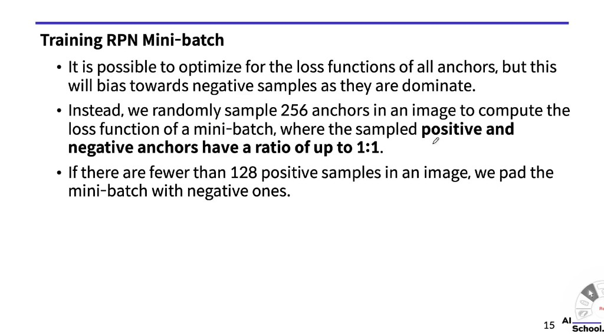

**왜 모든 anchor에 대해 loss를 계산하지 않는가?**

이미지 하나에 수만 개의 anchor가 생성됩니다. 대부분은 배경(negative)입니다.  
모든 anchor를 사용하면 negative가 압도적 → **학습이 배경 쪽으로 편향**됩니다.

**해결책 — Balanced Sampling:**

| 항목 | 값 |
|------|----|
| 이미지당 anchor 샘플 수 | **256** |
| Positive : Negative 비율 | **최대 1:1 (128 : 128)** |
| Positive 부족 시 | Negative로 나머지 채움 |

**Positive anchor 기준 (둘 중 하나라도 만족하면):**
1. 특정 GT box와 **IoU가 가장 높은** anchor
2. 어떤 GT box와 **IoU ≥ 0.7**인 anchor

**Negative anchor 기준:**
- 모든 GT box와 **IoU < 0.3**인 anchor

슬라이드에 명시된 것처럼: "It is possible to optimize for the loss functions of all anchors, but this will bias towards negative samples as they are dominate."

---

### M-8. Faster R-CNN Training 전략

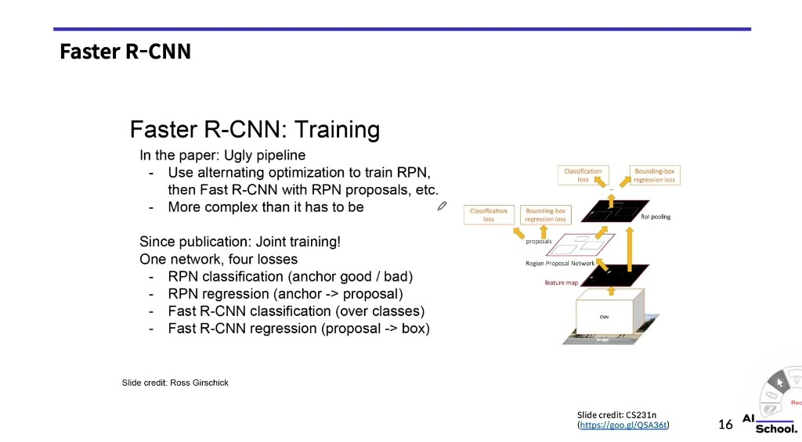

**논문 원본 방식 — Alternating Training ("ugly pipeline"):**

슬라이드에 "In the paper: Ugly pipeline"이라고 명시되어 있습니다.

1. ImageNet pre-trained 모델로 **RPN 학습** (proposal 생성)
2. Step 1의 proposals로 **Fast R-CNN 학습** (conv layer 별도, 공유 없음)
3. Fast R-CNN의 conv layer를 고정하고 **RPN fine-tune** (이제부터 conv 공유)
4. conv layer 고정, **Fast R-CNN의 FC layer만 fine-tune**

"More complex than it has to be"라고 슬라이드에 직접 언급됩니다.

**현재 방식 — Joint Training (하나의 통합된 네트워크):**

"Since publication: Joint training! **One network, four losses**"

4개의 loss를 동시에 최적화:

| Loss | 역할 |
|------|------|
| ① RPN classification loss | anchor가 object인가 background인가 |
| ② RPN regression loss | anchor → proposal bbox 보정 |
| ③ Fast R-CNN classification loss | proposal이 어떤 클래스인가 |
| ④ Fast R-CNN regression loss | proposal → 최종 bbox 보정 |

슬라이드 오른쪽 다이어그램에서:
- 아래: CNN backbone (conv layers → feature map)
- 중간: Region Proposal Network (feature map → proposals)
- 위: RoI Pooling → FC → 두 개의 loss (cls + bbox reg)
- 각 모듈에서 "Classification loss"와 "Bounding-box regression loss"가 모두 표시됨

---

### M-9. PASCAL VOC 2007 Detection 결과 예시

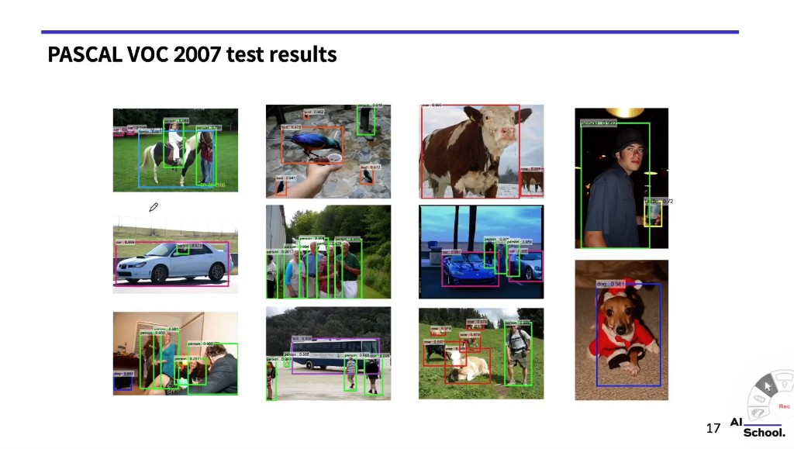

다양한 카테고리(사람, 말, 소, 새, 자동차, 자전거 등)에서의 Faster R-CNN detection 결과입니다.

- 색깔별 bounding box가 각 클래스를 구분
- 박스 상단에 클래스 이름과 confidence score 표시
- 여러 물체가 겹쳐있는 복잡한 장면에서도 정확하게 탐지

---

### M-10. Faster R-CNN 성능 결과

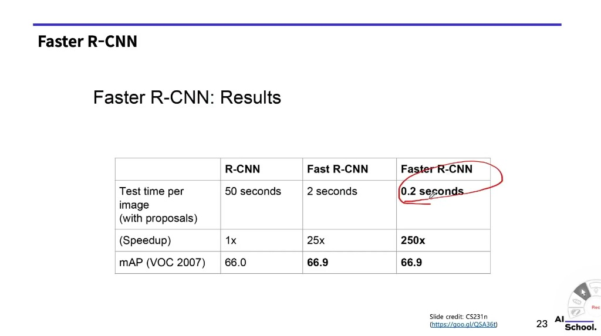

| 항목 | R-CNN | Fast R-CNN | **Faster R-CNN** |
|------|-------|------------|-----------------|
| Test time / image (with proposals) | 50s | 2s | **0.2s** |
| Speedup | 1× | 25× | **250×** |
| mAP (VOC 2007) | 66.0 | 66.9 | **66.9** |

**핵심 포인트:**
- Proposal 포함 end-to-end 기준으로 **R-CNN 대비 250배 빠름**
- mAP는 Fast R-CNN과 동일(66.9%) — 속도를 높이면서도 정확도를 잃지 않음
- Fast R-CNN의 2초를 0.2초로 줄인 것 = Selective Search(2초) → RPN(거의 무료)으로 대체한 효과

---

### M-11. Faster R-CNN 장점과 단점

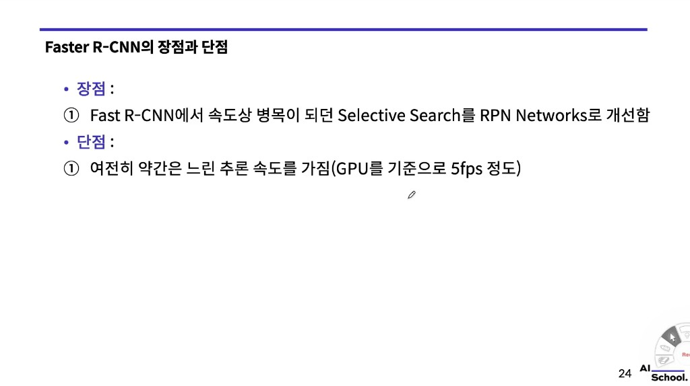

**장점**
- Fast R-CNN의 유일한 병목이던 Selective Search를 **RPN으로 완전히 대체**  
  → proposal도 GPU에서 학습 가능, end-to-end 최적화 가능
- RPN과 Fast R-CNN이 conv layer를 **공유** → proposal 생성이 거의 공짜
- R-CNN 대비 **250배 빠른 추론** (0.2s vs 50s)
- RPN이 학습 가능하므로 시간이 지날수록 더 좋은 proposal 생성

**단점**
- 여전히 약 **5fps** (GPU 기준) — 실시간(30fps)에 미달  
  → GPU 기준 5fps는 초당 5장 처리 가능
- **Two-stage 구조의 한계**: proposal 생성 후 분류하는 두 단계가 여전히 존재
- 구현 복잡도: RPN + Fast R-CNN 두 모듈, 4개의 loss 관리 필요
- 작은 물체나 밀집된 물체 탐지에 여전히 어려움

→ 이후 **YOLO(45fps), SSD(58fps)** 등 One-stage detector가 실시간 요구를 충족합니다.

---

## 전체 흐름 요약 — R-CNN 계열의 발전

| 모델 | 논문 | 핵심 아이디어 | Test time | mAP(VOC07) | 남은 한계 |
|------|------|--------------|-----------|-----------|----------|
| **R-CNN** | CVPR 2014 | CNN으로 region 분류 첫 시도 | ~50s | 58.5% | region별 독립 CNN, 복잡한 파이프라인 |
| **Fast R-CNN** | ICCV 2015 | 이미지 1회 forward + RoI Pooling | ~2s | 66.9% | Selective Search CPU 병목(2초) |
| **Faster R-CNN** | NeurIPS 2015 | RPN으로 proposal도 GPU 내에서 | **0.2s** | 66.9% | 여전히 5fps, Two-stage |
| **YOLO/SSD** | CVPR/ECCV 2016 | One-stage, 전체를 한 번에 | **~0.02s** | ~63-73% | 작은 물체 탐지 약함 |

**각 모델이 해결한 병목:**
```
R-CNN   → (해결: CNN을 이미지 전체에 1회 적용) →   Fast R-CNN
Fast R-CNN → (해결: Selective Search → RPN)  →   Faster R-CNN
Faster R-CNN → (해결: Two-stage → One-stage) →   YOLO / SSD
```

---

## 핵심 용어 한 줄 정리

| 용어 | 정의 |
|------|------|
| **Region Proposal** | 물체가 있을 것 같은 후보 영역을 이미지에서 미리 추출하는 과정 |
| **Selective Search** | 색상·질감·크기 유사도로 후보 region을 생성하는 전통 알고리즘 |
| **BBox Regression** | proposal의 위치를 GT에 맞게 보정하는 선형 회귀 |
| **RoI Pooling** | 임의 크기의 region을 고정 크기 feature map으로 변환 (Max Pooling 기반) |
| **Anchor** | RPN이 각 위치에서 미리 정의하는 다양한 크기·비율의 reference box |
| **IoU** | 두 bounding box의 겹침 정도 (교집합/합집합, 0~1) |
| **Multi-task Loss** | 분류 loss + 위치 loss를 하나의 식으로 합산하여 동시 최적화 |
| **Smooth L1 Loss** | 이상치에 강건한 위치 손실 함수 (작은 오차는 L2, 큰 오차는 L1처럼 작동) |
| **End-to-end 학습** | 파이프라인 전체를 하나의 loss로 묶어 동시에 학습하는 방식 |
| **mAP** | 각 클래스별 AP의 평균. Object Detection 성능의 표준 지표 |
| **RPN** | Feature map 위의 sliding window로 proposals를 학습 생성하는 네트워크 |
