# Week 7 — YOLO & Non-Maximum Suppression

> **이 문서의 목표**: 슬라이드를 처음 보는 사람도 YOLO의 동작 원리를 완전히 이해할 수 있도록 각 개념을 단계별로 풀어서 설명합니다.

---

## 들어가기 전에 — One-stage vs Two-stage

지금까지 배운 R-CNN 계열(R-CNN, Fast R-CNN, Faster R-CNN)은 모두 **두 단계(Two-stage)**를 거쳤습니다.

1. **Stage 1**: "이미지의 어디에 물체가 있을 것 같은가?" → Region Proposal 생성
2. **Stage 2**: "그 후보 영역이 실제로 무슨 물체인가?" → 분류 + 위치 보정

이 구조 덕분에 정확도는 높지만, 두 단계를 모두 거쳐야 하므로 **속도가 느립니다**.  
Faster R-CNN조차 약 **5~7 FPS** 수준이라 실시간 처리(30 FPS 이상)에는 무리가 있었습니다.

**YOLO(You Only Look Once)**는 이 두 단계를 **하나의 신경망으로 합쳐서 단 한 번의 forward pass**로 물체의 위치와 종류를 동시에 예측합니다.  
그 결과 **45 FPS**에 달하는 실시간 수준의 속도를 달성했습니다.

---

## Part N — YOLO (You Only Look Once)

> Redmon, Joseph, et al. "You only look once: Unified, real-time object detection." CVPR 2016.

---

### N-1. Object Detection 모델 발전 흐름 (Big Picture)

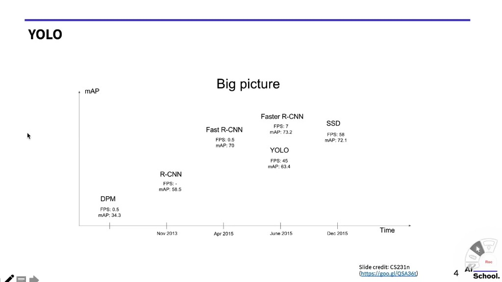

시간 축(가로)을 따라 mAP(세로, 높을수록 정확)와 FPS를 비교한 차트입니다.

| 모델 | 발표 시점 | FPS | mAP (VOC07) |
|------|-----------|-----|-------------|
| DPM | Nov 2013 | 0.5 | 34.3 |
| R-CNN | Nov 2013 | - (매우 느림) | 58.5 |
| Fast R-CNN | Apr 2015 | 0.5 | 70 |
| Faster R-CNN | Jun 2015 | 7 | 73.2 |
| **YOLO** | **Jun 2015** | **45** | 63.4 |
| SSD | Dec 2015 | 58 | 72.1 |

**핵심 트레이드오프**: YOLO는 Faster R-CNN보다 mAP가 낮지만(63.4 vs 73.2), FPS는 6배 이상 빠릅니다(45 vs 7). 실시간 응용(자율주행, 드론, CCTV)에는 YOLO가 훨씬 현실적입니다.

---

### N-2. YOLO의 기본 컨셉 — Grid Cell

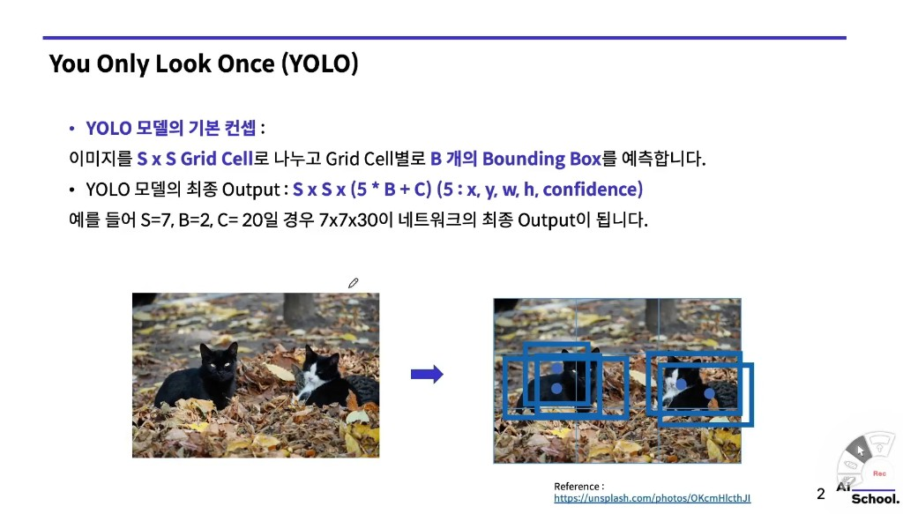

YOLO의 핵심 아이디어는 "이미지를 격자(grid)로 나눠서, 각 칸이 스스로 물체를 예측하게 한다"는 것입니다.

#### 동작 방식

**Step 1 — 이미지를 S×S 격자로 나눕니다.**

예를 들어 S=7이면 이미지를 7×7 = 49개의 칸(cell)으로 균등하게 나눕니다.  
고양이 사진이라면, 왼쪽 고양이가 있는 부분 칸과 오른쪽 고양이가 있는 칸이 각각 담당 영역을 가지게 됩니다.

**Step 2 — 각 grid cell이 B개의 Bounding Box를 예측합니다.**

B=2라면 각 칸이 두 개의 후보 bounding box를 예측합니다.  
두 개를 예측하는 이유는 크기나 비율이 다른 물체를 더 잘 잡기 위해서입니다.

**Step 3 — 최종 출력 텐서의 크기 = S × S × (5 × B + C)**

여기서:
- `5`: 하나의 bounding box를 설명하는 데 필요한 값의 수 (x, y, w, h, confidence)
- `B`: 각 cell당 예측하는 bounding box 수
- `C`: 예측할 클래스(물체 종류)의 수

**예시 (PASCAL VOC 기준)**: S=7, B=2, C=20  
→ 출력 텐서 크기 = **7 × 7 × 30** (5×2 + 20 = 30)

> **직관적 이해**: R-CNN은 "먼저 어디를 볼지 찾고, 그 다음 뭔지 분류하는" 탐정처럼 일합니다. YOLO는 사진 전체를 격자로 나눠서 모든 칸이 동시에 "내 구역에 뭔가 있으면 어디 있고 뭔지 바로 말하는" 방식입니다.

---

### N-3. 출력값의 의미 — (x, y, w, h, confidence)

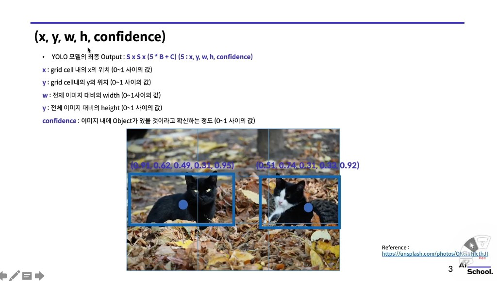

각 bounding box는 **5개의 숫자**로 표현됩니다. 슬라이드의 고양이 예시를 통해 이해해 봅시다.

#### x, y — Bounding Box 중심의 위치

```
x : grid cell 내의 x 위치 (0~1 사이의 값)
y : grid cell 내의 y 위치 (0~1 사이의 값)
```

- x와 y는 **해당 grid cell 내에서의 상대적 위치**입니다.
- 예를 들어 x=0.5, y=0.5면 그 grid cell의 정중앙에 bounding box 중심이 있다는 의미입니다.
- x=0이면 cell의 왼쪽 경계, x=1이면 오른쪽 경계입니다.

> 주의: x, y는 grid cell의 크기를 1로 봤을 때의 비율입니다. 전체 이미지 기준이 아닙니다.

#### w, h — Bounding Box의 폭과 높이

```
w : 전체 이미지 대비의 width  (0~1 사이의 값)
h : 전체 이미지 대비의 height (0~1 사이의 값)
```

- w와 h는 **전체 이미지 크기 대비 비율**입니다.
- 예를 들어 w=0.3이면 bounding box의 너비가 전체 이미지 너비의 30%라는 의미입니다.
- x, y와 달리 이미지 전체를 기준으로 한다는 점이 중요합니다.

#### confidence — 해당 box에 물체가 있을 확률

```
confidence : 이미지 내에 Object가 있을 것이라고 확신하는 정도 (0~1 사이의 값)
```

정확히는 다음 두 요소의 곱입니다:

$$\text{confidence} = P(\text{obj}) \times \text{IoU}_{\text{pred}}^{\text{truth}}$$

- $P(\text{obj})$: 이 cell에 물체 중심이 있을 확률
- $\text{IoU}_{\text{pred}}^{\text{truth}}$: 예측 box와 실제 GT box의 겹침 정도

물체가 없는 background 칸이면 confidence ≈ 0, 물체가 있고 박스도 잘 맞으면 confidence ≈ 1이 됩니다.

#### 슬라이드 예시 해석

슬라이드에서 두 고양이에 대한 예측값:
- 왼쪽 고양이: `(0.21, 0.62, 0.49, 0.31, 0.95)` → 95% 확신, box 중심은 cell 내 (21%, 62%) 위치
- 오른쪽 고양이: `(0.51, 0.74, 0.31, 0.83, 0.92)` → 92% 확신

---

### N-4. YOLO 전체 추론(Inference) 구조

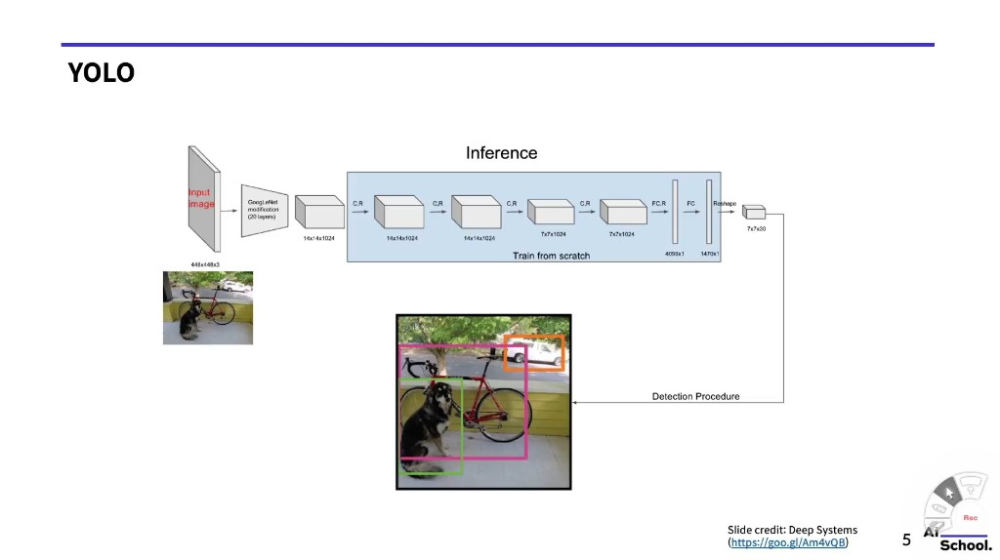

YOLO의 신경망 구조를 앞에서 뒤로 따라가 봅시다.

```
[Input Image: 448×448×3]
        ↓
[GoogLeNet 변형 (20 layers) → 14×14×1024]
        ↓
[Conv+ReLU: 14×14×1024]
        ↓
[Conv+ReLU: 14×14×1024]
        ↓
[Conv+ReLU: 7×7×1024]    ← stride 2로 해상도 절반
        ↓
[Conv+ReLU: 7×7×1024]
        ↓
[FC+ReLU: 4096×1]        ← 전체 특징을 하나의 벡터로 압축
        ↓
[FC: 1470×1]
        ↓
[Reshape: 7×7×30]        ← 최종 출력 텐서
        ↓
[Detection Procedure]    ← NMS 등 후처리
        ↓
[최종 Detection 결과]
```

**왜 입력이 448×448인가?**  
기존 GoogLeNet은 224×224 입력을 사용했지만, 물체 탐지는 세밀한 공간 정보가 중요하므로 해상도를 2배 높였습니다.

**GoogLeNet을 왜 사용했나?**  
ImageNet에서 검증된 강력한 특징 추출기를 가져와서 fine-tuning하는 전이학습(Transfer Learning) 전략입니다. 처음부터 학습하는 것보다 훨씬 효율적입니다.

---

### N-5. 출력 텐서 해부하기 — 단계별 분석

YOLO의 핵심은 7×7×30 출력 텐서를 이해하는 것입니다.  
각 grid cell당 30개의 값이 있는데, 이게 어떻게 구성되는지 슬라이드를 따라가며 단계별로 살펴봅니다.

---

#### Step 1 — 첫 번째 Bounding Box (bbox1) 정보

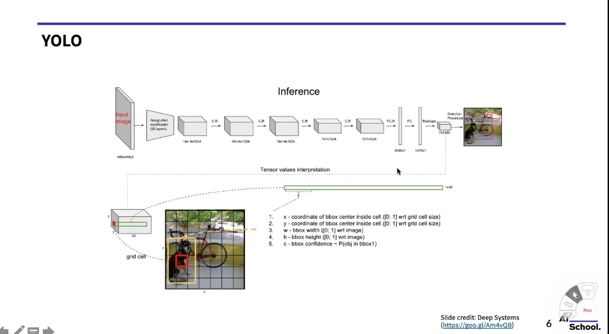

30개 값 중 **처음 5개(인덱스 0~4)**: `bbox1`의 위치와 confidence

```
인덱스 0: x  — bbox1 중심의 x 위치 (grid cell 내, 0~1)
인덱스 1: y  — bbox1 중심의 y 위치 (grid cell 내, 0~1)
인덱스 2: w  — bbox1의 너비 (전체 이미지 대비, 0~1)
인덱스 3: h  — bbox1의 높이 (전체 이미지 대비, 0~1)
인덱스 4: c  — bbox1의 confidence ≈ P(obj in bbox1)
```

슬라이드에서 grid cell 하나를 확대한 1×30 벡터의 앞부분 5칸이 여기에 해당합니다.

---

#### Step 2 — 두 번째 Bounding Box (bbox2) 정보

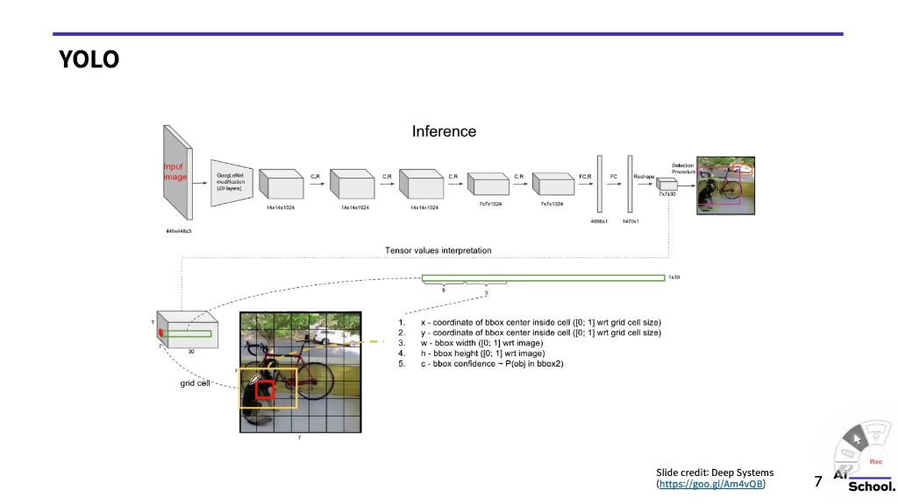

30개 값 중 **다음 5개(인덱스 5~9)**: `bbox2`의 위치와 confidence

```
인덱스 5: x  — bbox2 중심의 x 위치
인덱스 6: y  — bbox2 중심의 y 위치
인덱스 7: w  — bbox2의 너비
인덱스 8: h  — bbox2의 높이
인덱스 9: c  — bbox2의 confidence ≈ P(obj in bbox2)
```

> **왜 bbox를 2개 예측하나?** 하나의 cell 안에 두 가지 크기·비율의 물체가 있을 수 있기 때문입니다. 두 bbox는 각각 독립적으로 학습되며, 학습 과정에서 서로 다른 모양의 물체를 전문적으로 잡도록 분화됩니다.

---

#### Step 3 — 두 BBox를 합치면

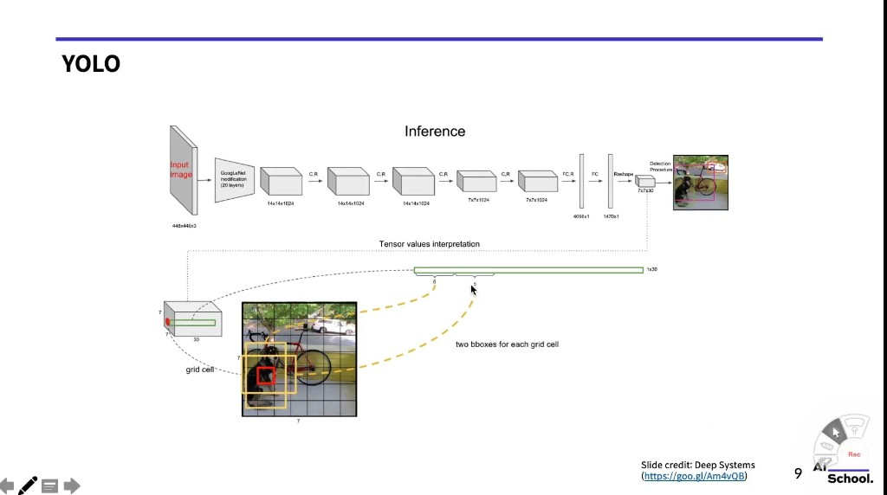

```
[인덱스 0~4 : bbox1의 x, y, w, h, confidence]
[인덱스 5~9 : bbox2의 x, y, w, h, confidence]
                  ↑ 총 10개 값 (5B = 5×2)
```

이 10개 값이 "이 cell에서 어디에 bbox가 있는가"를 나타냅니다.

---

#### Step 4 — 클래스 점수 (Class Scores)

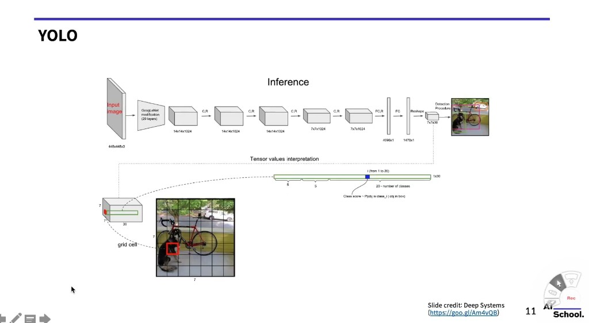

30개 값 중 **나머지 20개(인덱스 10~29)**: 각 클래스에 대한 점수

```
인덱스 10~29 (20개): Class score_j = P(obj in cell이 class_j에 속한다 | cell 안에 obj가 있다)
```

PASCAL VOC 데이터셋에는 20개의 클래스가 있습니다 (사람, 자동차, 개, 자전거, 의자 등).

중요한 점: 이 20개의 클래스 점수는 **bbox1과 bbox2가 공유**합니다.  
즉, "이 cell 안에 물체가 있다면 어떤 종류인가"는 bbox 개수와 관계없이 cell 단위로 한 번만 예측합니다.

> 이것이 YOLO의 한계 중 하나입니다. 하나의 cell 안에 서로 다른 종류의 물체 두 개가 있으면(예: 사람과 자전거가 같은 cell에 겹쳐 있으면) 제대로 분류하기 어렵습니다.

---

#### Step 5 — 최종 클래스별 confidence 계산 (bbox1)

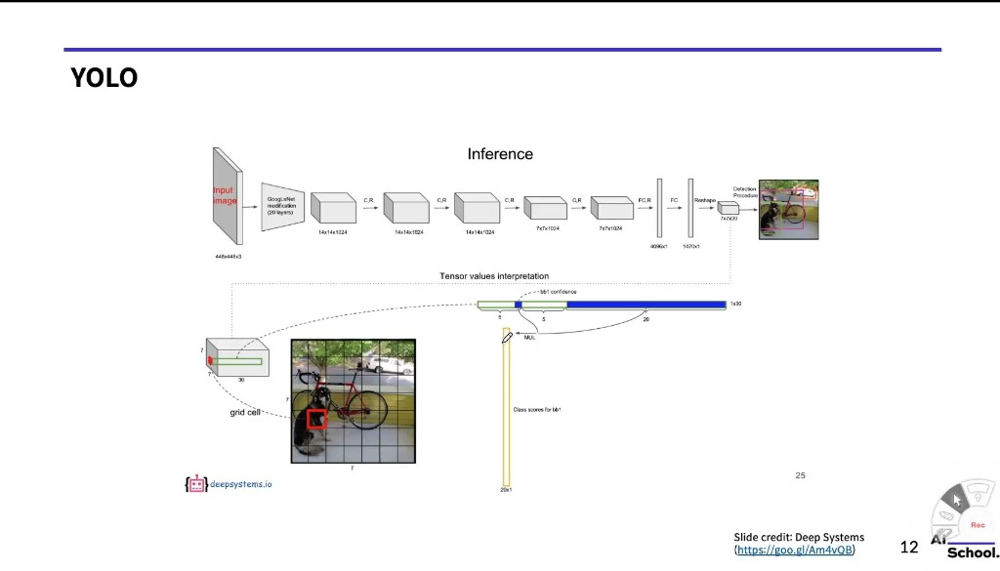

"bbox1이 실제로 class_j의 물체를 잘 잡았는가?"를 하나의 점수로 표현합니다.

$$\text{class-specific confidence for bbox1, class } j = \underbrace{c_1}_{\text{bbox1 confidence}} \times \underbrace{\text{class score}_j}_{\text{P(class\_j | obj)}}$$

- $c_1 = P(\text{obj in bbox1}) \times \text{IoU}$: bbox1에 물체가 있을 확률 × 얼마나 잘 맞는가
- $\text{class score}_j = P(\text{class}_j \mid \text{obj})$: 물체가 있다면 j번 클래스일 확률

이 곱의 결과는 **bbox1에 대한 20개의 최종 점수 벡터(20×1)** 입니다.  
예를 들어 "bbox1이 자전거를 잡은 confidence = 0.8" 같은 식입니다.

---

#### Step 6 — 최종 클래스별 confidence 계산 (bbox2)

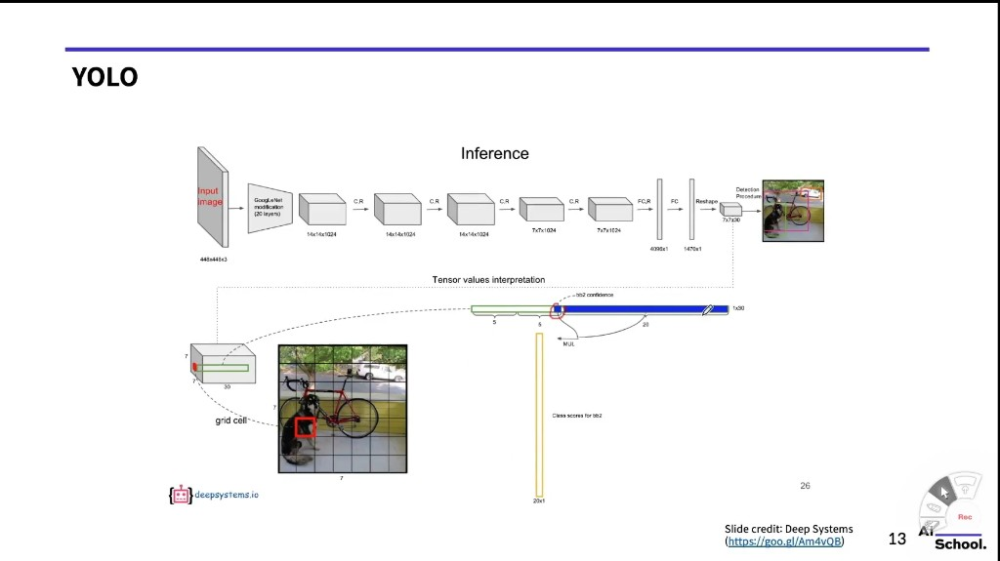

bbox1과 동일한 방식으로 bbox2에 대해서도 20개의 클래스별 점수를 계산합니다.

$$\text{class-specific confidence for bbox2, class } j = c_2 \times \text{class score}_j$$

결과: **bbox2에 대한 20개의 최종 점수 벡터(20×1)**

---

#### Step 7 — 모든 Grid Cell에 적용하면?

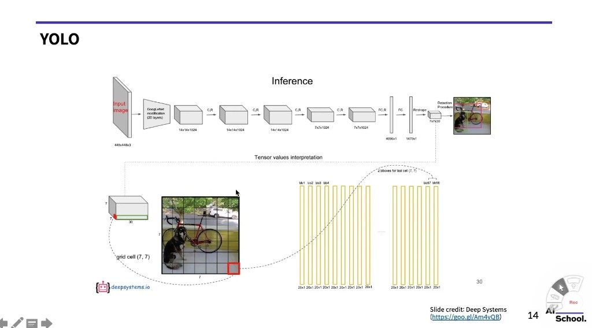

지금까지는 grid cell **하나**에 대해 살펴봤습니다. 이 과정을 **7×7 = 49개** 전체 cell에 반복하면:

- 각 cell에서 bbox1, bbox2 각각 20개의 클래스별 점수 → cell당 40개
- 전체: 49 cells × 2 bboxes = **98개의 bounding box**
- 각 bbox마다 20개의 클래스별 confidence score

슬라이드에서 "bb1, bb2, ..., bb97, bb98"로 표기된 열들이 이 98개의 bbox입니다.  
마지막 cell (7, 7)에 대한 bb97, bb98이 맨 오른쪽에 위치합니다.

```
최종 예측:
- 총 98개의 bbox 후보
- 각 bbox마다 20개의 클래스별 confidence
→ 98 × 20 = 1960개의 점수
```

이 많은 후보 박스들 중에서 의미 있는 것만 골라내는 작업이 필요합니다.  
그것이 바로 **Non-Maximum Suppression(NMS)** 입니다.

---

### N-6. Detection Procedure 전체 흐름

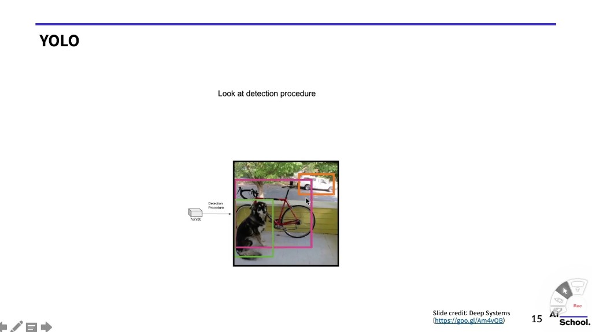

7×7×30 텐서를 Detection Procedure에 통과시키면 최종 detection 결과가 나옵니다.

```
[7×7×30 텐서]
      ↓
[각 bbox에 대해 20개의 class-specific confidence 계산]
      ↓
[낮은 confidence는 threshold로 제거 (예: 0.2 미만 → 0으로)]
      ↓
[Non-Maximum Suppression (클래스별 적용)]
      ↓
[최종 detection 결과: 클래스 레이블 + 위치 + confidence]
```

결과 이미지에서 개(초록 박스), 자전거(분홍 박스), 자동차(주황 박스)가 각각 탐지된 것을 볼 수 있습니다.

---

## Part O — Non-Maximum Suppression (NMS)

### O-1. NMS가 필요한 이유

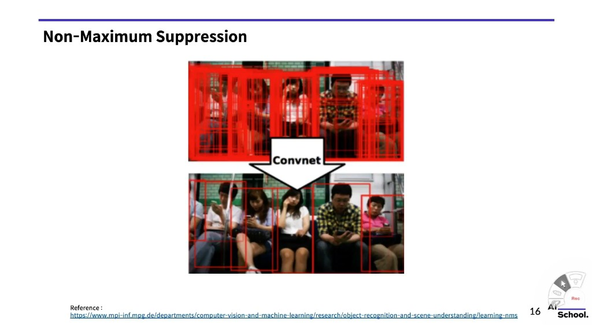

슬라이드의 위쪽 이미지를 보면, 사람들이 앉아 있는 사진에 **수십 개의 빨간 박스**가 빽빽하게 겹쳐 있습니다. 이것이 신경망이 처음에 예측하는 raw output입니다.

**왜 이렇게 많은 박스가 생기는가?**

YOLO는 7×7 = 49개의 grid cell 각각에서 2개의 bbox를 예측하므로 총 98개의 후보 박스가 나옵니다. 사람이 앉아 있는 영역을 여러 cell이 동시에 감지하면 같은 사람에 대한 박스가 여러 개 생깁니다.

**NMS는 이 중복 박스들을 제거해 가장 적합한 하나만 남기는 과정입니다.**

---

### O-2. NMS 알고리즘 단계별 설명

NMS는 **클래스별로** 독립적으로 수행됩니다. 예시로 "사람" 클래스에 대해 NMS를 적용하는 과정을 봅시다.

**[Step 1] Confidence threshold로 1차 필터링**
- 사람 클래스에 대한 confidence가 임계값(예: 0.5) 미만인 박스는 제거합니다.

**[Step 2] 남은 박스들을 confidence 내림차순으로 정렬**
- 예: [0.95, 0.88, 0.72, 0.65, 0.60, ...]

**[Step 3] 가장 높은 confidence의 박스를 최종 선택에 추가**
- 0.95짜리 박스를 선택합니다.

**[Step 4] 선택한 박스와 나머지 박스들의 IoU를 계산**
- IoU(Intersection over Union): 두 박스가 얼마나 겹치는지를 나타내는 지표 (0~1)

$$\text{IoU} = \frac{\text{두 박스의 교집합 넓이}}{\text{두 박스의 합집합 넓이}}$$

**[Step 5] IoU가 임계값(예: 0.5) 이상인 박스들을 제거**
- 많이 겹치는 박스는 "같은 물체를 가리키는 중복 박스"로 판단하고 제거합니다.

**[Step 6] 남은 박스들 중 다시 가장 높은 confidence의 박스를 선택하고 [Step 4~5]를 반복**
- 더 이상 남은 박스가 없을 때까지 반복합니다.

**결과**: 각 실제 물체당 하나의 최적 박스만 남습니다.

---

### O-3. IoU(Intersection over Union) 이해하기

IoU는 Object Detection에서 가장 자주 등장하는 지표입니다.

```
        ┌──────────────┐
        │  A           │
        │      ┌───────┼────┐
        │      │  교집합│    │
        └──────┼───────┘    │
               │      B     │
               └────────────┘

IoU = 교집합 넓이 / (A넓이 + B넓이 - 교집합 넓이)
```

- IoU = 1: 두 박스가 완전히 일치
- IoU = 0: 두 박스가 전혀 겹치지 않음
- IoU > 0.5: 일반적으로 "같은 물체를 가리킨다"고 판단

**NMS에서 IoU의 역할**: 선택된 박스와 IoU가 높은 다른 박스들은 "중복"으로 판단하여 제거합니다.

---

## 전체 흐름 요약

```
이미지 입력 (448×448×3)
        ↓
GoogLeNet 기반 CNN 통과 (특징 추출)
        ↓
7×7×30 텐서 출력
  ├─ 각 cell: bbox1 (x, y, w, h, conf) + bbox2 (x, y, w, h, conf) + 20개 class scores
        ↓
bbox별 class-specific confidence 계산
  (bbox confidence × class score = 최종 확신도)
        ↓
Threshold 필터링 (낮은 confidence 제거)
        ↓
Non-Maximum Suppression (클래스별 중복 박스 제거)
        ↓
최종 Detection 결과
  (물체마다 1개의 bbox + 클래스 레이블 + confidence)
```

---

## YOLO vs R-CNN 계열 비교 정리

| 항목 | R-CNN | Fast R-CNN | Faster R-CNN | YOLO |
|------|-------|------------|--------------|------|
| 방식 | Two-stage | Two-stage | Two-stage | **One-stage** |
| Region Proposal | Selective Search | Selective Search | RPN | **없음 (grid로 대체)** |
| FPS | 매우 느림 | 0.5 | 7 | **45** |
| mAP (VOC07) | 58.5 | 70 | 73.2 | 63.4 |
| 특징 | 최초의 CNN OD | end-to-end 학습 | 완전 CNN 내 처리 | **실시간 처리** |
| 한계 | 느림 | proposal 병목 | 여전히 느림 | 작은 물체 탐지 약함 |

---

## 핵심 개념 한 줄 정리

| 개념 | 설명 |
|------|------|
| **Grid Cell** | 이미지를 S×S로 나눈 각 칸. 각 칸이 물체를 독립적으로 예측 |
| **Bounding Box** | 물체의 위치를 나타내는 사각형. (x, y, w, h)로 표현 |
| **Confidence** | 해당 박스에 물체가 있고, 박스가 얼마나 정확한지의 척도 |
| **Class Score** | 물체가 있다고 가정했을 때, 어떤 클래스인지의 확률 |
| **Class-specific Confidence** | confidence × class score. 최종 탐지에 사용되는 점수 |
| **IoU** | 두 박스가 겹치는 정도 (0~1). 탐지 평가 및 NMS에 활용 |
| **NMS** | 같은 물체에 대한 중복 박스를 제거하는 후처리 알고리즘 |
| **One-stage Detector** | Region Proposal 없이 단일 네트워크로 탐지. 빠르지만 정확도 트레이드오프 |
