# SSD: Single Shot MultiBox Detector

---

## 목차

- [A. SSD가 탄생한 배경](#a-ssd가-탄생한-배경)
- [B. One-stage vs Two-stage Detector](#b-one-stage-vs-two-stage-detector)
- [C. SSD의 Big Picture — 성능/속도 발전 흐름](#c-ssd의-big-picture--성능속도-발전-흐름)
- [D. SSD 개요 — 논문과 아키텍처 한눈에 보기](#d-ssd-개요--논문과-아키텍처-한눈에-보기)
- [E. Multi-scale Feature Maps — "크기별 망원경"](#e-multi-scale-feature-maps--크기별-망원경)
- [F. Default Box — 앵커의 SSD 버전](#f-default-box--앵커의-ssd-버전)
- [G. SSD 아키텍처 상세](#g-ssd-아키텍처-상세)
- [H. Default Box Scales & Aspect Ratios — 공식으로 배치 설계](#h-default-box-scales--aspect-ratios--공식으로-배치-설계)
- [I. Matching Strategy — "어떤 Default Box가 GT를 담당하는가?"](#i-matching-strategy--어떤-default-box가-gt를-담당하는가)
- [J. Loss Function — 분류 + 위치를 동시에](#j-loss-function--분류--위치를-동시에)
- [K. Loss Function — Localization Loss](#k-loss-function--localization-loss)
- [L. Loss Function — Confidence Loss](#l-loss-function--confidence-loss)
- [M. Training Tricks](#m-training-tricks)
- [N. Ablation Study — 각 요소가 얼마나 중요한가?](#n-ablation-study--각-요소가-얼마나-중요한가)
- [O. 실험 결과 — COCO 시각화](#o-실험-결과--coco-시각화)
- [P. SSD 성능 정량 분석 — PASCAL VOC2007](#p-ssd-성능-정량-분석--pascal-voc2007)
- [Q. SSD 속도 분석 — 타 모델과 비교](#q-ssd-속도-분석--타-모델과-비교)
- [R. SSD의 장점과 단점](#r-ssd의-장점과-단점)
- [핵심 개념 정리](#핵심-개념-정리)

---

## A. SSD가 탄생한 배경

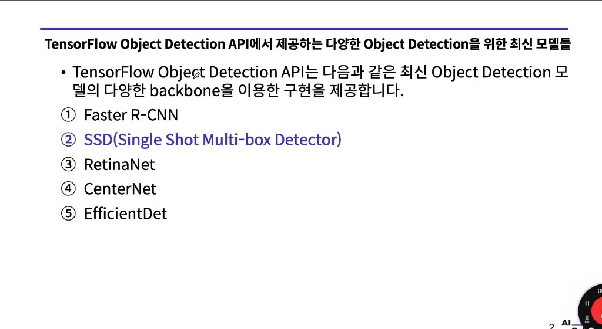

TensorFlow Object Detection API는 다양한 Object Detection 모델 구현을 제공합니다.  
이 중 **SSD(Single Shot MultiBox Detector)** 가 이번에 다룰 모델입니다.

| 번호 | 모델 | 특징 |
|------|------|------|
| ① | Faster R-CNN | Two-stage, 정확도 높음, 느림 |
| **②** | **SSD** | **One-stage, 빠르고 정확도도 준수** |
| ③ | RetinaNet | Focal Loss로 class imbalance 해결 |
| ④ | CenterNet | Anchor-free 방식 |
| ⑤ | EfficientDet | Compound scaling |

SSD는 2015년 말 제안된 후 꽤 오랫동안 실시간 Object Detection의 기준 모델로 사용되었습니다.

---

## B. One-stage vs Two-stage Detector

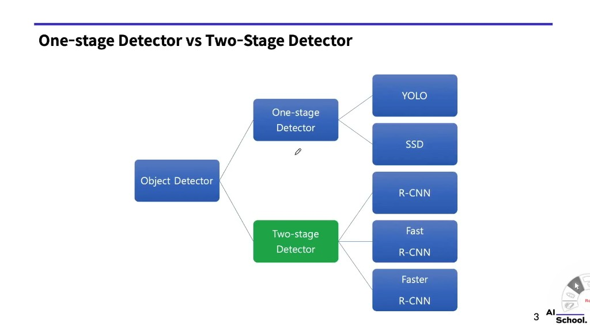

Object Detector는 크게 두 가지 계열로 나뉩니다:

```
Object Detector
├── One-stage Detector  (속도 우선)
│   ├── YOLO     ← 이전 노트(02.yolo_nms.md)에서 학습
│   └── SSD      ← 이번 노트의 주인공
└── Two-stage Detector  (정확도 우선)
    ├── R-CNN    ← 01.object_detection_rcnn.md
    ├── Fast R-CNN
    └── Faster R-CNN
```

### 두 계열의 핵심 차이

**Two-stage**는 탐색 → 분류를 순서대로 수행합니다:
1. Region Proposal Network(RPN)이 "물체가 있을 법한 영역" 후보를 제안
2. 그 후보를 CNN에 넣어 클래스 분류 + 위치 정밀 조정

**One-stage**는 이 두 단계를 한 번에 처리합니다:
- 이미지 전체에 미리 설정된 수많은 default box(anchor)를 깔고
- 각 box에 대해 동시에 클래스 확률 + 위치 조정을 예측

> **직관적 비유**:  
> Two-stage = 경비원이 먼저 "수상한 구역"을 표시한 뒤, 다른 팀이 정밀 조사  
> One-stage = 전체 구역을 한 팀이 동시에 빠르게 훑기

이 차이 때문에 One-stage가 훨씬 빠르지만, 초기에는 정확도가 낮았습니다. SSD는 **Multi-scale Feature Map** 전략으로 이 격차를 줄인 것이 핵심입니다.

---

## C. SSD의 Big Picture — 성능/속도 발전 흐름

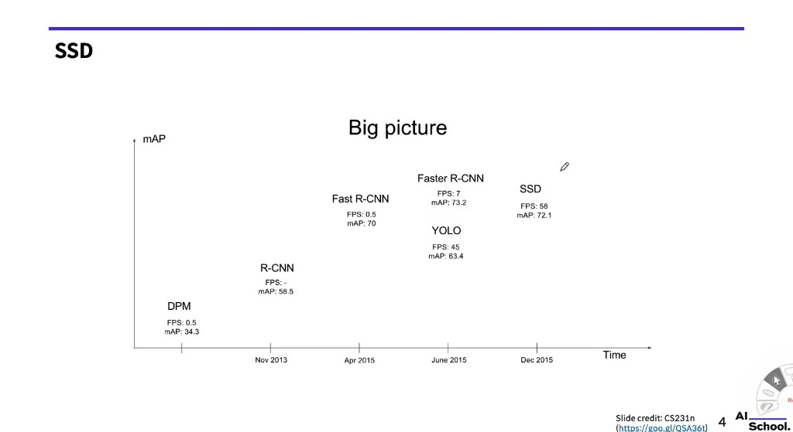

> 슬라이드 출처: CS231n (https://goo.gl/QSA36t)

x축은 발표 시기, y축은 mAP(정확도)입니다. 각 점에 FPS(속도)도 함께 표시되어 있습니다.

| 모델 | 발표 시기 | FPS | mAP | 비고 |
|------|-----------|-----|-----|------|
| DPM | 2013년 이전 | 0.5 | 34.3 | 딥러닝 이전 시대 |
| R-CNN | Nov 2013 | — (매우 느림) | 58.5 | 딥러닝 첫 등장 |
| Fast R-CNN | Apr 2015 | 0.5 | 70 | RoI Pooling 도입 |
| Faster R-CNN | Jun 2015 | 7 | 73.2 | RPN 통합 |
| YOLO | Jun 2015 | 45 | 63.4 | 최초 One-stage |
| **SSD** | **Dec 2015** | **58** | **72.1** | **속도+정확도 균형** |

**핵심 인사이트**: SSD는 YOLO보다 빠르면서도(58 vs 45 FPS), Faster R-CNN에 버금가는 정확도(72.1 vs 73.2 mAP)를 달성했습니다.  
"속도를 희생하면 정확도가 올라간다"는 트레이드오프를 크게 개선한 모델입니다.

---

## D. SSD 개요 — 논문과 아키텍처 한눈에 보기

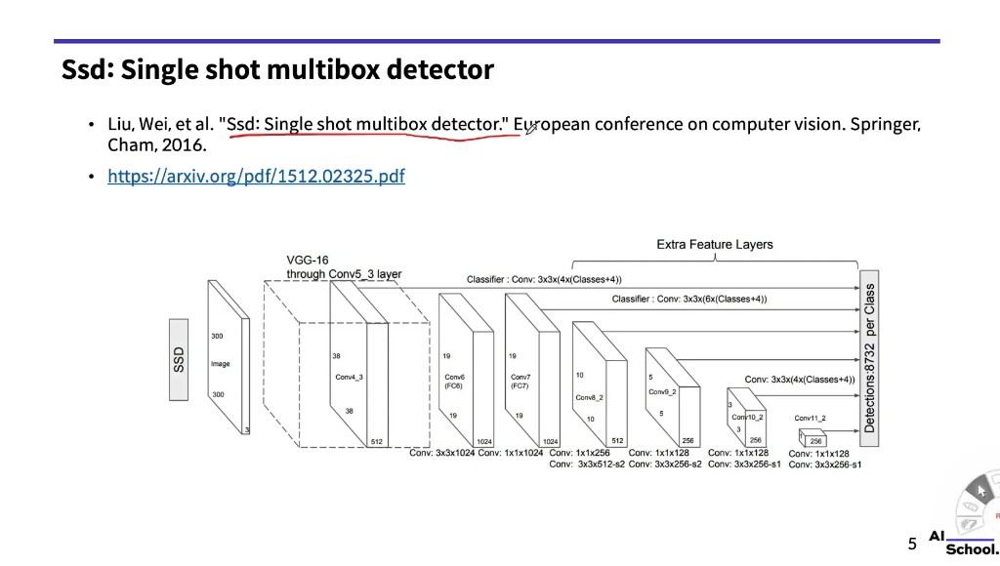

**논문**: Liu, Wei, et al. "Ssd: Single shot multibox detector." European conference on computer vision. Springer, Cham, 2016.  
([arXiv:1512.02325](https://arxiv.org/pdf/1512.02325.pdf))

위 그림은 SSD의 전체 아키텍처입니다:

```
입력 이미지 (300×300)
        │
   VGG-16 Backbone
   (Conv1_1 ~ Conv5_3)
        │
  [Conv4_3 특징맵: 38×38]──────────────────────── Classifier
        │
  FC 레이어 (FC6, FC7)
  → Conv 레이어로 변환
        │
  [Extra Feature Layers]
        ├── Conv8_2 (10×10) ────────────── Classifier
        ├── Conv9_2 (5×5) ──────────────── Classifier
        ├── Conv10_2 (3×3) ─────────────── Classifier
        └── Conv11_2 (1×1) ─────────────── Classifier
        │
  총 8732개 후보 박스
        │
  Non-Maximum Suppression
        │
  최종 검출 결과
```

SSD의 핵심 아이디어:
1. **VGG-16**을 backbone으로 사용 (Conv5_3까지)
2. 그 뒤에 **Extra Feature Layers**를 추가 (점점 작아지는 특징맵)
3. **여러 scale의 특징맵에서 동시에 예측** → 크고 작은 물체 모두 잘 탐지

---

## E. Multi-scale Feature Maps — "크기별 망원경"

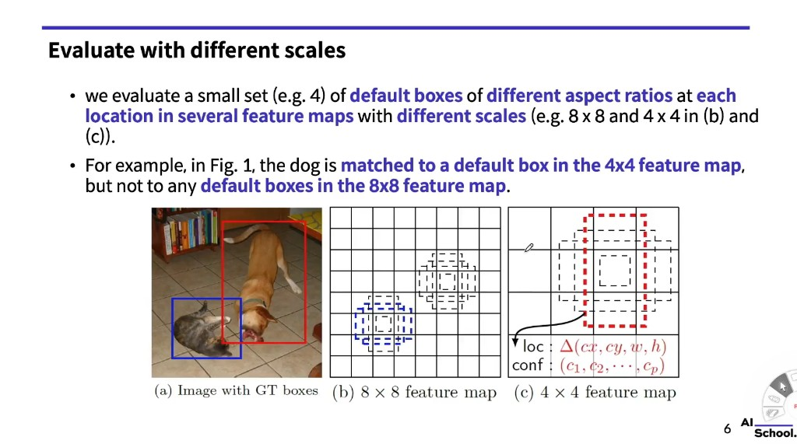

### 왜 여러 scale의 특징맵을 사용하는가?

YOLO v1의 한계: 마지막 레이어 단 하나의 특징맵(7×7)에서만 예측  
→ 작은 물체는 이미 많이 압축되어 정보가 사라진 상태

SSD의 해결책: **서로 다른 크기의 특징맵에서 각각 예측**

```
큰 특징맵 (8×8) → 세밀한 격자 → 작은 물체 탐지에 유리
작은 특징맵 (4×4) → 넓은 격자 → 큰 물체 탐지에 유리
```

### 슬라이드 상세 분석

슬라이드의 세 부분을 읽어봅니다:

**(a) Image with GT boxes**  
- 빨간 박스: 큰 개(dog) — 화면에서 꽤 많은 공간 차지
- 파란 박스: 작은 고양이(cat) — 화면 구석의 작은 영역

**(b) 8×8 feature map**  
- 세밀한 격자 = 이미지를 8×8로 나눈 것  
- 점선 박스들(default boxes)이 각 위치에 촘촘히 배치  
- **개는 여기서 매칭되지 않음** → 개는 너무 커서 8×8 격자에서 커버하기 어렵

**(c) 4×4 feature map**  
- 굵은 격자 = 이미지를 4×4로 나눈 것  
- 각 칸이 더 넓어짐 → 큰 물체를 커버하기 좋음  
- **빨간 박스(개)가 4×4 feature map의 default box에 매칭됨** ✓  
- 출력: `loc: Δ(cx, cy, w, h)` + `conf: (c₁, c₂, ..., cₚ)`

> **핵심 정리**: 특징맵이 크면 작은 물체, 특징맵이 작으면 큰 물체를 담당합니다.  
> 마치 돋보기(세밀한 관찰) vs 쌍안경(먼 거리 관찰)처럼, 각 scale이 자신에게 맞는 크기의 물체를 찾습니다.

---

## F. Default Box — 앵커의 SSD 버전

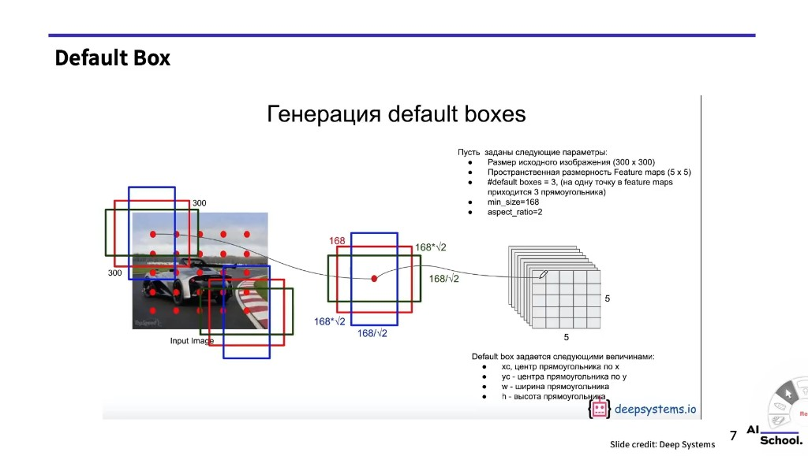

> 슬라이드 출처: Deep Systems (deepsystems.io)  
> (러시아어 설명이 있으나 내용은 동일합니다)

### Default Box란?

Faster R-CNN의 Anchor Box와 동일한 개념입니다.  
이미지 위에 미리 다양한 크기·비율의 사각형 박스를 깔아놓고, 각 박스에 물체가 있는지 예측합니다.

### 슬라이드 분석

슬라이드 왼쪽의 조건:
- 입력 이미지: 300×300
- 특징맵 크기: 5×5 (격자 5행 5열)
- 각 위치당 default box 수: **3개**
- min_size = 168
- aspect_ratio = 2

특징맵의 각 격자 점(빨간 점)은 원본 이미지의 어느 위치를 "담당"하는지 대응됩니다.

각 점에서 3개의 default box가 생성됩니다:

```
min_size = 168 (픽셀 단위)

박스 1: 168 × 168                     (정사각형, 1:1)
박스 2: 168×√2 × 168/√2 ≈ 238 × 119  (가로 긴 직사각형, 2:1)
박스 3: 168/√2 × 168×√2 ≈ 119 × 238  (세로 긴 직사각형, 1:2)
```

오른쪽 다이어그램의 박스들(초록, 파랑, 빨강)이 바로 이 세 종류입니다.

Default box는 4개의 숫자로 표현됩니다:
- `xc`: 박스 중심의 x좌표
- `yc`: 박스 중심의 y좌표
- `w`: 박스의 너비
- `h`: 박스의 높이

### Anchor Box(Faster R-CNN)와의 차이

| | Faster R-CNN Anchor | SSD Default Box |
|---|---|---|
| 위치 | 마지막 Conv 특징맵 하나 | 여러 scale의 특징맵 각각 |
| 총 개수 | ~20,000개 | 8,732개 |
| Scale 다양성 | 중간 | 높음 (작은 ~ 큰 특징맵 전부) |

---

## G. SSD 아키텍처 상세

### G-1. SSD vs YOLO 아키텍처 비교

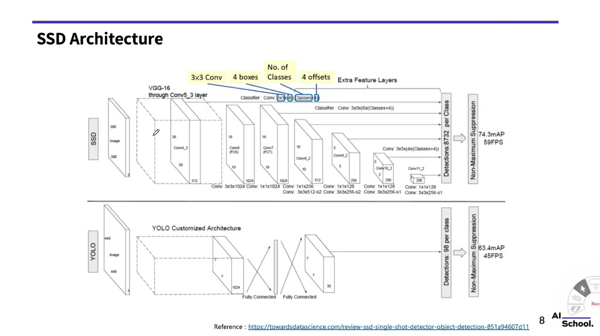

> 출처: [towardsdatascience.com](https://towardsdatascience.com/review-ssd-single-shot-detector-object-detection-851a94607d11)

**위쪽 (SSD):**

```
SSD (300×300 입력)
  └─ VGG-16 (Conv1_1 ~ Conv5_3)
        └─ Conv4_3 [38×38×512]
              └─ 3×3 Conv (Classifier: 4 boxes)
        └─ Conv6 (FC6→Conv) [19×19×1024]
        └─ Conv7 (FC7→Conv) [19×19×1024]
              └─ 3×3 Conv (Classifier: 6 boxes)
        └─ [Extra Feature Layers]
              ├─ Conv8_2 [10×10×512]
              ├─ Conv9_2 [5×5×256]
              ├─ Conv10_2 [3×3×256]
              └─ Conv11_2 [1×1×256]
  → Detections: 8732 per Class
  → Non-Maximum Suppression
  → 74.3 mAP / 59 FPS
```

Classifier 표기 `Conv: 3×3×4×(Classes+4)` 의 의미:
- `3×3`: 커널 크기
- `4`: 이 위치에서 예측할 default box 수
- `(Classes+4)`: 각 box마다 Classes개의 클래스 확률 + 4개의 위치 파라미터(cx, cy, w, h)

**아래쪽 (YOLO):**

```
YOLO (448×448 입력)
  └─ YOLO Customized Architecture
        └─ Fully Connected × 2
  → Detections: 98 per class
  → Non-Maximum Suppression
  → 63.4 mAP / 45 FPS
```

### G-2. 레이어별 Box 수 계산

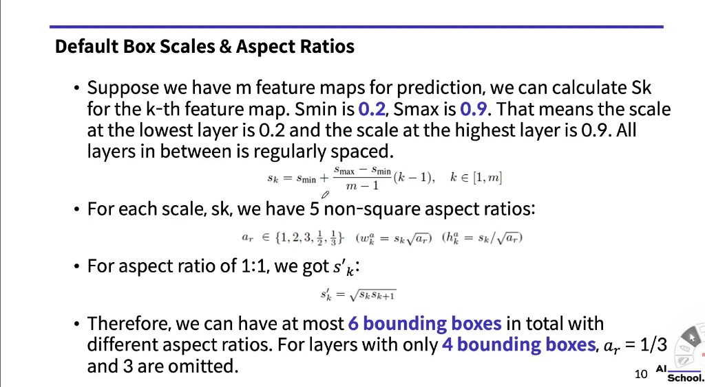

각 레이어에서 몇 개의 bounding box가 나오는지 직접 계산해봅니다.

**예시: Conv4_3**
- 특징맵 크기: 38×38
- 채널 수: 512
- 각 위치마다 4개의 default box
- 각 box당 출력: (클래스 수 + 4) = (20+1+4) = 25 (PASCAL VOC 기준)
- 총 출력 텐서: **38 × 38 × 4 × 25 = 144,400**
- box 개수만: **38 × 38 × 4 = 5,776개**

| 레이어 | 특징맵 크기 | box per 위치 | 총 box 수 |
|--------|------------|-------------|----------|
| Conv4_3 | 38×38 | 4 | **5,776** |
| Conv7 (FC7) | 19×19 | 6 | **2,166** |
| Conv8_2 | 10×10 | 6 | **600** |
| Conv9_2 | 5×5 | 6 | **150** |
| Conv10_2 | 3×3 | 4 | **36** |
| Conv11_2 | 1×1 | 4 | **4** |
| **합계** | | | **8,732** |

**5776 + 2166 + 600 + 150 + 36 + 4 = 8,732**

비교: YOLO는 7×7 격자 × 2 box = **98개**  
→ SSD는 YOLO보다 **약 89배 많은 후보 박스**를 사용해 다양한 크기·위치·비율의 물체를 놓치지 않습니다.

---

## H. Default Box Scales & Aspect Ratios — 공식으로 배치 설계

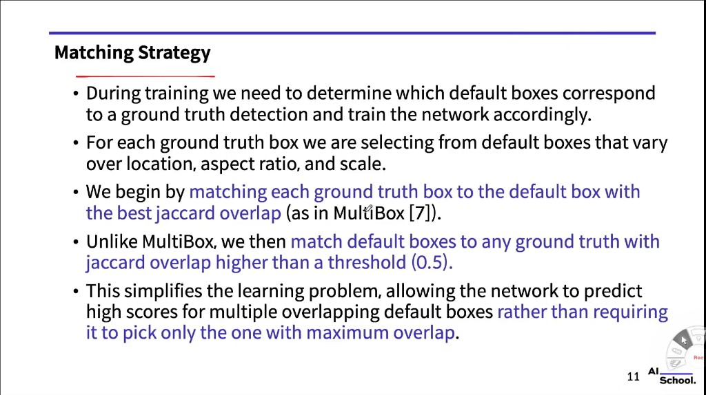

### Scale 설계 공식

m개의 feature map을 사용할 때, k번째 feature map의 default box 크기(scale)를 다음 공식으로 결정합니다:

$$s_k = s_{\min} + \frac{s_{\max} - s_{\min}}{m - 1}(k-1), \quad k \in [1, m]$$

| 기호 | 의미 |
|------|------|
| $s_k$ | k번째 feature map에서의 default box scale (0~1, 원본 이미지 비율) |
| $s_{\min}$ | 가장 하위 레이어(큰 특징맵)의 scale = **0.2** |
| $s_{\max}$ | 가장 상위 레이어(작은 특징맵)의 scale = **0.9** |
| $m$ | prediction에 사용하는 총 feature map 수 |
| $k$ | 레이어 번호 (1부터 시작) |

**직관적 이해**:  
- 특징맵이 크면(= 하위 레이어) → 0.2 scale → 작은 물체 담당  
- 특징맵이 작으면(= 상위 레이어) → 0.9 scale → 큰 물체 담당  
- 사이 레이어들은 0.2와 0.9 사이에 균등 분포

**수치 예시** (m=6일 때):

| k | $s_k$ | 의미 |
|---|--------|------|
| 1 | 0.20 | 원본 이미지의 20% 크기 박스 (작은 물체) |
| 2 | 0.34 | |
| 3 | 0.48 | |
| 4 | 0.62 | |
| 5 | 0.76 | |
| 6 | 0.90 | 원본 이미지의 90% 크기 박스 (큰 물체) |

### Aspect Ratio 설계

각 scale에 대해 **5가지 비정사각형 aspect ratio**:

$$a_r \in \{1, 2, 3, \tfrac{1}{2}, \tfrac{1}{3}\}$$

각 aspect ratio에서 default box의 폭과 높이:

$$w_k^a = s_k \sqrt{a_r}, \quad h_k^a = \frac{s_k}{\sqrt{a_r}}$$

| $a_r$ | 폭 ($w_k^a$) | 높이 ($h_k^a$) | 형태 |
|--------|-------------|--------------|------|
| 1 | $s_k$ | $s_k$ | 정사각형 |
| 2 | $s_k\sqrt{2}$ | $s_k/\sqrt{2}$ | 가로 긴 직사각형 |
| 3 | $s_k\sqrt{3}$ | $s_k/\sqrt{3}$ | 더 가로 긴 직사각형 |
| 1/2 | $s_k/\sqrt{2}$ | $s_k\sqrt{2}$ | 세로 긴 직사각형 |
| 1/3 | $s_k/\sqrt{3}$ | $s_k\sqrt{3}$ | 더 세로 긴 직사각형 |

### 1:1 비율 추가 박스

aspect ratio = 1인 경우, 추가로 **scale을 달리한 정사각형 박스** 하나를 더 씁니다:

$$s'_k = \sqrt{s_k \cdot s_{k+1}}$$

이것은 현재 레이어와 다음 레이어의 scale의 기하평균으로, 두 레이어 사이의 중간 크기 박스입니다.

### 최종 박스 수

- 정사각형 2개 (aspect ratio 1 × 2종 scale) + 비정사각형 4종 = **최대 6개** per 위치
- 일부 레이어는 $a_r = 1/3$과 $a_r = 3$ 생략 → **4개** per 위치

이것이 G-2 표에서 Conv4_3과 마지막 두 레이어가 "4 boxes", 나머지가 "6 boxes"인 이유입니다.

---

## I. Matching Strategy — "어떤 Default Box가 GT를 담당하는가?"

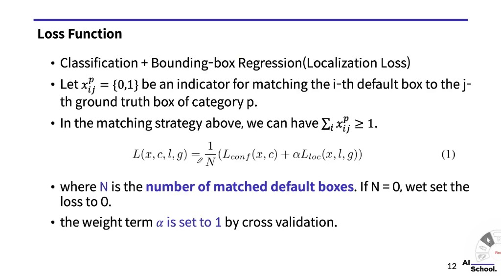

### 왜 Matching Strategy가 필요한가?

8,732개의 default box 중 실제로 학습에 "정답(GT)"으로 활용되는 것은 일부뿐입니다.  
나머지는 "배경(background)"으로 처리됩니다.  
**어떤 default box가 어떤 GT box를 담당하는지 결정하는 규칙**이 Matching Strategy입니다.

### SSD의 2단계 매칭

**Step 1**: 각 GT box에 대해, **Jaccard overlap(= IoU)이 가장 높은 default box 1개**를 매칭  
(MultiBox [7]과 동일)

**Step 2**: 그 다음, **Jaccard overlap ≥ 0.5인 모든 default box**를 추가로 매칭  
(MultiBox와 다른 SSD만의 특징)

```
GT box (개) ─── Step 1 ──► default box A (IoU=0.82, 최고 overlap)  ← 무조건 매칭
              ─── Step 2 ──► default box B (IoU=0.61)                ← 0.5 이상이므로 매칭
                          ► default box C (IoU=0.55)                ← 0.5 이상이므로 매칭
                          ► default box D (IoU=0.31)                ← 0.5 미만, 배경
```

### Step 2를 추가한 이유

**MultiBox 방식(Step 1만)의 문제점**:  
"최고 overlap 단 1개만" 양성으로 쓰면, 위치가 조금 다른 default box들이 모두 음성(배경)으로 취급됩니다.  
→ 네트워크가 "정답에 가까운 박스도 무조건 배경으로 보라"고 학습되어 불안정

**SSD의 해결**:  
IoU ≥ 0.5를 넘는 박스들은 모두 양성으로 처리  
→ 한 GT에 여러 default box가 high confidence를 갖도록 학습  
→ **더 안정적이고 유연한 학습** 가능

> **Jaccard overlap = IoU**: 두 박스의 교집합 / 합집합  
> IoU 개념이 낯설면 YOLO 노트(02.yolo_nms.md)의 IoU 설명을 참고하세요.

---

## J. Loss Function — 분류 + 위치를 동시에

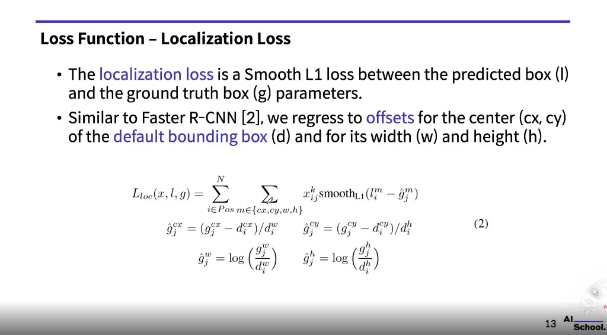

### SSD의 전체 Loss 구조

$$L(x, c, l, g) = \frac{1}{N}\left(L_{conf}(x, c) + \alpha L_{loc}(x, l, g)\right)$$

| 기호 | 의미 |
|------|------|
| $x$ | Matching indicator 행렬. $x^p_{ij} \in \{0, 1\}$: i번째 default box가 카테고리 p의 j번째 GT box와 매칭되면 1 |
| $c$ | 각 default box의 클래스 confidence 예측값 |
| $l$ | 각 default box의 위치 예측값 (predicted box) |
| $g$ | Ground truth box의 좌표 |
| $N$ | 매칭된 default box의 총 수 |
| $\alpha$ | Localization Loss의 가중치 (= **1**, cross-validation으로 결정) |

### N이 0인 경우

매칭된 default box가 하나도 없으면 ($N = 0$), Loss를 **0**으로 설정합니다.  
(0으로 나누는 연산을 방지)

### Faster R-CNN과의 비교

Faster R-CNN의 Multi-task Loss와 구조가 거의 동일합니다:

$$L = L_{cls} + \lambda L_{reg}$$

**차이점**:
- Faster R-CNN: 2단계(RPN + 분류)이므로 loss도 단계별로 계산
- SSD: 단 1회의 forward pass에서 모든 loss를 동시에 계산

이것이 "Single Shot"의 의미입니다!

### 매칭 인디케이터 $x^p_{ij}$의 특성

Matching Strategy에 따라 **한 GT에 여러 default box가 매칭**되므로:

$$\sum_i x^p_{ij} \geq 1$$

(j번째 GT에 매칭된 default box 수가 1개 이상)

---

## K. Loss Function — Localization Loss

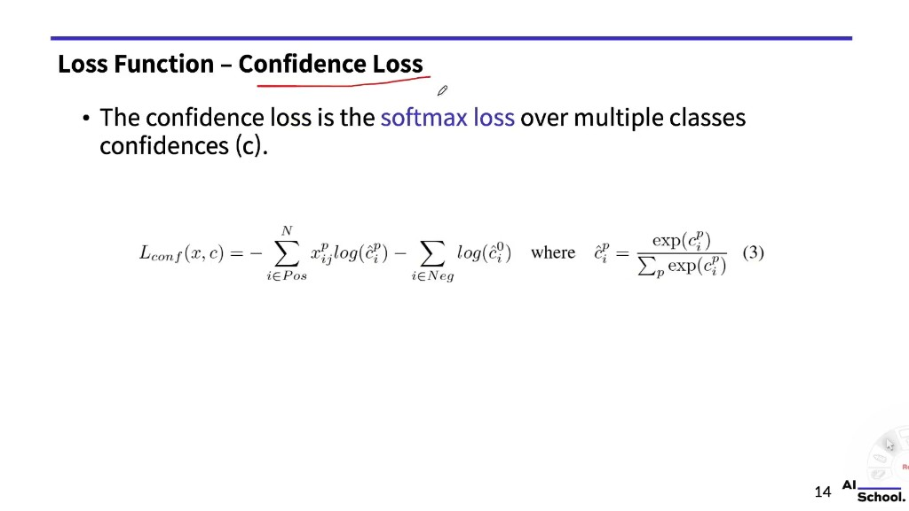

### 수식 전체

$$L_{loc}(x, l, g) = \sum_{i \in Pos} \sum_{m \in \lbrace cx,cy,w,h \rbrace} x^k_{ij} \cdot \text{smooth}_{L1}(l^m_i - \hat{g}^m_j)$$

### 좌표 변환 공식

직접 GT 좌표를 예측하는 대신, **default box 대비 offset**을 예측합니다.  
(Faster R-CNN과 동일한 방식)

$$\hat{g}^{cx}_j = \frac{g^{cx}_j - d^{cx}_i}{d^w_i}, \quad \hat{g}^{cy}_j = \frac{g^{cy}_j - d^{cy}_i}{d^h_i}$$

$$\hat{g}^w_j = \log\!\left(\frac{g^w_j}{d^w_i}\right), \quad \hat{g}^h_j = \log\!\left(\frac{g^h_j}{d^h_i}\right)$$

| 기호 | 의미 |
|------|------|
| $g^{cx}_j, g^{cy}_j$ | GT box j의 중심 x, y 좌표 |
| $g^w_j, g^h_j$ | GT box j의 너비, 높이 |
| $d^{cx}_i, d^{cy}_i$ | default box i의 중심 x, y 좌표 |
| $d^w_i, d^h_i$ | default box i의 너비, 높이 |
| $\hat{g}$ | "네트워크가 학습해야 할 목표 offset값" |

### 왜 log를 취하는가?

`w`, `h`에 log를 취하는 이유:
- 크기(width, height)는 항상 양수 → log를 취하면 전체 실수 범위로 변환
- 크기 변화를 **비율**로 표현 (예: 박스가 2배가 되면 log(2) ≈ 0.69으로 표현)
- 작은 박스와 큰 박스의 변화량을 균일하게 처리

### Smooth L1 Loss

$$\text{smooth}_{L1}(x) = \begin{cases} 0.5 x^2 & \text{if } |x| < 1 \\ |x| - 0.5 & \text{otherwise} \end{cases}$$

- 차이가 작으면 (|x| < 1): L2처럼 부드럽게 → 수치 안정적
- 차이가 크면 (|x| ≥ 1): L1처럼 선형 → 이상치(outlier)에 강건

---

## L. Loss Function — Confidence Loss

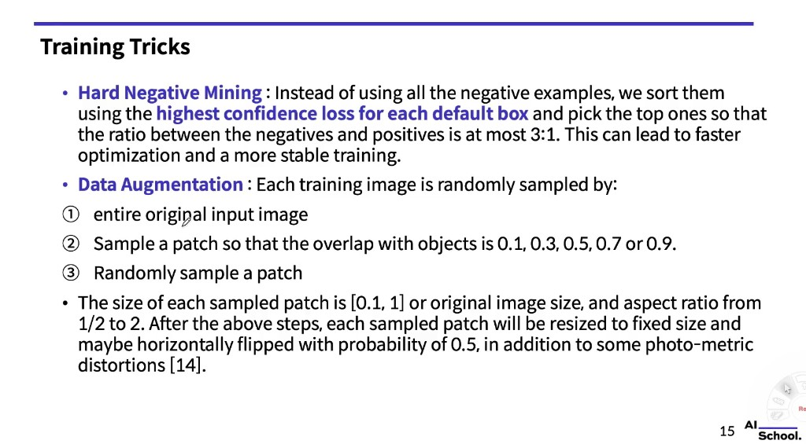

### 수식 전체

$$L_{conf}(x, c) = -\sum_{i \in Pos} x^p_{ij} \log(\hat{c}^p_i) - \sum_{i \in Neg} \log(\hat{c}^0_i)$$

$$\text{where} \quad \hat{c}^p_i = \frac{\exp(c^p_i)}{\sum_p \exp(c^p_i)}$$

### 수식 분해

| 항 | 의미 |
|---|------|
| $-\sum_{i \in Pos} x^p_{ij} \log(\hat{c}^p_i)$ | **양성 박스(매칭된 default box)**에 대한 올바른 클래스 예측 loss |
| $-\sum_{i \in Neg} \log(\hat{c}^0_i)$ | **음성 박스(배경으로 지정된 default box)**에 대해 "배경(class 0)"으로 예측하는 loss |
| $\hat{c}^p_i$ | softmax를 적용한 클래스 p에 대한 confidence 확률 |

### softmax를 쓰는 이유

YOLO v1은 클래스 확률에 sigmoid를 사용했지만, SSD는 **softmax**를 사용합니다.  
softmax의 특성: 모든 클래스 확률의 합 = 1  
→ 물체는 한 가지 클래스에만 속한다는 가정 반영  
→ multi-class 분류에 자연스럽게 적합

---

## M. Training Tricks

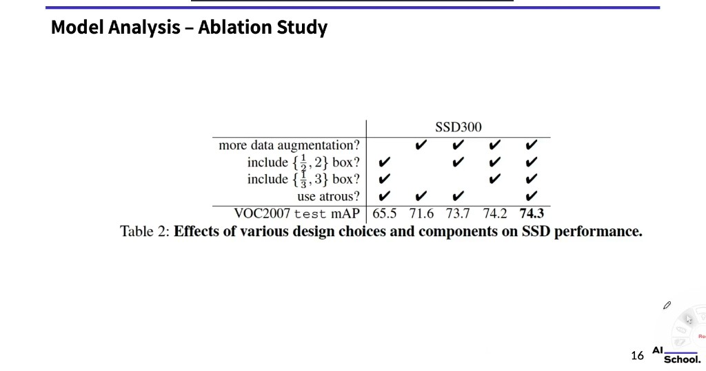

### 1. Hard Negative Mining

**문제**: 8,732개의 default box 중 매칭된(양성) 박스는 아주 적고, 나머지 대부분(음성)은 배경입니다.  
→ 양성:음성 비율이 극도로 불균형 (예: 100:8632)  
→ 모델이 "모든 걸 배경"이라 예측해도 loss가 작아지는 문제 발생

**해결책: Hard Negative Mining**
1. 모든 음성 default box를 confidence loss 기준으로 내림차순 정렬
2. Loss가 높은 상위 음성만 선택 (이들이 "어렵고 혼란스러운 음성들"= Hard Negatives)
3. 유지되는 음성:양성 비율 = **최대 3:1**

```
예시)
양성 박스: 50개
기존 음성: 8,682개
Hard Negative Mining 후 선택되는 음성: 최대 150개 (= 50 × 3)
→ 총 학습에 사용되는 박스: 200개 (양성 50 + 음성 150)
```

**효과**: 학습 속도 향상 + 더 안정적인 수렴

### 2. Data Augmentation

학습 이미지를 매번 다음 세 가지 방식 중 하나로 변환해서 사용합니다:

**① 전체 원본 이미지 사용**

**② 물체와 overlap이 {0.1, 0.3, 0.5, 0.7, 0.9} 중 하나가 되도록 patch 샘플링**
- 사람이 판단하기에 "조금 걸치는" 정도부터 "거의 다 포함"하는 정도까지 다양

**③ 랜덤 patch 샘플링**

각 샘플링된 patch에 대해 추가 처리:
- 크기: 원본 이미지의 [0.1, 1] 범위 내 랜덤
- Aspect ratio: 1/2 ~ 2 사이 랜덤
- **50% 확률로 좌우 반전 (Horizontal flip)**
- Photo-metric distortions (밝기, 대비, 채도 등 변화)

**효과**: 다양한 위치, 크기, 각도의 물체 패턴 학습 → 일반화 능력 향상

---

## N. Ablation Study — 각 요소가 얼마나 중요한가?

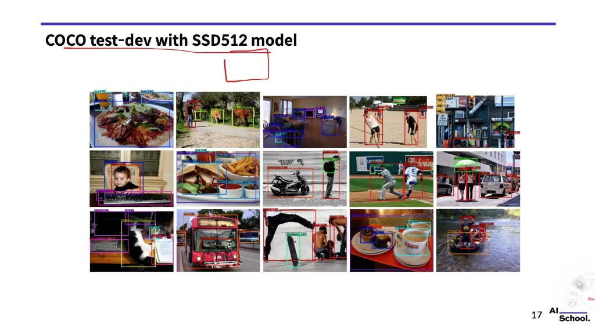

**Ablation Study**: 각 구성 요소를 하나씩 추가하거나 제거해 가며 성능 변화를 측정하는 실험.  
"이 요소가 있어야 성능이 좋아지는가?"를 검증합니다.

**SSD300에서 VOC2007 test mAP 결과**:

| 설정 | mAP | 설명 |
|------|-----|------|
| 기준 (no aug, 2 boxes, atrous 없음) | 65.5 | Data Aug 없음, {1/2,2} box 없음, {1/3,3} box 없음 |
| + Data Augmentation | 71.6 | **+6.1** (가장 큰 기여!) |
| + {1/2, 2} box 추가 | 73.7 | **+2.1** (aspect ratio 다양화) |
| + {1/3, 3} box 추가 | 74.2 | **+0.5** |
| + Atrous Convolution | **74.3** | **+0.1** (최종 SSD) |

**분석**:
1. **Data Augmentation이 압도적** (+6.1): 단순히 이미지를 다양하게 보여주는 것만으로 성능이 크게 향상
2. **Aspect ratio 다양화가 두 번째** (+2.1): 다양한 형태의 물체를 커버하기 위해 반드시 필요
3. **1/3, 3 비율은 효과가 작음** (+0.5): 극단적인 비율의 물체가 많지 않음을 시사
4. **Atrous Convolution 효과 미미** (+0.1)

> **Atrous Convolution** (= Dilated Convolution): 커널 내부에 간격(dilation)을 두어 더 넓은 receptive field를 갖게 하는 방식. VGG-16의 FC6, FC7을 Conv 레이어로 변환할 때 사용.

---

## O. 실험 결과 — COCO 시각화

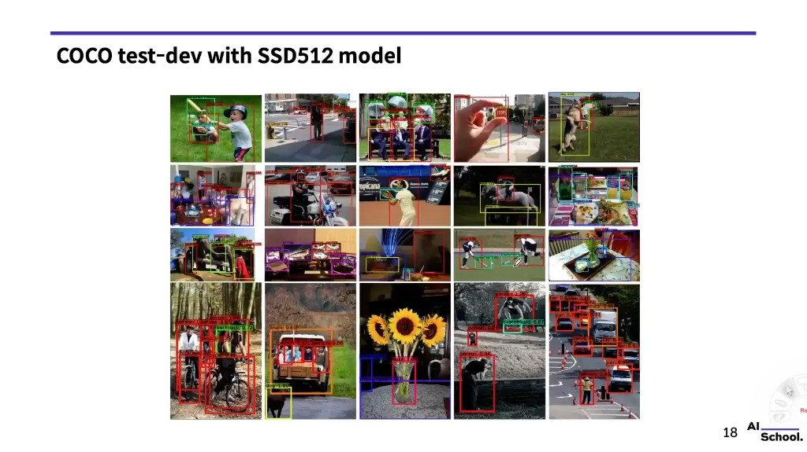
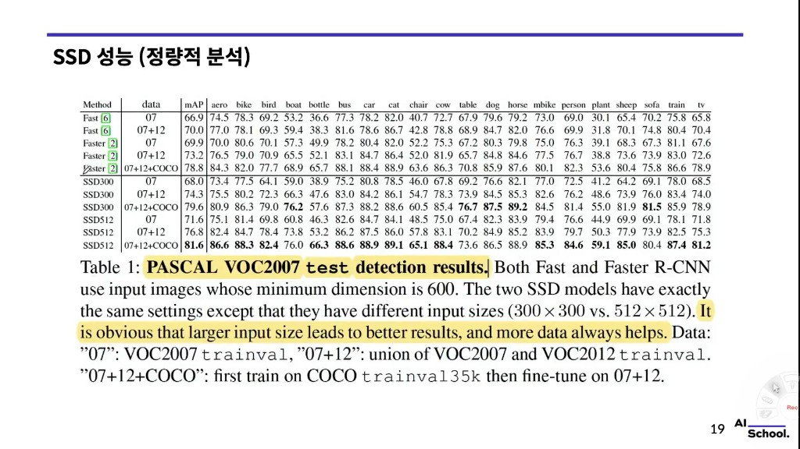

COCO test-dev 데이터셋에서 **SSD512 모델**의 탐지 결과입니다.

두 슬라이드에 걸쳐 15장 × 2 = 30개의 이미지가 보여집니다.

**관찰할 수 있는 점**:
- **다양한 물체 크기 처리**: 음식 접시 위 작은 아이템부터 큰 동물, 사람까지 탐지
- **다중 클래스**: 한 이미지 내에서 사람, 차량, 동물 등 여러 클래스를 동시 탐지
- **다양한 색상의 bounding box**: 각 클래스마다 다른 색상으로 시각화
- **confidence score 표시**: 박스 위에 숫자로 신뢰도가 표시됨

---

## P. SSD 성능 정량 분석 — PASCAL VOC2007

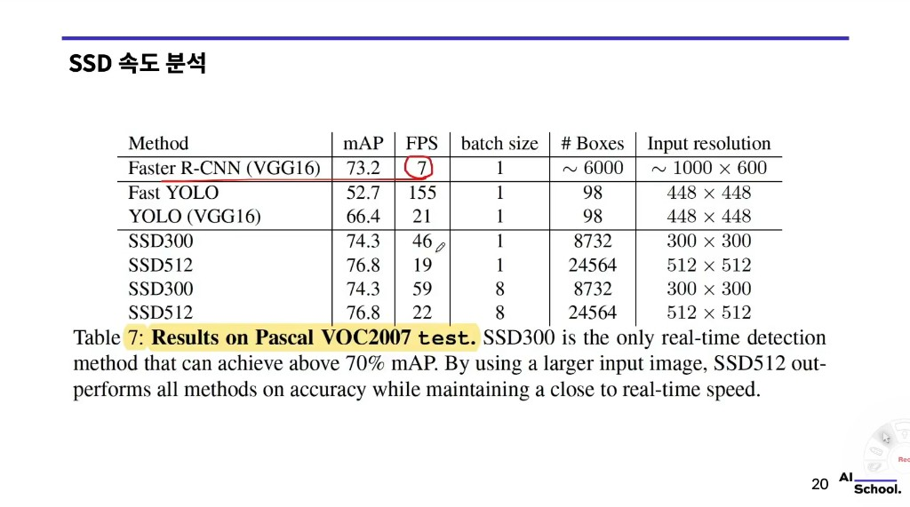

PASCAL VOC2007 test detection results (Table 1):

| 방법 | 데이터 | mAP | 비고 |
|------|--------|-----|------|
| Fast R-CNN | 07 | 66.9 | Two-stage |
| Fast R-CNN | 07+12 | 70.0 | |
| Faster R-CNN | 07 | 69.9 | Two-stage |
| Faster R-CNN | 07+12 | 73.2 | |
| Faster R-CNN | 07+12+COCO | 78.8 | 최강 Two-stage |
| **SSD300** | **07** | **68.0** | One-stage |
| **SSD300** | **07+12** | **74.3** | Faster R-CNN 능가! |
| **SSD300** | **07+12+COCO** | **79.6** | |
| **SSD512** | **07** | **71.6** | |
| **SSD512** | **07+12** | **76.8** | |
| **SSD512** | **07+12+COCO** | **81.6** | 최고 성능 |

**핵심 인사이트**:
1. SSD300은 VOC07+12 학습 시 mAP 74.3으로 **Faster R-CNN(73.2) 능가** → One-stage가 Two-stage를 추월!
2. 더 큰 입력(512×512)인 SSD512는 더욱 높은 성능 → **입력 해상도가 클수록 유리**
3. 추가 데이터(COCO) 학습 시 성능이 더 높아짐 → **데이터 양이 중요**

---

## Q. SSD 속도 분석 — 타 모델과 비교

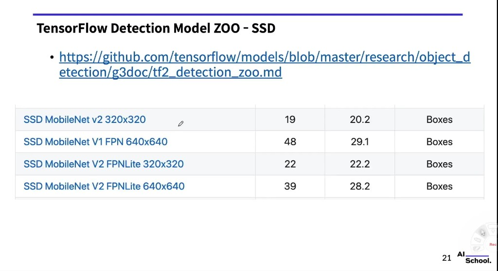

Pascal VOC2007 test 기준 속도/정확도 비교 (Table 7):

| 방법 | mAP | FPS | batch size | # Boxes | 입력 해상도 |
|------|-----|-----|-----------|---------|----------|
| Faster R-CNN (VGG16) | 73.2 | **7** | 1 | ~6,000 | ~1000×600 |
| Fast YOLO | 52.7 | **155** | 1 | 98 | 448×448 |
| YOLO (VGG16) | 66.4 | 21 | 1 | 98 | 448×448 |
| **SSD300** | **74.3** | **46** | 1 | 8,732 | 300×300 |
| SSD512 | 76.8 | 19 | 1 | 24,564 | 512×512 |
| **SSD300** | **74.3** | **59** | 8 | 8,732 | 300×300 |
| SSD512 | 76.8 | 22 | 8 | 24,564 | 512×512 |

**핵심 결론** (논문의 말 그대로):

> "SSD300 is the **only real-time detection method that can achieve above 70% mAP**."  
> (SSD300은 70% mAP 이상을 달성하는 유일한 실시간 검출 방법이다)

> "By using a larger input image, SSD512 **outperforms all methods on accuracy** while maintaining a close to real-time speed."  
> (더 큰 입력을 사용한 SSD512는 근실시간 속도를 유지하면서 모든 방법 중 최고 정확도를 달성했다)

**분석**:
- Faster R-CNN: 정확도는 비슷하지만 FPS가 7 → 실시간 불가
- Fast YOLO: 빠르지만 mAP 52.7로 너무 낮음
- SSD300: FPS 46~59로 실시간 + mAP 74.3 → 균형점 달성
- SSD512: 정확도 우선이라면 최고 선택

---

## R. SSD의 장점과 단점

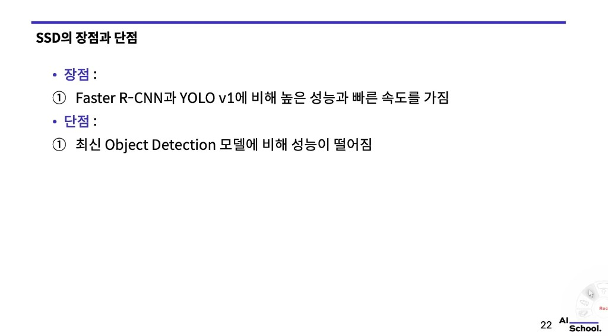

### 장점

**① Faster R-CNN과 YOLO v1에 비해 높은 성능과 빠른 속도**

| | 정확도 | 속도 |
|---|--------|------|
| Faster R-CNN | 높음 | 느림(7FPS) |
| YOLO v1 | 낮음 | 빠름(45FPS) |
| **SSD** | **높음** | **빠름(58FPS)** |

SSD는 속도와 정확도 두 마리 토끼를 모두 잡은 첫 번째 모델입니다.

**핵심 요인**:
- Multi-scale Feature Maps → 다양한 크기 물체 탐지
- Default Box → 다양한 비율·크기 후보 박스
- End-to-end 학습 → 전체 파이프라인을 한 번에 최적화

### 단점

**① 최신 Object Detection 모델에 비해 성능이 떨어짐**

SSD 이후 등장한 모델들:
- **RetinaNet (2017)**: Focal Loss로 class imbalance 해결 → SSD보다 높은 mAP
- **YOLOv3/v4/v5**: 더 발전된 One-stage
- **EfficientDet**: Compound scaling으로 효율 극대화
- **DETR (2020)**: Transformer 기반 Object Detection

SSD는 2015년 모델이므로, 오늘날 최신 모델들과 비교하면 정확도가 낮습니다.  
그러나 SSD의 아이디어(Multi-scale Feature Maps, Default Box 배치 방식)는 이후 많은 모델들에게 영향을 주었습니다.

---

## 핵심 개념 정리

| 용어 | 한 줄 정의 |
|------|-----------|
| **SSD** | Single Shot MultiBox Detector. 한 번의 forward pass로 분류+위치 예측 |
| **One-stage Detector** | Region Proposal 없이 이미지 전체를 한 번에 처리하는 탐지기 |
| **Default Box** | 특징맵의 각 위치에 미리 배치한 다양한 크기·비율의 후보 박스 (= Anchor Box) |
| **Multi-scale Feature Map** | 여러 크기의 특징맵에서 각각 예측 → 다양한 크기의 물체 탐지 |
| **Backbone** | 특징 추출용 CNN (SSD의 경우 VGG-16 사용) |
| **Extra Feature Layers** | VGG-16 뒤에 추가로 붙인 레이어들 (작아지는 특징맵 생성) |
| **Jaccard Overlap** | = IoU. 두 박스의 교집합 / 합집합 |
| **Matching Strategy** | Default box와 GT box를 어떻게 대응시킬지 결정하는 규칙 |
| **Hard Negative Mining** | Confidence loss가 높은 음성 샘플만 골라서 학습하는 기법 |
| **Smooth L1 Loss** | 값이 클 때는 L1, 작을 때는 L2 성질을 갖는 위치 손실 함수 |
| **Ablation Study** | 구성 요소를 하나씩 추가/제거하며 기여도를 측정하는 실험 |
| **Atrous Convolution** | 커널 내 간격(dilation)을 두어 receptive field를 넓히는 합성곱 |
| **mAP** | mean Average Precision. 탐지 정확도의 표준 평가 지표 |
| **FPS** | Frames Per Second. 초당 처리 가능한 이미지 수 (속도 지표) |
