# RetinaNet & Focal Loss

> **강의 목표**: 기존 One-stage Detector의 근본적 약점인 Class Imbalance를 Focal Loss로 해결한 RetinaNet을 이해한다.  
> 이 노트는 GitHub 페이지에서 처음 RetinaNet을 접하는 사람도 이해할 수 있도록 작성되었습니다.

---

## 목차

- [A. RetinaNet이란 무엇인가?](#a-retinanet이란-무엇인가)
- [B. One-stage Detector 계열에서 RetinaNet의 위치](#b-one-stage-detector-계열에서-retinanet의-위치)
- [C. 기존 One-stage Detector의 두 가지 문제점](#c-기존-one-stage-detector의-두-가지-문제점)
- [D. Class Imbalance 문제의 심각성](#d-class-imbalance-문제의-심각성)
- [E. Cross Entropy Loss 복습 — Focal Loss의 출발점](#e-cross-entropy-loss-복습--focal-loss의-출발점)
- [F. Balanced Cross Entropy — 첫 번째 시도와 한계](#f-balanced-cross-entropy--첫-번째-시도와-한계)
- [G. Focal Loss — 핵심 아이디어](#g-focal-loss--핵심-아이디어)
- [H. α-balanced Focal Loss — 최종 형태](#h-α-balanced-focal-loss--최종-형태)
- [I. RetinaNet Architecture — FPN + 두 개의 Subnet](#i-retinanet-architecture--fpn--두-개의-subnet)
- [J. RetinaNet 성능 — 속도 vs 정확도](#j-retinanet-성능--속도-vs-정확도)
- [K. RetinaNet 성능 — COCO test-dev 정량 분석](#k-retinanet-성능--coco-test-dev-정량-분석)
- [L. RetinaNet의 장점과 단점](#l-retinanet의-장점과-단점)
- [핵심 개념 정리](#핵심-개념-정리)

---

## A. RetinaNet이란 무엇인가?

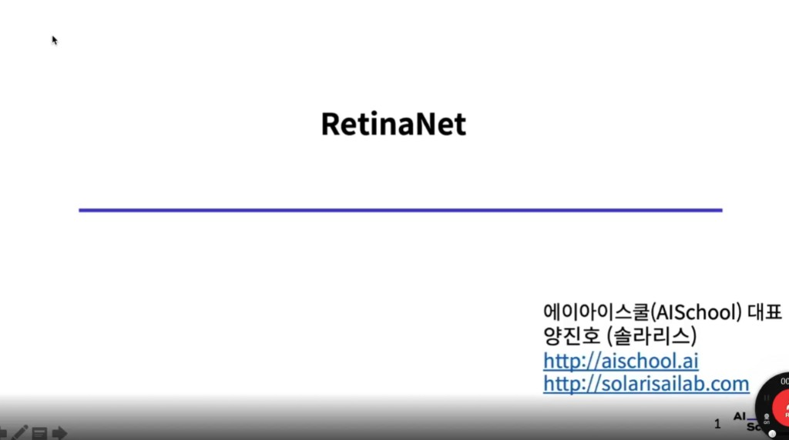

**RetinaNet**은 2017년 Facebook AI Research(FAIR)의 Tsung-Yi Lin 등이 제안한 One-stage Object Detector입니다.

이전 노트에서 다룬 모델들과 비교하면:

| 모델 | 연도 | 계열 | 핵심 기여 |
|------|------|------|----------|
| R-CNN / Fast / Faster | 2013–2015 | Two-stage | Region Proposal 개선 |
| YOLO | 2015 | One-stage | 최초 End-to-end One-stage |
| SSD | 2015 | One-stage | Multi-scale Feature Map |
| **RetinaNet** | **2017** | **One-stage** | **Focal Loss — Class Imbalance 해결** |

RetinaNet의 핵심 기여는 새로운 아키텍처보다 **Focal Loss**라는 새로운 손실 함수에 있습니다.  
이 손실 함수 하나가 "왜 One-stage는 Two-stage보다 정확도가 낮은가"라는 오래된 질문에 답을 제시했습니다.

---

## B. One-stage Detector 계열에서 RetinaNet의 위치

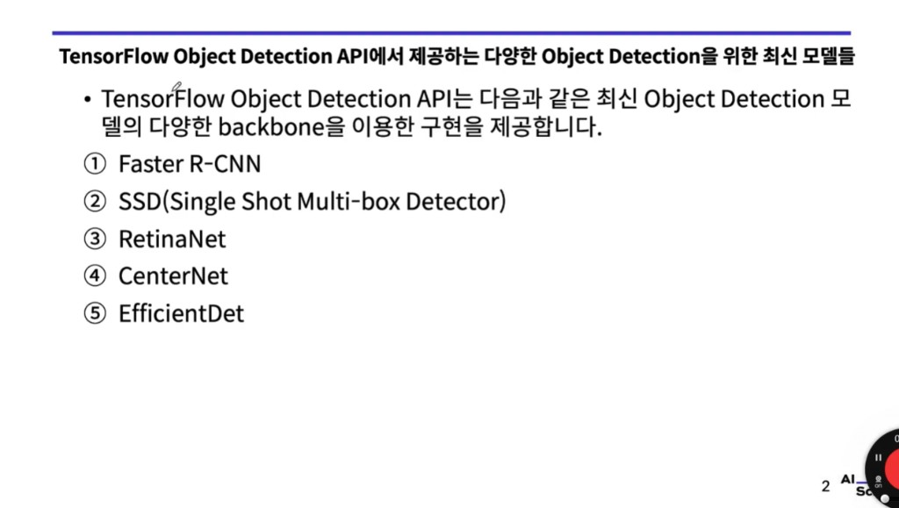

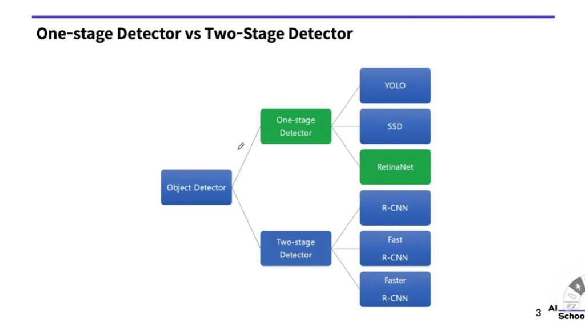

TensorFlow Object Detection API가 제공하는 5대 모델 중 **③ RetinaNet**이 이번 주제입니다.

분류 트리에서 RetinaNet은 **One-stage Detector** 계열에 속합니다 (초록색 박스로 강조):

```
Object Detector
├── One-stage Detector
│   ├── YOLO
│   ├── SSD
│   └── RetinaNet  ← 이번 주제
└── Two-stage Detector
    ├── R-CNN
    ├── Fast R-CNN
    └── Faster R-CNN
```

그런데 RetinaNet은 단순히 "또 다른 One-stage"가 아닙니다.  
**기존 One-stage의 근본적인 약점을 분석하고 해결한 모델**입니다.

---

## C. 기존 One-stage Detector의 두 가지 문제점

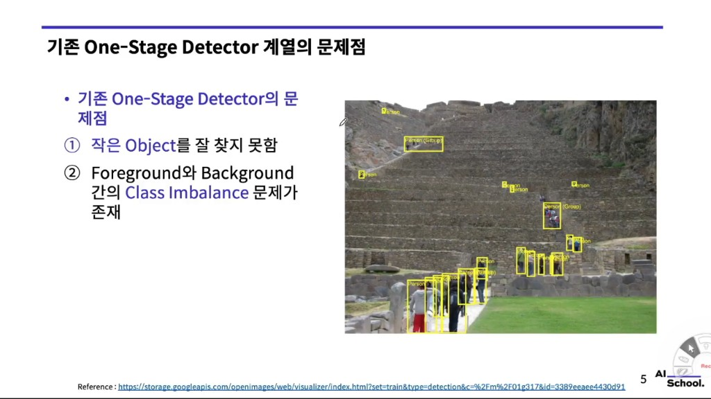

슬라이드 오른쪽 사진은 마추픽추 계단을 촬영한 이미지입니다. 멀리 있는 작은 사람들이 많고, 각각에 노란 박스가 쳐져 있습니다. 이 사진이 두 가지 문제를 직관적으로 보여줍니다.

### 문제 ① 작은 Object를 잘 찾지 못함

- 멀리 있는 사람처럼 이미지에서 아주 작은 영역을 차지하는 물체는 탐지하기 어렵습니다.
- YOLO v1은 마지막 7×7 특징맵 하나에서만 예측 → 작은 물체 정보가 압축·손실됨
- SSD는 Multi-scale로 어느 정도 개선했지만 여전히 한계가 있음

### 문제 ② Foreground-Background 간 Class Imbalance

- 한 이미지에서 "물체가 있는 위치"(foreground)는 극히 일부
- 나머지 대부분은 "배경"(background)
- One-stage는 이미지 전체에 10,000 ~ 100,000개의 anchor를 깔고 예측  
  → 이 중 실제 물체에 해당하는 anchor는 고작 수십 개
  → **배경 anchor : 물체 anchor 비율 = 수천 : 1 이상**

> **직관적 비유**:  
> 강의실 사진에서 "학생 얼굴" 픽셀은 전체 픽셀의 5%도 안 됩니다.  
> 나머지 95%는 벽, 책상, 빈 공간(= 배경).  
> 모델에게 "모든 위치를 배경으로 예측해도 손실이 작다"는 잘못된 신호를 보냅니다.

SSD는 **Hard Negative Mining**으로 배경:물체 = 3:1을 강제해 어느 정도 완화했지만,  
RetinaNet은 이것보다 더 근본적인 해결책인 **Focal Loss**를 제안했습니다.

---

## D. Class Imbalance 문제의 심각성

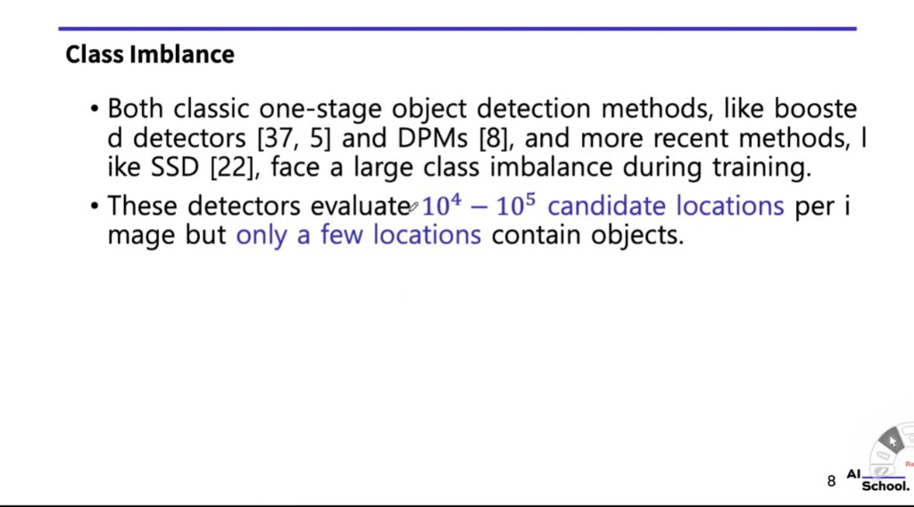

논문의 표현을 직접 분석해봅니다:

> "These detectors evaluate **10⁴ − 10⁵ candidate locations** per image but **only a few locations** contain objects."

| 항목 | 수치 |
|------|------|
| 이미지당 평가하는 후보 위치 수 | **10,000 ~ 100,000개** |
| 그 중 실제 물체가 있는 위치 | **수십 ~ 수백 개** |
| 배경 : 물체 비율 | **수백 : 1 ~ 수천 : 1** |

이 문제는 SSD, YOLO뿐만 아니라 boosted detector, DPM 같은 고전 방법들도 모두 겪어온 문제입니다.

### 기존 해결책들의 한계

| 방법 | 설명 | 한계 |
|------|------|------|
| Hard Negative Mining (SSD) | loss 높은 배경만 학습 | 여전히 수동적 필터링, 비율 고정 |
| Bootstrap | 어려운 샘플 반복 학습 | 복잡한 훈련 과정 |
| α-balanced CE | 클래스별 가중치 부여 | easy/hard 구분 불가 |

RetinaNet의 Focal Loss는 이 문제를 **자동으로, 연속적으로** 해결합니다.

---

## E. Cross Entropy Loss 복습 — Focal Loss의 출발점

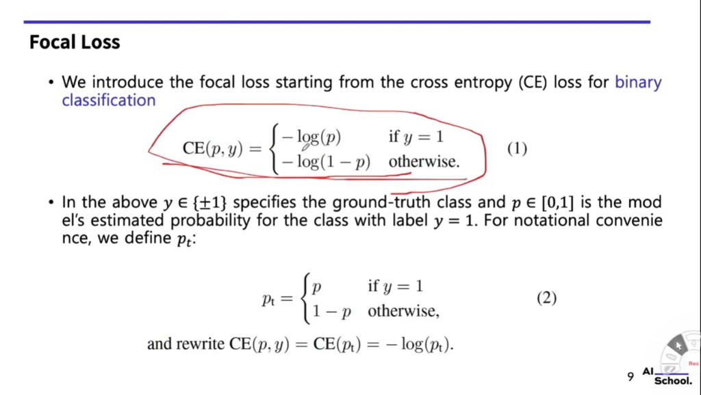

Focal Loss를 이해하려면 먼저 이진 분류(binary classification)용 Cross Entropy(CE) Loss를 이해해야 합니다.

### Binary CE Loss

$$\text{CE}(p, y) = \begin{cases} -\log(p) & \text{if } y = 1 \\ -\log(1-p) & \text{otherwise} \end{cases} \tag{1}$$

| 기호 | 의미 |
|------|------|
| $y \in \{+1, -1\}$ | 정답 레이블: +1이면 양성(물체), -1이면 음성(배경) |
| $p \in [0, 1]$ | 모델이 예측한 "y=1(물체)일 확률" |

### $p_t$ 표기법 — 수식 단순화

수식을 깔끔하게 쓰기 위해 $p_t$를 정의합니다:

$$p_t = \begin{cases} p & \text{if } y = 1 \\ 1-p & \text{otherwise} \end{cases} \tag{2}$$

- 정답이 **양성(y=1)**일 때: 모델이 양성으로 예측한 확률 $p$를 그대로 사용
- 정답이 **음성(y=-1)**일 때: 모델이 음성으로 예측한 확률 $1-p$를 사용

이렇게 하면 두 경우를 한 줄로 표현 가능:

$$\text{CE}(p, y) = \text{CE}(p_t) = -\log(p_t)$$

### $p_t$의 의미

$p_t$는 **"모델이 정답 클래스를 얼마나 확신하는가"**를 나타냅니다.
- $p_t$ → 1: 매우 자신 있게 정답을 맞춤 (쉬운 예제)
- $p_t$ → 0: 정답을 거의 반대로 예측 (어려운 예제)

CE Loss의 문제: $p_t = 0.9$처럼 **이미 잘 분류된 쉬운 예제도 loss 값이 0이 아닙니다**.  
배경 anchor가 수만 개라면, 각각의 loss는 작지만 **총합이 압도적으로 커집니다** → 물체 탐지 학습을 방해!

---

## F. Balanced Cross Entropy — 첫 번째 시도와 한계

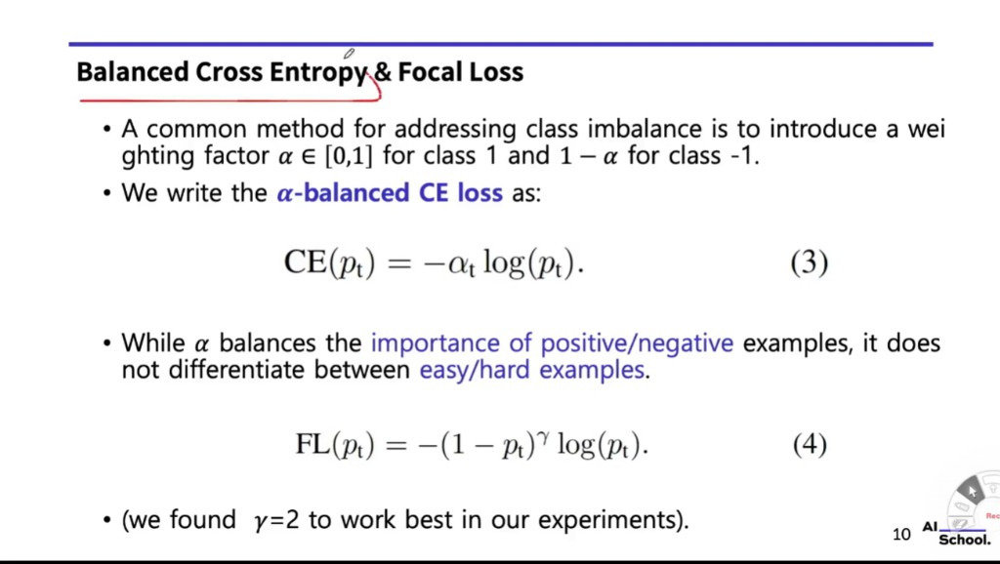

### α-balanced CE

Class Imbalance의 가장 간단한 해결책: 클래스마다 **가중치(weight)**를 다르게 부여합니다.

$$\text{CE}(p_t) = -\alpha_t \log(p_t) \tag{3}$$

| 기호 | 의미 |
|------|------|
| $\alpha \in [0, 1]$ | 양성(class 1) 샘플에 대한 가중치 |
| $1 - \alpha$ | 음성(class -1) 샘플에 대한 가중치 |

**예시**: α = 0.25 설정 시
- 물체(양성) loss에 0.25 곱하기
- 배경(음성) loss에 0.75 곱하기  
→ 배경 loss를 상대적으로 낮춰 물체 탐지에 집중

### α-balanced CE의 한계

> "While α balances the importance of positive/negative examples,  
> it does **not differentiate between easy/hard examples**."

α 가중치는 양성/음성 클래스 구분만 가능합니다.  
**쉬운 배경(easy negative)**과 **어려운 배경(hard negative)**을 구분하지 못합니다.

```
[모든 배경 anchor를 α=0.75로 동일하게 처리]
    ┌── 쉬운 배경 (pt=0.99): loss 작음 → 그래도 수가 많아 총합 큼
    └── 어려운 배경 (pt=0.5): loss 큼 → 진짜 학습해야 할 것
```

→ **쉬운 배경 anchor들의 loss 총합**이 여전히 학습을 압도

---

## G. Focal Loss — 핵심 아이디어

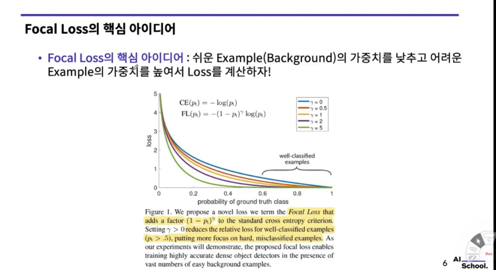

### Focal Loss 수식

$$\text{FL}(p_t) = -(1 - p_t)^\gamma \log(p_t) \tag{4}$$

| 기호 | 의미 |
|------|------|
| $p_t$ | 정답 클래스에 대한 예측 확률 (앞에서 정의) |
| $\gamma \geq 0$ | focusing parameter. γ=0이면 CE와 동일 |
| $(1-p_t)^\gamma$ | **modulating factor** — 쉬운 예제의 loss를 줄이는 핵심 항 |

### 핵심 아이디어: "쉬운 예제의 loss를 자동으로 줄여라"

슬라이드의 그래프를 분석합니다:
- x축: probability of ground truth class ($p_t$, 0~1)
- y축: loss 값
- 여러 곡선: γ = 0(= CE), 0.5, 1, 2, 5

**γ=0 (파란선, CE)**: $p_t = 0.9$여도 loss가 상당히 큼  
**γ=2 (보라선, FL)**: $p_t = 0.9$이면 loss가 거의 0에 수렴

```
[예시: γ=2]

쉬운 배경 anchor (pt = 0.99):   FL = -(1-0.99)^2 × log(0.99) = -(0.0001) × 0.0043 ≈ 0.0000004
CE:                              CE = -log(0.99) ≈ 0.0043

→ Focal Loss는 CE의 약 1/10000 수준! 학습에서 거의 무시됨
```

```
[어려운 물체 anchor (pt = 0.5)]:  FL = -(1-0.5)^2 × log(0.5) = -(0.25) × 0.693 ≈ 0.173
CE:                                CE = -log(0.5) = 0.693

→ Focal Loss ≈ CE의 1/4 수준. 여전히 의미있는 gradient 발생
```

### 직관적 이해

> **Focal Loss의 철학**:  
> "이미 잘 맞추고 있는(쉬운) 배경 anchor는 알아서 무시해줄게.  
> 진짜 어렵고 헷갈리는 anchor에만 집중해서 배워."

이것이 "Focal"이라는 이름의 유래입니다 — 어려운 예제에 **집중(focus)**합니다.

### γ 값에 따른 효과

| γ | 효과 | 특성 |
|---|------|------|
| 0 | CE와 동일 | Focus 없음 |
| 0.5 | 약한 focus | |
| 1 | 중간 focus | |
| **2** | **강한 focus** | **논문 권장값** |
| 5 | 매우 강한 focus | 너무 극단적 |

논문에서는 γ=2를 권장합니다. 슬라이드 그래프에서 γ=2(보라선)가 "well-classified examples" 영역에서 가장 빠르게 0으로 수렴하는 것을 확인할 수 있습니다.

---

## H. α-balanced Focal Loss — 최종 형태

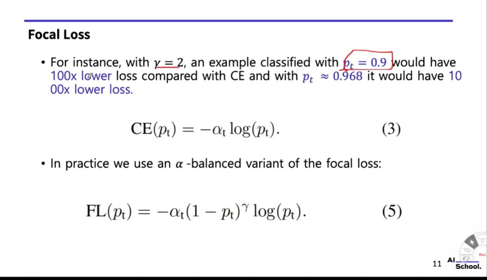

### 수치 예시로 효과 확인

슬라이드에서 γ=2를 사용한 경우:

| $p_t$ | CE 대비 loss 감소 | 의미 |
|--------|-----------------|------|
| **0.9** | **100배 감소** | "꽤 자신 있게 맞춘" 쉬운 예제 |
| **≈0.968** | **1000배 감소** | "매우 자신 있게 맞춘" 아주 쉬운 예제 |

```
γ=2, pt=0.9:
  CE = -log(0.9) ≈ 0.105
  FL = -(1-0.9)^2 × log(0.9) = -(0.01) × 0.105 ≈ 0.00105
  비율: CE / FL ≈ 100배 차이  ✓

γ=2, pt=0.968:
  CE = -log(0.968) ≈ 0.0326
  FL = -(1-0.968)^2 × log(0.968) ≈ -(0.001024) × 0.0326 ≈ 0.0000334
  비율: CE / FL ≈ 1000배 차이  ✓
```

### 최종 Focal Loss: α-balanced variant

α 가중치와 γ 집중 효과를 결합한 최종 형태:

$$\text{FL}(p_t) = -\alpha_t (1 - p_t)^\gamma \log(p_t) \tag{5}$$

| 기호 | 의미 |
|------|------|
| $\alpha_t$ | 클래스 가중치 (양성/음성 불균형 보정) |
| $(1-p_t)^\gamma$ | 쉬운 예제 down-weighting (easy/hard 구분) |
| $\log(p_t)$ | 기본 CE 항 |

**두 가지 역할이 상호 보완**:
- $\alpha_t$: "어떤 **클래스**를 더 중요하게 볼 것인가?" (양성 vs 음성)
- $(1-p_t)^\gamma$: "얼마나 **어려운** 예제를 더 중요하게 볼 것인가?" (hard vs easy)

> **논문의 최적 파라미터**: α = 0.25, γ = 2

α를 0.25로 작게 설정하는 이유: γ>0로 인해 이미 easy negative의 loss가 줄어들었기 때문에, 양성을 더 많이 강조하지 않아도 됩니다. α-balanced만 쓸 때보다 α를 낮게 설정합니다.

---

## I. RetinaNet Architecture — FPN + 두 개의 Subnet

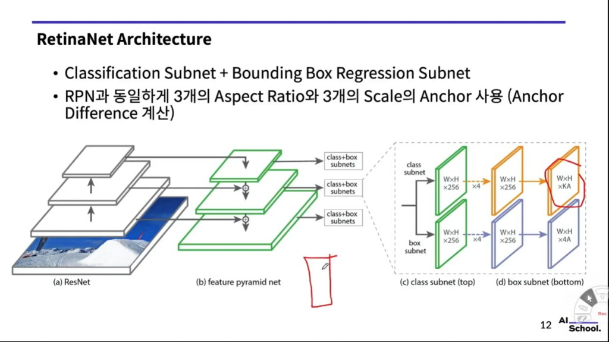

RetinaNet은 3가지 구성 요소로 이루어집니다:

### (a) ResNet Backbone

입력 이미지에서 특징을 추출하는 기반 네트워크.  
ResNet-50 또는 ResNet-101을 사용합니다.

### (b) Feature Pyramid Network (FPN)

```
                 입력 이미지
                     │
              ResNet Backbone
         C3 ──── C4 ──── C5
          │       │       │
    (top-down pathway + lateral connections)
          │
    P3 ── P4 ── P5 ── P6 ── P7
    ↑더 큰 특징맵      더 작은 특징맵↑
    (작은 물체 탐지)  (큰 물체 탐지)
```

FPN은 Faster R-CNN 논문(Lin, 2017)에서 제안된 구조로, 여러 scale의 특징맵을 **피라미드** 형태로 생성합니다.  
SSD의 Extra Feature Layers와 유사하지만, 상위 레이어(의미 정보가 풍부)의 정보를 하위 레이어(공간 해상도가 높음)에 **top-down으로 전달**한다는 차이가 있습니다.

### (c) Classification Subnet

각 FPN 레벨의 특징맵을 받아 클래스 확률을 예측:

```
입력: W × H × 256 (FPN 출력)
  │
Conv 3×3 × 256 (×4 반복)
  │
W × H × 256
  │
Conv 3×3 × KA
  │
출력: W × H × KA
  (K: 클래스 수, A: 위치당 anchor 수)
```

### (d) Bounding Box Regression Subnet

각 FPN 레벨의 특징맵을 받아 위치 조정값을 예측:

```
입력: W × H × 256 (FPN 출력)
  │
Conv 3×3 × 256 (×4 반복)
  │
W × H × 256
  │
Conv 3×3 × 4A
  │
출력: W × H × 4A
  (4: cx, cy, w, h 오프셋, A: 위치당 anchor 수)
```

### Anchor 설계

RPN(Faster R-CNN)과 동일하게:
- **3가지 Aspect Ratio**: {1:2, 1:1, 2:1}
- **3가지 Scale**: {2⁰, 2^(1/3), 2^(2/3)}
- 위치당 **3 × 3 = 9개 anchor**

### 전체 구조 요약

```
입력 이미지
    │
ResNet (a)
    │
FPN (b) ─────────────────────────┐
    │ 각 레벨 (P3~P7)             │
    ├── Class Subnet (c)          ├── BBox Regression Subnet (d)
    │       └── W×H×KA 출력       │       └── W×H×4A 출력
    └────────────────────────────┘
                    │
         합쳐서 NMS 적용
                    │
            최종 탐지 결과
```

**Classification과 Regression subnet은 모든 FPN 레벨에서 가중치를 공유합니다** (weight sharing).  
→ 파라미터 효율적, 일관된 예측 가능

---

## J. RetinaNet 성능 — 속도 vs 정확도

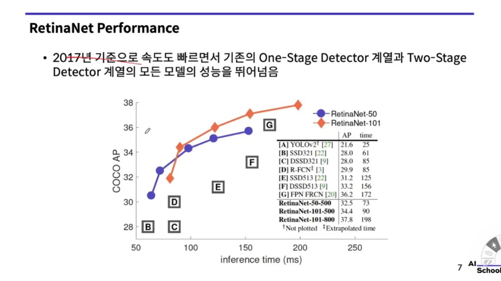

2017년 기준, COCO test-dev에서 Inference time(ms) vs COCO AP 그래프:

| 모델 | AP | Inference time |
|------|-----|----------------|
| **[A] YOLOv2** | 21.6 | 25 ms |
| [B] SSD321 | 28.0 | 61 ms |
| [C] DSSD321 | 28.0 | 85 ms |
| [D] R-FCN | 29.9 | 85 ms |
| [E] SSD513 | 31.2 | 125 ms |
| [F] DSSD513 | 33.2 | 156 ms |
| [G] FPN FRCN | 36.2 | 172 ms |
| **RetinaNet-50-500** | **32.5** | **73 ms** |
| **RetinaNet-101-500** | **34.4** | **90 ms** |
| **RetinaNet-101-800** | **37.8** | **198 ms** |

그래프에서 RetinaNet-50과 RetinaNet-101은 **다른 모든 방법의 upper envelope(상한 곡선)** 를 형성합니다.

즉, **같은 시간 내에서 가장 높은 정확도**, 또는 **같은 정확도에서 가장 빠른 속도**를 달성했습니다.

**특히 주목할 점**:
- RetinaNet-50-500(73ms) vs FPN FRCN(172ms): 비슷한 AP이지만 속도가 2배 이상 빠름
- RetinaNet-101-800(AP=37.8)은 당시 최고 Two-stage인 FPN FRCN(AP=36.2)보다 높음

> 2017년 기준으로 속도도 빠르면서 기존 One-stage와 Two-stage 계열 **모든 모델의 성능을 뛰어넘음**

---

## K. RetinaNet 성능 — COCO test-dev 정량 분석

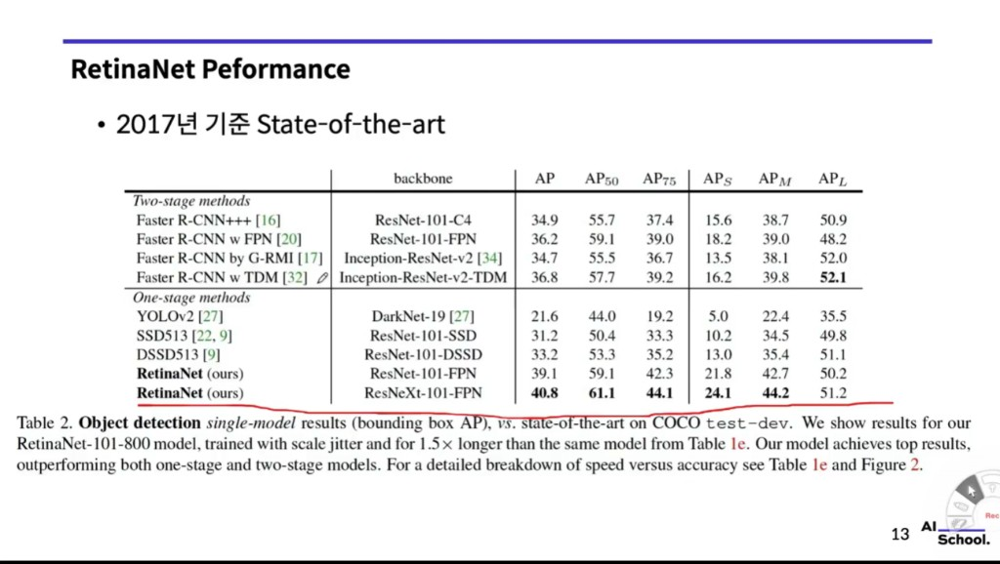

COCO test-dev single-model detection results (Table 2):

**Two-stage Methods:**

| 모델 | Backbone | AP | AP₅₀ | AP₇₅ |
|------|---------|-----|------|------|
| Faster R-CNN+++ | ResNet-101-C4 | 34.9 | 55.7 | 37.4 |
| Faster R-CNN w FPN | ResNet-101-FPN | 36.2 | 59.1 | 39.0 |
| Faster R-CNN by G-RMI | Inception-ResNet-v2 | 34.7 | 55.5 | 36.7 |
| Faster R-CNN w TDM | Inception-ResNet-v2-TDM | 36.8 | 57.7 | 39.2 |

**One-stage Methods:**

| 모델 | Backbone | AP | AP₅₀ | AP₇₅ |
|------|---------|-----|------|------|
| YOLOv2 | DarkNet-19 | 21.6 | 44.0 | 19.2 |
| SSD513 | ResNet-101-SSD | 31.2 | 50.4 | 33.3 |
| DSSD513 | ResNet-101-DSSD | 33.2 | 53.3 | 35.2 |
| **RetinaNet** | **ResNet-101-FPN** | **39.1** | **59.1** | **42.3** |
| **RetinaNet** | **ResNeXt-101-FPN** | **40.8** | **61.1** | **44.1** |

**핵심 결론**:
- RetinaNet(ResNet-101): AP **39.1** → 모든 Two-stage 모델 능가
- RetinaNet(ResNeXt-101): AP **40.8** → 당시 최고 정확도

> "Our model achieves top results, **outperforming both one-stage and two-stage models**."

### AP 지표 설명

| 지표 | 의미 |
|------|------|
| **AP** | IoU 임계값을 0.5~0.95로 변화시키며 평균한 종합 지표 |
| **AP₅₀** | IoU ≥ 0.50인 박스만 정답으로 인정 (넓은 기준) |
| **AP₇₅** | IoU ≥ 0.75인 박스만 정답으로 인정 (엄격한 기준) |
| **AP_S** | Small objects (면적 < 32²) |
| **AP_M** | Medium objects (32² ~ 96²) |
| **AP_L** | Large objects (면적 > 96²) |

RetinaNet은 AP, AP₅₀, AP₇₅ 모두에서 당시 SOTA를 달성했습니다.

---

## L. RetinaNet의 장점과 단점

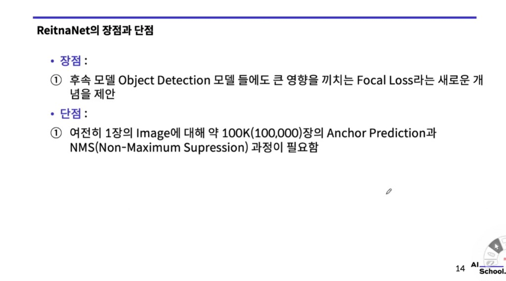

### 장점

**① Focal Loss라는 새로운 개념을 제안, 후속 모델에 큰 영향**

Focal Loss는 RetinaNet만을 위한 기술이 아닙니다.  
Class Imbalance 문제가 있는 **모든 분류/탐지 작업**에 적용할 수 있는 범용 손실 함수입니다.

이후 수많은 논문들이 Focal Loss 또는 그 변형을 채택했습니다:
- YOLOv3, v4, v5 계열
- EfficientDet
- FCOS, CenterNet 등 Anchor-free 방법들
- 세그멘테이션, 의료 영상 분야

**② 당시 One-stage와 Two-stage 모두를 능가하는 정확도**

Focal Loss 하나만으로 Two-stage의 정확도 장벽을 허물었습니다.  
"One-stage는 정확도가 낮다"는 고정관념을 깼습니다.

### 단점

**① 여전히 이미지 1장당 약 100K(100,000)개의 Anchor Prediction과 NMS 과정이 필요**

RetinaNet은 Anchor-based 방법입니다.  
FPN의 각 레벨에서 수많은 anchor를 계산하고 NMS로 정리해야 합니다.

이 문제를 해결하기 위한 다음 세대 모델들:
- **FCOS (2019)**: Anchor-free, 포인트 기반 예측
- **DETR (2020)**: Transformer 기반, NMS 없이 end-to-end 탐지
- **CenterNet**: 물체 중심점만 찾는 방식

### Focal Loss 이전 vs 이후

```
[Focal Loss 이전]
One-stage: 빠르지만 정확도 낮음 (Class Imbalance 미해결)
Two-stage: 정확하지만 느림

[Focal Loss 이후]
RetinaNet: 빠르면서 정확 (두 세계의 장점 결합)
          ↓
이후 거의 모든 One-stage detector가 Focal Loss 또는 그 변형을 채택
```

---

## 핵심 개념 정리

| 용어 | 한 줄 정의 |
|------|-----------|
| **RetinaNet** | ResNet+FPN 위에 Focal Loss를 적용한 One-stage Detector (ICCV 2017) |
| **Focal Loss** | 쉬운 예제(배경)의 loss를 자동으로 줄여 어려운 예제(물체) 학습에 집중하는 손실 함수 |
| **Class Imbalance** | 학습 데이터에서 배경 anchor(음성)가 물체 anchor(양성)보다 압도적으로 많은 불균형 |
| **$p_t$** | 모델이 정답 클래스에 부여한 확률. 높을수록 쉬운 예제 |
| **γ (gamma)** | Focusing parameter. 클수록 쉬운 예제의 loss를 더 강하게 줄임 (권장: γ=2) |
| **Modulating factor** | $(1-p_t)^\gamma$ — Focal Loss의 핵심 항, 자동 down-weighting |
| **α-balanced** | 양성/음성 클래스에 각각 α, 1-α 가중치를 부여하는 방식 |
| **FPN** | Feature Pyramid Network. ResNet에 top-down pathway를 추가해 multi-scale 특징맵 생성 |
| **Classification Subnet** | FPN 각 레벨에서 클래스 확률을 예측하는 서브네트워크 |
| **Box Regression Subnet** | FPN 각 레벨에서 bounding box 오프셋을 예측하는 서브네트워크 |
| **Weight Sharing** | 모든 FPN 레벨이 같은 subnet 가중치를 공유 |
| **Hard Negative Mining** | SSD의 방법. loss 높은 배경만 선택해 학습 (Focal Loss의 선구자) |
| **COCO AP** | IoU 0.5~0.95를 평균한 COCO 데이터셋 표준 정확도 지표 |
