# CenterNet: Objects as Points

---

## 목차

- [A. CenterNet이란 무엇인가?](#a-centernet이란-무엇인가)
- [B. 기존 Object Detection 모델의 세 가지 문제점](#b-기존-object-detection-모델의-세-가지-문제점)
- [C. CenterNet의 핵심 아이디어 — "Objects as Points"](#c-centernet의-핵심-아이디어--objects-as-points)
- [D. Anchor-based vs Center Point-based 비교](#d-anchor-based-vs-center-point-based-비교)
- [E. CenterNet이 Anchor-based와 다른 3가지 핵심 차이](#e-centernet이-anchor-based와-다른-3가지-핵심-차이)
- [F. CenterNet의 확장 — 하나의 구조로 다양한 문제 해결](#f-centernet의-확장--하나의-구조로-다양한-문제-해결)
- [G. Loss Function — 세 가지 출력과 세 가지 손실](#g-loss-function--세-가지-출력과-세-가지-손실)
- [H. Keypoint Loss — Focal Loss 변형](#h-keypoint-loss--focal-loss-변형)
- [I. Offset Loss — Discretization 오차 보정](#i-offset-loss--discretization-오차-보정)
- [J. Size Loss — 박스 크기 예측](#j-size-loss--박스-크기-예측)
- [K. Training 설정](#k-training-설정)
- [L. 성능 — 속도 vs 정확도 그래프](#l-성능--속도-vs-정확도-그래프)
- [M. 성능 — COCO test-dev 정량 비교](#m-성능--coco-test-dev-정량-비교)
- [N. 성능 — Backbone별 속도/정확도 Trade-off](#n-성능--backbone별-속도정확도-trade-off)
- [O. 시각적 결과 — Object Detection / Pose / 3D](#o-시각적-결과--object-detection--pose--3d)
- [P. CenterNet의 의의 — 장점 정리](#p-centernet의-의의--장점-정리)
- [핵심 개념 정리](#핵심-개념-정리)

---

## A. CenterNet이란 무엇인가?

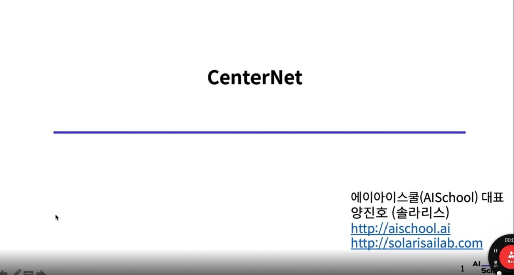

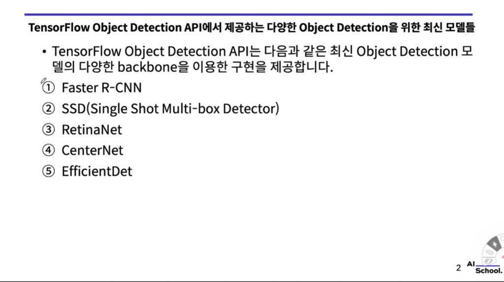

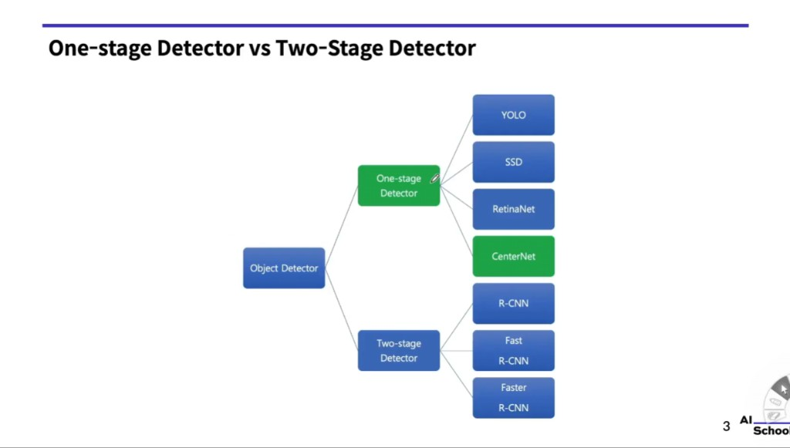

**CenterNet**은 2019년 UT Austin과 UC Berkeley 연구팀이 발표한 **Anchor-free One-stage Object Detector**입니다.

TensorFlow Object Detection API의 5대 모델 중 **④ CenterNet**이 이번 주제입니다.

분류 트리에서 CenterNet은 One-stage 계열에 속하지만, YOLO·SSD·RetinaNet과 근본적으로 다릅니다:

```
Object Detector
├── One-stage Detector
│   ├── YOLO          ← Anchor-based
│   ├── SSD           ← Anchor-based
│   ├── RetinaNet     ← Anchor-based
│   └── CenterNet     ← Anchor-FREE (이번 주제)
└── Two-stage Detector
    └── ...
```

**논문**: Zhou, Xingyi, Dequan Wang, and Philipp Krähenbühl. "Objects as Points." arXiv:1904.07850 (2019).  
([arXiv:1904.07850](https://arxiv.org/pdf/1904.07850.pdf))

### 핵심 아이디어 한 줄 요약

> **"물체를 anchor box가 아닌 bounding box의 중심점 하나로 표현한다."**

이전 모델들은 수천~수십만 개의 anchor box를 미리 깔고 각각을 분류했지만,  
CenterNet은 "물체의 중심점을 찾으면 그 점에서 크기를 예측하면 된다"는 단순한 철학에서 출발합니다.

---

## B. 기존 Object Detection 모델의 세 가지 문제점

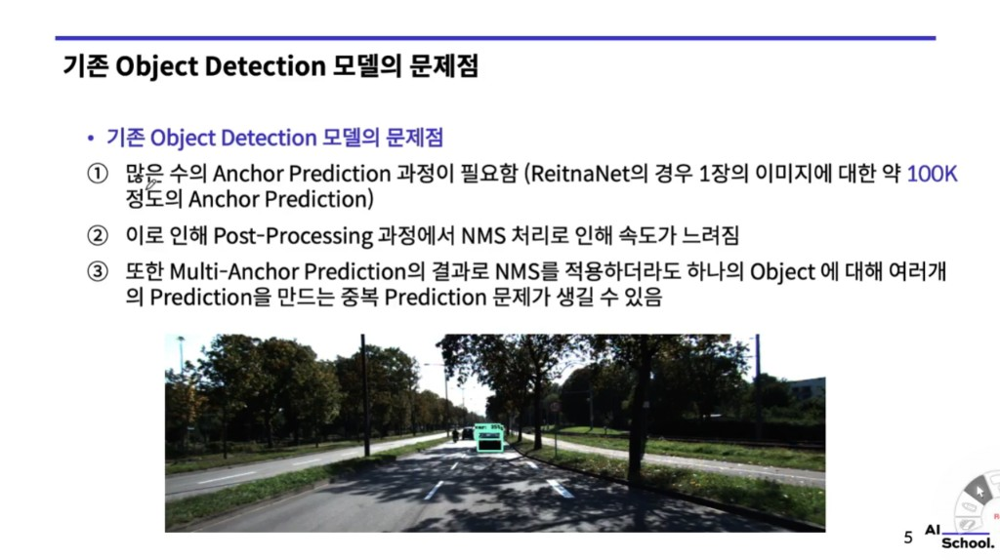

슬라이드 사진: 도로 위 차량 탐지 이미지. 버스 하나에 청록색 bounding box 하나가 쳐져 있습니다. 단 하나의 물체에도 많은 anchor prediction이 필요했던 기존 방식의 한계를 보여줍니다.

기존 Object Detection 모델(SSD, RetinaNet 포함)이 가진 세 가지 문제:

### 문제 ① 과도한 Anchor Prediction

- RetinaNet 기준: 이미지 1장당 약 **100,000개(100K)**의 anchor prediction 필요
- 이 anchor들을 모두 CNN에 통과시켜 클래스 + 위치를 예측
- 연산량이 매우 크다 → 속도 저하

### 문제 ② NMS에 의한 후처리 속도 저하

- 100K개의 예측 결과 중 겹치는 박스를 제거하는 NMS(Non-Maximum Suppression) 과정이 필수
- NMS는 순차적 처리(정렬 → 반복 제거)이므로 GPU 병렬화 어려움
- 전체 추론 시간에서 NMS가 차지하는 비율이 무시할 수 없음

### 문제 ③ 중복 Prediction 문제

- 여러 anchor가 동일한 물체에 매칭될 때 → NMS 이후에도 하나의 물체에 여러 박스가 남는 경우 있음
- NMS의 IoU 임계값 설정이 민감 (너무 엄격하면 recall 저하, 너무 느슨하면 중복 박스 남음)

> **직관적 비유**:  
> 기존 방식 = "전국 모든 버스 정류장에 경비원 배치 후 버스 오면 신고"  
> CenterNet = "버스 운전석(= 중심점)만 보면 버스인지 판단 가능"

---

## C. CenterNet의 핵심 아이디어 — "Objects as Points"

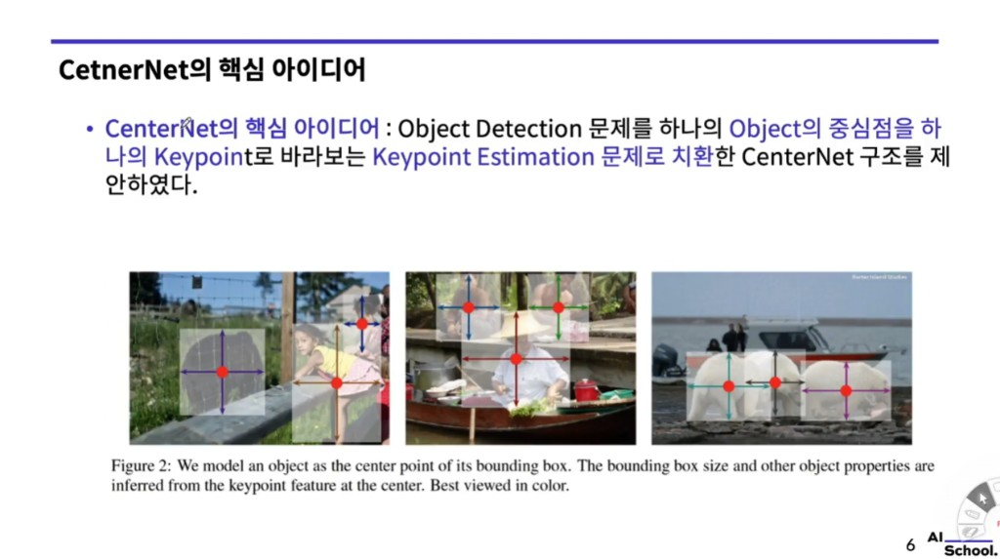

### Keypoint Estimation으로의 문제 변환

CenterNet의 가장 독창적인 발상:

> **Object Detection 문제를 하나의 Object의 중심점을 하나의 Keypoint로 바라보는  
> Keypoint Estimation 문제로 치환한다.**

슬라이드 Figure 2를 분석합니다:

- 세 이미지(새, 요리사, 선박들)에서 각 물체마다 **빨간 점(중심점)**이 표시됨
- 그 점에서 화살표 방향으로 **width와 height**가 예측됨
- 빨간 점 = bounding box의 중심 (cx, cy)
- 화살표 = bounding box의 크기 (w, h)

```
[기존 Anchor-based 방식]
이미지 → 수천 개의 anchor box 배치
        → 각 box: "여기에 물체 있나?" + "박스 조정"
        → NMS로 중복 제거 → 최종 결과

[CenterNet 방식]
이미지 → 특징맵에서 중심점 heatmap 생성
        → heatmap의 local peak = 물체의 중심
        → 중심점에서 w, h 예측
        → 완료! (NMS 불필요)
```

논문 Abstract에서:

> "We model an object as a single point — **the center point of its bounding box**.  
> Our detector uses keypoint estimation to find center points and regresses to all other object properties."

---

## D. Anchor-based vs Center Point-based 비교

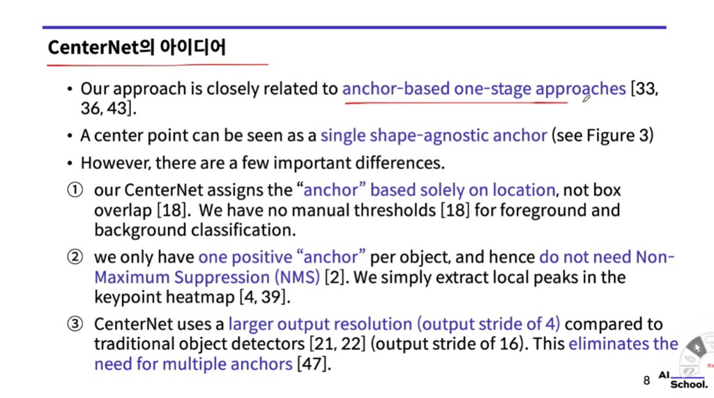

논문의 Figure 3을 분석합니다:

### (a) Standard Anchor-based Detection

```
[그림 왼쪽: anchor-based]
두 개의 anchor box (빨간 점선, 초록 점선)가 물체를 둘러싸고 있음

- 빨간 점선 anchor: IoU > 0.7 → positive (양성)
- 초록 점선 anchor: IoU < 0.3 → negative (음성)
- 그 외: ignored (무시)
```

**과정**:
1. 특징맵 각 위치에 수십~수백 개의 anchor 배치
2. 각 anchor와 GT box의 IoU 계산
3. IoU > threshold → 양성 (해당 GT로 학습)
4. IoU < threshold → 음성 (배경으로 학습)
5. 그 중간 → 무시
6. NMS로 중복 제거

**문제**: IoU 기반 임계값 = 수동 설정 필요, 중복 anchor 다수

### (b) Center Point-based Detection (CenterNet)

```
[그림 오른쪽: center point-based]
물체 중앙에 초록색 십자(+) 표시 = 중심점
중심점 주변은 heatmap gradient로 표현

- 중심 픽셀 → 해당 물체에 할당
- 주변 점들 → 감소된 negative loss 적용
- Object size → 중심점에서 직접 regression
```

**과정**:
1. 특징맵에서 **Gaussian heatmap** 생성 (각 GT 중심점을 가우시안으로 표현)
2. heatmap의 **local peak(극대점)** = 물체 중심 예측
3. 중심점에서 w, h 예측
4. **NMS 없이** 각 peak를 독립된 물체로 처리

**장점**: IoU 임계값 불필요, anchor 설계 불필요, NMS 불필요

---

## E. CenterNet이 Anchor-based와 다른 3가지 핵심 차이

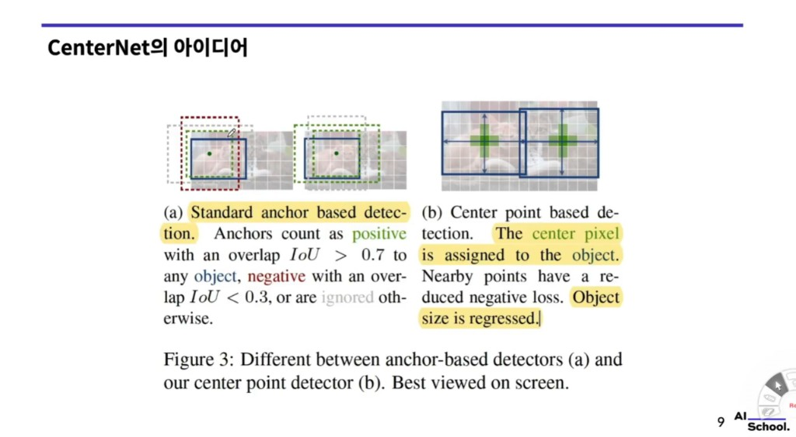

논문에서 설명하는 3가지 중요한 차이점:

### 차이 ① "Anchor" 할당 기준

```
[기존 Anchor-based]
anchor ↔ GT 매칭 기준: IoU 값
- IoU > 0.7 → positive  
- IoU < 0.3 → negative
- 중간값 → ignored
→ 수동 임계값 설정 필요, 임계값에 민감

[CenterNet]
"anchor"(= center point) 할당 기준: location만
- GT box의 중심점이 어느 픽셀에 있는가?
- No manual thresholds for foreground/background
→ 완전 자동, 임계값 없음
```

### 차이 ② 물체당 "anchor" 수

```
[기존 Anchor-based]
물체 하나당 여러 anchor가 positive로 매칭
→ NMS 필수 (중복 박스 제거)

[CenterNet]
물체 하나당 딱 하나의 positive "anchor" (= 중심점)
→ NMS 불필요!
→ keypoint heatmap의 local peaks만 추출
```

### 차이 ③ Output Stride (출력 해상도)

```
[기존 방법]
output stride = 16
→ 512×512 입력 → 32×32 특징맵
→ 작은 물체는 너무 압축됨 → anchor 여러 개 필요

[CenterNet]
output stride = 4
→ 512×512 입력 → 128×128 출력
→ 4배 더 세밀한 격자 → 작은 물체도 잘 표현
→ 위치당 여러 anchor 불필요
```

> **핵심**: output stride 4 덕분에 이미지를 더 세밀하게 볼 수 있어서, 하나의 중심점만으로도 충분히 물체를 구별할 수 있습니다.

---

## F. CenterNet의 확장 — 하나의 구조로 다양한 문제 해결

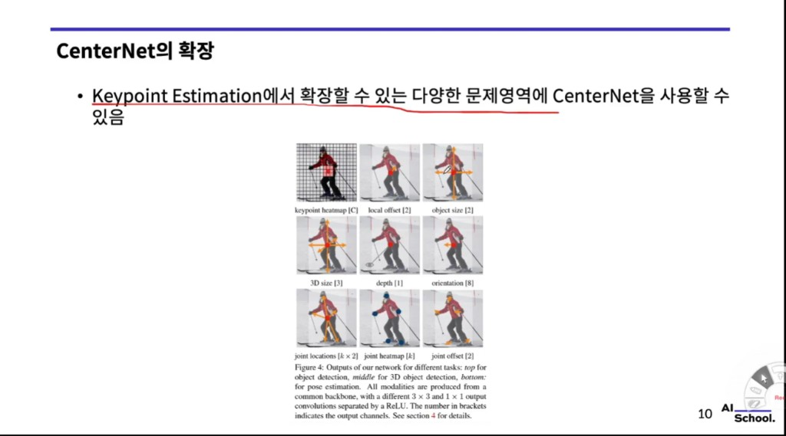

CenterNet의 또 다른 강점: **Keypoint Estimation 프레임워크를 다양한 비전 문제에 바로 확장** 가능

슬라이드의 Figure 4는 스키 선수 이미지 하나로 세 가지 태스크를 동시에 보여줍니다:

### Object Detection (2D)

```
출력:
- keypoint heatmap [C]:  클래스 수만큼의 채널. 각 채널이 해당 클래스의 중심점 heatmap
- local offset     [2]:  x, y 방향 보정값 (discretization 오차 보정)
- object size      [2]:  w, h (bounding box 크기)

총 출력: C + 2 + 2 = C + 4 채널
```

### 3D Object Detection (자율주행용)

```
추가 출력:
- 3D size      [3]:  3D 박스의 길이, 너비, 높이
- depth        [1]:  카메라에서 물체까지의 깊이(거리)
- orientation  [8]:  물체의 방향 (orientation을 8개 값으로 표현)
```

### Human Pose Estimation (자세 추정)

```
추가 출력:
- joint locations [k×2]:  k개 관절의 x, y 좌표 (k=17: COCO 기준 17개 관절)
- joint heatmap   [k]:    각 관절의 heatmap
- joint offset    [2]:    관절 위치 보정값
```

> **같은 backbone 네트워크**에서 태스크에 맞는 head만 교체하면 되므로 매우 효율적입니다.  
> "중심점을 찾는다"는 철학 자체가 범용적으로 적용됩니다.

---

## G. Loss Function — 세 가지 출력과 세 가지 손실

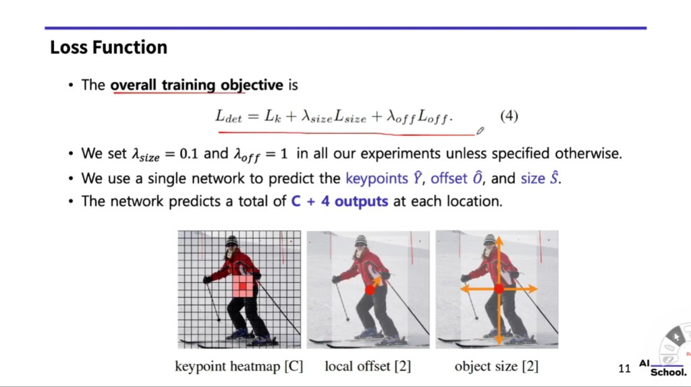

### 전체 학습 목표 (Overall Training Objective)

$$L_{det} = L_k + \lambda_{size} L_{size} + \lambda_{off} L_{off}$$

| 기호 | 의미 |
|------|------|
| $L_k$ | Keypoint(중심점) 예측 loss |
| $L_{size}$ | Object size(w, h) 예측 loss |
| $L_{off}$ | Local offset(위치 보정) 예측 loss |
| $\lambda_{size} = 0.1$ | size loss 가중치 (작게 설정 — 정확한 위치보다 중심점 탐지가 더 중요) |
| $\lambda_{off} = 1$ | offset loss 가중치 |

### 네트워크의 출력 구조

네트워크는 각 위치에서 총 **C + 4** 채널을 출력합니다:

```
입력: 512×512 이미지
출력: 128×128 × (C+4) 텐서
                   │
    ┌──────────────┼──────────────┐
    │              │              │
  Keypoint      Offset         Size
  heatmap [C]    [2]            [2]
  (클래스 수)   (Δx, Δy)      (w, h)
```

슬라이드 하단의 스키 선수 이미지 3장:
- **keypoint heatmap [C]**: 스키어 위치에 붉은 heatmap — "이 위치에 물체가 있다"
- **local offset [2]**: 스키어 발 근처에 점 — 위치 보정값
- **object size [2]**: 스키어에서 화살표 → bounding box의 너비/높이

---

## H. Keypoint Loss — Focal Loss 변형

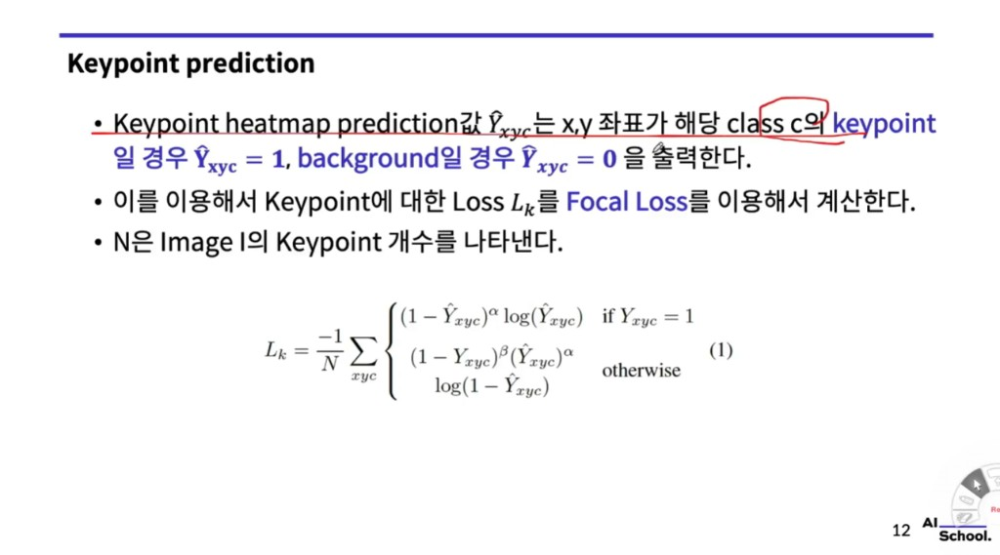

### Keypoint Heatmap

Keypoint prediction 값 $\hat{Y}_{xyc}$:
- $(x, y)$ 위치가 클래스 $c$의 keypoint(중심점)이면 → $\hat{Y}_{xyc} = 1$
- background이면 → $\hat{Y}_{xyc} = 0$

이것은 **Gaussian heatmap**으로 부드럽게 표현됩니다:  
GT 중심점 정확한 위치는 1, 주변으로 갈수록 점점 0에 가까운 Gaussian 분포

### Keypoint Loss 수식

$$L_k = \frac{-1}{N} \sum_{xyc} \begin{cases} (1 - \hat{Y}_{xyc})^\alpha \log(\hat{Y}_{xyc}) & \text{if } Y_{xyc} = 1 \\ (1 - Y_{xyc})^\beta (\hat{Y}_{xyc})^\alpha \log(1 - \hat{Y}_{xyc}) & \text{otherwise} \end{cases}$$

| 기호 | 의미 |
|------|------|
| $\hat{Y}_{xyc}$ | 네트워크의 예측값 (0~1 사이 확률) |
| $Y_{xyc}$ | GT heatmap 값 (Gaussian 분포, 중심=1) |
| $N$ | 이미지 내 keypoint(물체) 개수 — loss를 normalize |
| $\alpha, \beta$ | Focal Loss 하이퍼파라미터 (논문: α=2, β=4) |

### Focal Loss와의 연결

이 수식은 RetinaNet의 Focal Loss를 keypoint heatmap에 맞게 변형한 것입니다:

**정답(중심점)인 경우 (Y=1)**:
$$-(1 - \hat{Y}_{xyc})^\alpha \log(\hat{Y}_{xyc})$$
- Focal Loss의 양성 항과 동일
- $\hat{Y}_{xyc}$가 1에 가까울수록 loss 감소 (쉬운 예측 = 낮은 loss)

**배경인 경우 (Y≠1)**:
$$-(1 - Y_{xyc})^\beta (\hat{Y}_{xyc})^\alpha \log(1 - \hat{Y}_{xyc})$$
- Focal Loss의 음성 항 변형
- **$(1 - Y_{xyc})^\beta$**: GT Gaussian 값이 1에 가까운 위치(= 중심점 근처)는 배경 loss를 줄여줌  
  → 중심점 바로 옆 위치가 배경으로 잘못 학습되는 것을 방지 (penalty 감소)
- **$(\hat{Y}_{xyc})^\alpha$**: 이미 "배경"으로 잘 예측된 위치의 loss를 줄임 (Focal Loss 역할)

```
[직관적 이해]
중심점 정확한 위치: 강하게 학습 (loss 큼)
중심점 바로 옆 (Gaussian 값 높음): 배경이어도 loss를 줄여줌
멀리 떨어진 배경: 쉽게 배경으로 예측 → loss 작음
```

---

## I. Offset Loss — Discretization 오차 보정

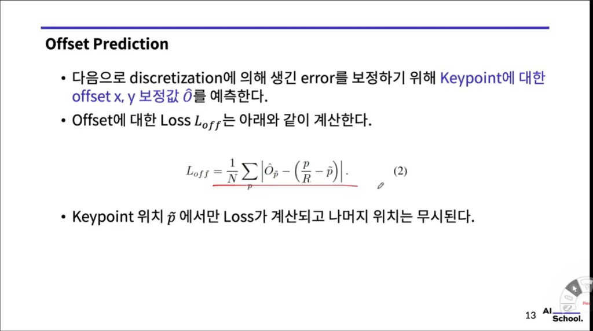

### 왜 Offset이 필요한가?

CenterNet의 출력 해상도: 128×128 (input 512×512 → stride 4)

즉, 512픽셀의 세계를 128픽셀로 압축합니다.  
**실수(float) 좌표 → 정수(int) 격자**로 매핑할 때 **discretization 오차** 발생:

```
예시: GT 중심점이 (301, 201) 픽셀에 있음
output stride = 4
→ 특징맵에서의 위치: (301/4, 201/4) = (75.25, 50.25)
→ 반올림: (75, 50) ← 정수 위치

오차: (75.25 - 75, 50.25 - 50) = (0.25, 0.25)
→ 이 오차를 보정하는 것이 Offset 예측
```

### Offset Loss 수식

$$L_{off} = \frac{1}{N} \sum_p \left|\hat{O}_{\tilde{p}} - \left(\frac{p}{R} - \tilde{p}\right)\right|$$

| 기호 | 의미 |
|------|------|
| $p$ | 원본 이미지에서의 keypoint 위치 (실수 좌표) |
| $R$ | output stride = 4 |
| $\tilde{p}$ | 특징맵에서의 discretized(정수화된) keypoint 위치 = $\lfloor p/R \rfloor$ |
| $\hat{O}_{\tilde{p}}$ | 네트워크가 $\tilde{p}$ 위치에서 예측한 offset 보정값 |
| $\frac{p}{R} - \tilde{p}$ | 정수화에 의해 발생한 실제 오차 |

**중요**: Loss는 keypoint 위치 $\tilde{p}$에서만 계산하고, 나머지 위치는 무시합니다.  
→ 의미 있는 위치(물체 중심)에서만 학습

---

## J. Size Loss — 박스 크기 예측

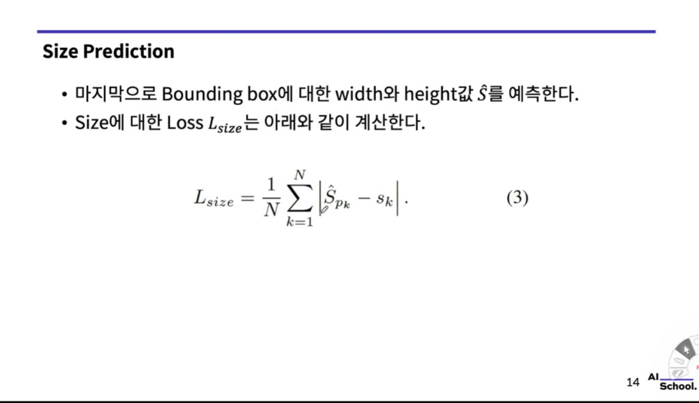

### 크기 예측

각 물체 k에 대해 bounding box의 **width와 height**를 예측합니다:

$$L_{size} = \frac{1}{N} \sum_{k=1}^N \left|\hat{S}_{p_k} - s_k\right|$$

| 기호 | 의미 |
|------|------|
| $s_k$ | k번째 물체의 실제 크기 벡터 $(w_k, h_k)$ — 원본 이미지 기준 |
| $\hat{S}_{p_k}$ | 네트워크가 k번째 물체의 중심점 $p_k$에서 예측한 크기 벡터 |
| $N$ | 이미지 내 물체 수 |

**Loss 함수**: L1 Loss (절댓값 차이)  
**크기 정규화 없음**: 논문에서는 log scale 변환 없이 raw size를 직접 예측합니다.  
(SSD, Faster R-CNN은 log scale을 사용했지만 CenterNet은 간단하게 L1 사용)

### 세 Loss의 관계 정리

$$L_{det} = \underbrace{L_k}_{\text{중심점 찾기}} + \underbrace{0.1 \cdot L_{size}}_{\text{크기 예측}} + \underbrace{1.0 \cdot L_{off}}_{\text{위치 보정}}$$

- $L_k$가 가장 중요 (물체 존재 여부 자체를 학습)
- $L_{off}$도 중요 ($\lambda=1$)
- $L_{size}$는 가중치 0.1로 약하게 학습 (대략적인 크기만으로도 충분)

---

## K. Training 설정

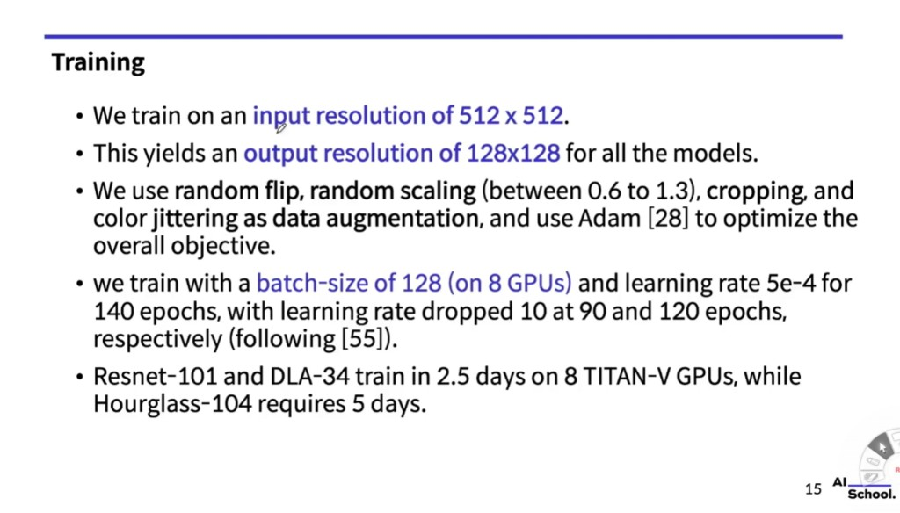

| 설정 | 값 |
|------|----|
| 입력 해상도 | **512 × 512** |
| 출력 해상도 | **128 × 128** (stride 4) |
| Data Augmentation | random flip, random scaling (0.6~1.3), cropping, color jittering |
| Optimizer | **Adam** |
| Batch size | **128 (8 GPUs)** |
| Learning rate | **5e-4** |
| Total epochs | **140** |
| LR drop | epoch 90, 120에서 각각 10배 감소 |

**학습 시간 (8 TITAN-V GPUs 기준)**:

| Backbone | 학습 시간 |
|---------|----------|
| ResNet-101 | 2.5일 |
| DLA-34 | 2.5일 |
| Hourglass-104 | 5일 |

**Backbone 선택 기준**:
- 속도 우선 → **ResNet-18** (FPS 142, 실시간)
- 균형 → **DLA-34** (FPS 52, AP 37.4) ← 일반적으로 권장
- 정확도 우선 → **Hourglass-104** (FPS 14, AP 40.3)

---

## L. 성능 — 속도 vs 정확도 그래프

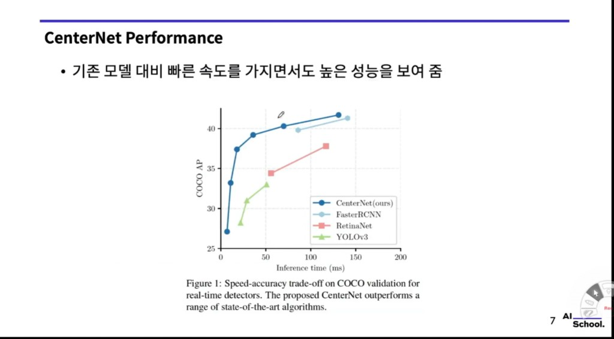

COCO validation에서 real-time detectors 비교 (Figure 1):

x축: Inference time (ms), y축: COCO AP

```
성능 비교 (논문 그래프에서):
YOLOv3     ─── 녹색 ─── 빠르지만 낮은 AP
RetinaNet  ─── 분홍 ─── 중간 속도, 중간 AP
FasterRCNN ─── 하늘 ─── 느리지만 높은 AP
CenterNet  ─── 파랑 ─── 빠르고 높은 AP (upper envelope)
```

**CenterNet이 upper envelope 형성**: 동일 시간 대비 가장 높은 AP, 또는 동일 AP 대비 가장 빠른 속도

- 빠른 버전(ResNet-18): 약 10~20ms → YOLOv3보다 빠르면서 AP 높음
- 정확한 버전(Hourglass-104): 약 70~130ms → FasterRCNN, RetinaNet 능가

---

## M. 성능 — COCO test-dev 정량 비교

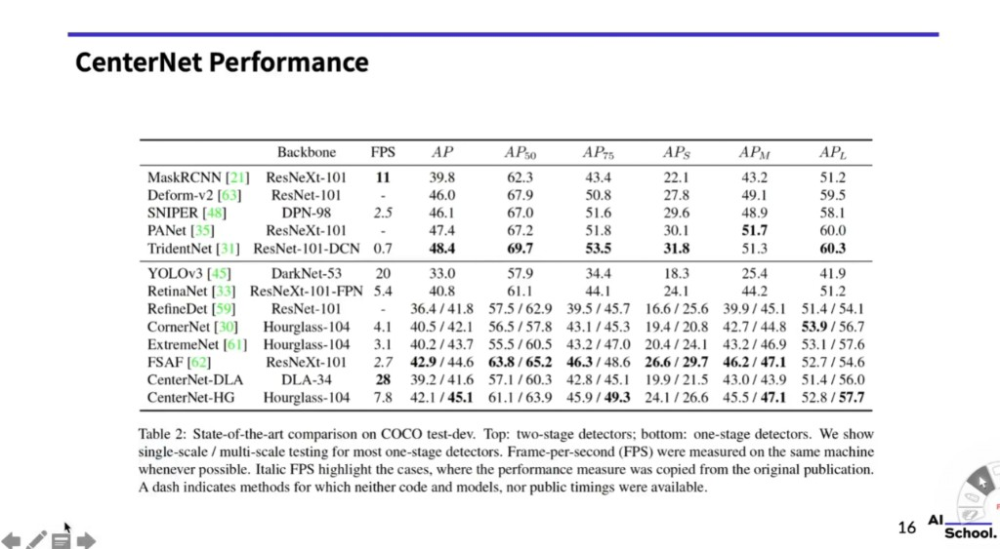

Table 2: State-of-the-art comparison on COCO test-dev (N.A. = No augmentation / single-scale):

**Two-stage Methods (상단):**

| 모델 | Backbone | FPS | AP | AP₅₀ | AP₇₅ |
|------|---------|-----|-----|------|------|
| MaskRCNN | ResNeXt-101 | 11 | 39.8 | 62.3 | 43.4 |
| Deform-v2 | ResNet-101 | — | 46.0 | 67.9 | 50.8 |
| SNIPER | DPN-98 | 2.5 | 46.1 | 67.0 | 51.6 |
| PANet | ResNeXt-101 | — | 47.4 | 67.2 | 51.8 |
| TridentNet | ResNet-101-DCN | 0.7 | **48.4** | **69.7** | **53.5** |

**One-stage Methods (하단):**

| 모델 | Backbone | FPS | AP | AP₅₀ | AP₇₅ |
|------|---------|-----|-----|------|------|
| YOLOv3 | DarkNet-53 | 20 | 33.0 | 57.9 | 34.4 |
| RetinaNet | ResNeXt-101-FPN | 5.4 | 40.8 | 61.1 | 44.1 |
| CornerNet | Hourglass-104 | 4.1 | 40.5 / 42.1 | 56.5 / 57.8 | — |
| ExtremeNet | Hourglass-104 | 3.1 | 40.2 / 43.7 | — | — |
| FSAF | ResNeXt-101 | 2.7 | **42.9 / 44.6** | — | — |
| **CenterNet-DLA** | **DLA-34** | **28** | **39.2 / 41.6** | 57.1 / 60.3 | — |
| **CenterNet-HG** | **Hourglass-104** | **7.8** | **42.1 / 45.1** | 61.1 / 63.9 | — |

**분석**:
- **CenterNet-DLA**: FPS **28** + AP 39.2 → 실시간에 가까운 속도로 RetinaNet(FPS 5.4)과 비슷한 정확도
- **CenterNet-HG**: AP **45.1** (multi-scale) → One-stage 중 최고 수준
- Two-stage TridentNet(AP=48.4)에는 미치지 못하지만, FPS=0.7 vs 7.8 → **속도는 11배 이상 빠름**

---

## N. 성능 — Backbone별 속도/정확도 Trade-off

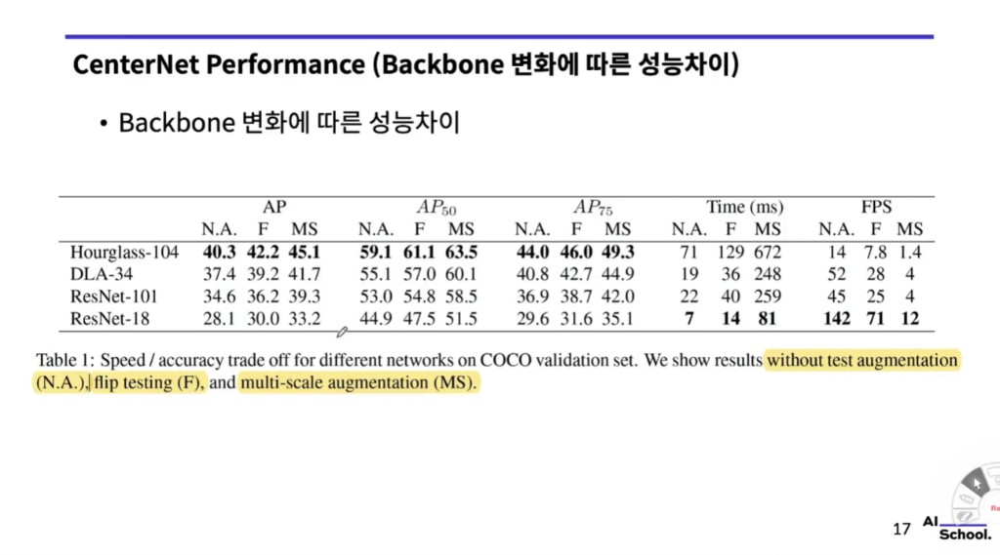

Table 1: COCO validation에서 backbone별 성능 (N.A. = no aug, F = flip, MS = multi-scale):

| Backbone | AP (N.A./F/MS) | AP₅₀ (N.A./F/MS) | Time ms (N.A./F/MS) | FPS (N.A./F/MS) |
|---------|----------------|-----------------|----------------------|----------------|
| Hourglass-104 | 40.3/42.2/45.1 | 59.1/61.1/63.5 | 71/129/672 | **14/7.8/1.4** |
| DLA-34 | 37.4/39.2/41.7 | 55.1/57.0/60.1 | 19/36/248 | **52/28/4** |
| ResNet-101 | 34.6/36.2/39.3 | 53.0/54.8/58.5 | 22/40/259 | **45/25/4** |
| ResNet-18 | 28.1/30.0/33.2 | 44.9/47.5/51.5 | 7/14/81 | **142/71/12** |

**사용 시나리오별 추천**:

| 시나리오 | 추천 Backbone | 특성 |
|---------|--------------|------|
| 실시간 응용 (IoT, 로봇) | ResNet-18 | FPS 142, 7ms — 초실시간 |
| 실시간 + 적당한 정확도 | DLA-34 | FPS 52, AP 37.4 |
| 정확도 우선 (오프라인) | Hourglass-104 | AP 45.1 (MS), FPS 7.8 |

---

## O. 시각적 결과 — Object Detection / Pose / 3D

### Object Detection 결과

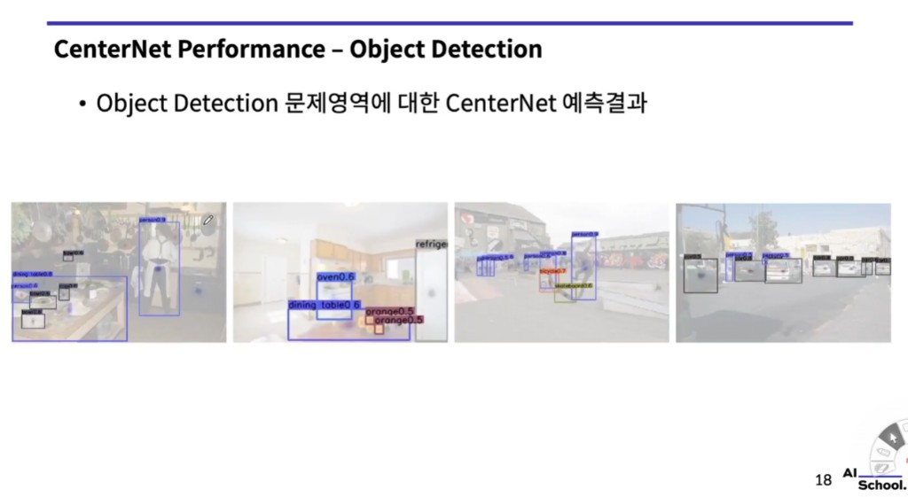

4장의 이미지에 CenterNet 탐지 결과가 표시되어 있습니다:
- 주방 장면: 사람, dining table, refrigerator, orange 등 다중 클래스 탐지
- 거리 장면: 사람, 차량 탐지
- 각 박스에 클래스 이름과 confidence score 표시

### Human Pose Estimation 결과

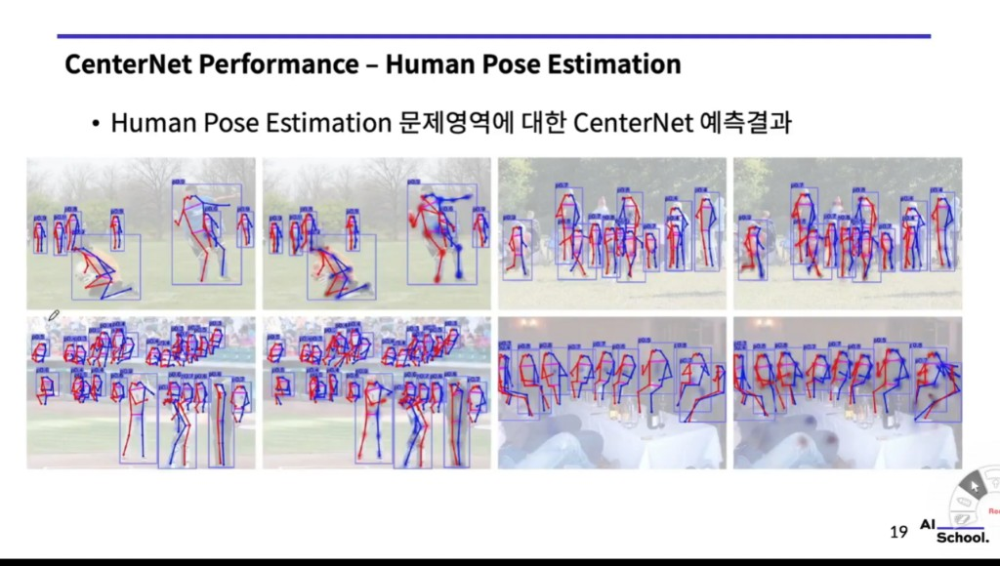

스포츠 장면(야구, 댄스, 식사 등) 8장에서 **사람 관절(joint) 위치 추정** 결과:
- **파란선**: GT(정답) skeleton
- **빨간선**: CenterNet 예측 skeleton
- 17개 관절 (머리, 어깨, 팔꿈치, 손목, 엉덩이, 무릎, 발목 등) 동시 추정
- 여러 사람이 겹쳐 있는 복잡한 장면에서도 각 사람을 구별해 관절 추정

### 3D Bounding Box Estimation 결과

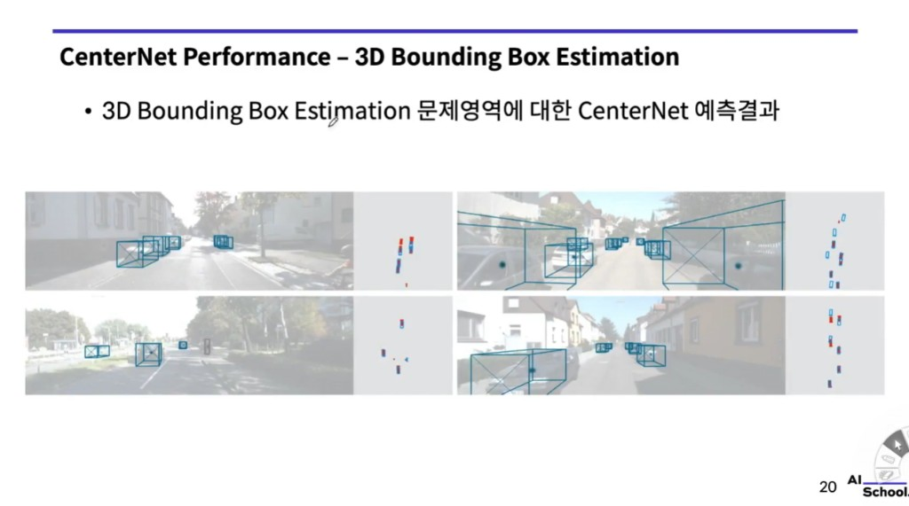

자율주행 데이터셋(KITTI 스타일)에서 **3D bounding box 추정** 결과:
- 왼쪽: 3D 박스가 그려진 도로 장면 이미지
- 오른쪽: 조감도(bird-eye view)에서 깊이(depth)와 위치를 시각화
- 각 차량에 대해 위치(x,y,z), 크기(l,w,h), 방향(orientation)을 동시에 예측

---

## P. CenterNet의 의의 — 장점 정리

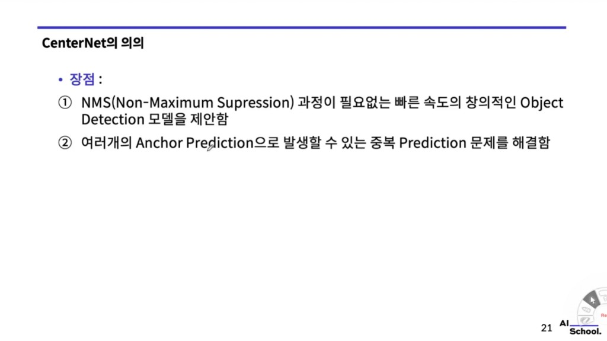

### 장점 ① NMS가 필요 없는 빠른 Object Detection

```
[기존 Anchor-based의 흐름]
이미지 → CNN → 수천 개 박스 예측 → NMS (순차 처리, 느림) → 결과

[CenterNet의 흐름]
이미지 → CNN → heatmap → local peak 추출 → 결과
                                ↑
                          병렬 처리 가능, 매우 빠름!
```

- NMS는 GPU에서 병렬화하기 어려운 순차적 연산
- CenterNet은 heatmap의 local peak(극대값)만 뽑으면 되므로 매우 간단
- → 추론 속도에서 큰 이점

### 장점 ② 중복 Prediction 문제 해결

- 기존: 여러 anchor가 같은 물체를 가리킬 수 있음 → NMS로 중복 제거 시 실수 가능
- CenterNet: 물체당 정확히 1개의 중심점 → 애초에 중복 예측 없음
- → 더 깔끔하고 신뢰도 높은 예측

### 추가 장점 (노트)

| 항점 | CenterNet의 이점 |
|------|----------------|
| Anchor 설계 | 불필요 — 크기·비율·개수 전혀 설정 안 해도 됨 |
| 하이퍼파라미터 | IoU 임계값 없음 — 학습 안정성 향상 |
| 확장성 | Pose, 3D BBox 등 추가 속성을 head만 추가하면 예측 가능 |
| End-to-end | 완전한 End-to-end 학습 가능 |

### 한계 (슬라이드에 명시되지 않았으나 알아둘 점)

- 물체가 겹치는 경우 heatmap에서 두 중심점이 구별되지 않을 수 있음 (특히 같은 클래스의 작은 물체들)
- 극도로 빠른 추론이 필요한 실시간 임베디드 환경에서는 아직 ResNet-18 기반이 유리하지만, 정확도는 더 개선 여지가 있음

---

## 핵심 개념 정리

| 용어 | 한 줄 정의 |
|------|-----------|
| **CenterNet** | 물체를 bounding box의 중심점 하나로 표현하는 Anchor-free One-stage Detector |
| **Anchor-free** | 미리 정의된 anchor box 없이 탐지하는 방식. CenterNet, FCOS 등이 대표적 |
| **Keypoint Estimation** | 이미지에서 특정 점(관절, 중심 등)의 위치를 예측하는 문제 |
| **Heatmap** | 각 픽셀 위치에서 keypoint일 확률을 나타내는 2D 확률 맵 |
| **Gaussian Heatmap** | GT 중심점 주변을 Gaussian 분포로 부드럽게 표현한 heatmap |
| **Local Peak** | heatmap에서 주변 픽셀보다 높은 값을 가진 극대점 = 탐지된 물체의 중심 |
| **Output Stride** | 입력 이미지와 출력 특징맵의 크기 비율. CenterNet = 4 (vs 기존 = 16) |
| **Discretization Error** | 실수 좌표를 정수 격자로 변환할 때 발생하는 위치 오차 |
| **Local Offset** | Discretization 오차를 보정하기 위한 (Δx, Δy) 예측값 |
| **DLA-34** | Deep Layer Aggregation. CenterNet 권장 backbone. 속도/정확도 균형 우수 |
| **Hourglass-104** | Stacked Hourglass Network. 정확도 최우선 시 사용하는 backbone |
| **NMS** | Non-Maximum Suppression. 겹치는 bbox를 제거하는 후처리. CenterNet에서는 불필요 |
